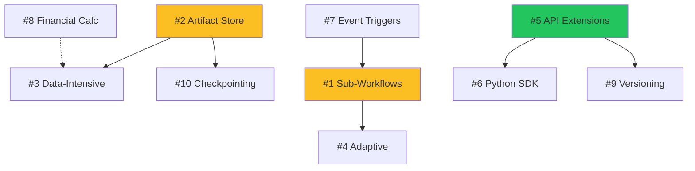

# Advanced Workflow Patterns — Ideas & Architecture

> Comprehensive capture of advanced workflow capabilities for spine-core.
> These patterns enable enterprise-grade orchestration: composition,
> data-intensive processing, self-modifying workflows, and external integration.
>
> Status: 💡 Idea | 🔬 Prototyped | 🏗️ In Progress | ✅ Done

---

## Quick Reference

| # | Pattern | Status | Complexity | Dependencies |
|---|---------|--------|------------|--------------|
| 1 | Sub-Workflows (Composition) | 💡 Idea | Medium | Workflow registry |
| 2 | Artifact Store (Large State) | 💡 Idea | High | Storage backends |
| 3 | Data-Intensive Workflows | 💡 Idea | High | #2 Artifact Store |
| 4 | Adaptive/Self-Modifying Workflows | 💡 Idea | High | #1 Sub-Workflows |
| 5 | Workflow API Extensions | 💡 Idea | Low | #3 Serialization ✅ |
| 6 | Python SDK Generation | 💡 Idea | Medium | OpenAPI spec |
| 7 | External Triggers & Events | 💡 Idea | Medium | Event bus |
| 8 | Financial Calculation Pipelines | 💡 Idea | Medium | Domain models |
| 9 | Workflow Versioning & Migration | 💡 Idea | High | #5 API Extensions |
| 10 | Distributed State & Checkpointing | 💡 Idea | High | #2 Artifact Store |
| 11 | Document Parsing & Extraction | 💡 Idea | High | Domain models |
| 12 | Container Orchestration Patterns | 🔬 Prototyped | Medium | LocalProcessAdapter ✅ |
| 13 | Workflow Management & Operations | 💡 Idea | Medium | TrackedWorkflowRunner ✅ |
| 14 | Secrets, Config & Environment | 🔬 Prototyped | Low | SecretsResolver ✅, FeatureFlags ✅ |
| 15 | Observability & Alerting | 🔬 Prototyped | Medium | Alert channels ✅, metrics ✅ |
| R1-R10 | **Real-World Case Study: SEC EDGAR Medallion** | ✅ Done | — | sec-docker-loader (98 GB DB) |
| F1-F10 | **Financial & Infrastructure Workflows** | ✅ Done | — | Env files, secrets, containers, zip export |

---

## 1. Sub-Workflows (Workflow Composition)

**Status**: 💡 Idea

### Problem

Workflows cannot invoke other workflows today. Users must:
- Duplicate step definitions across workflows
- Manually orchestrate parent→child via external scripts
- No reuse of common patterns (validation, notification, cleanup)

### What's Needed

A `Step.workflow()` factory that triggers another registered workflow
as a step, passing context and receiving results.

### Design

```python
# Parent workflow composes child workflows
parent = Workflow(
    name="daily_pipeline",
    steps=[
        Step.pipeline("fetch", "data.fetch"),
        Step.workflow(
            name="validate_data",
            workflow_name="common.validation",  # Registered child workflow
            params={"strict": True},
            wait=True,  # Block until child completes
        ),
        Step.workflow(
            name="enrich_parallel",
            workflow_name="enrichment.batch",
            params={"source": "$.outputs.fetch.data"},
            wait=True,
        ),
        Step.pipeline("load", "warehouse.load"),
    ],
)
```

### Implementation Plan

| Step | What | Where |
|------|------|-------|
| 1a | Add `StepType.WORKFLOW` enum | `orchestration/step_types.py` |
| 1b | Add `Step.workflow()` factory | `orchestration/step_types.py` |
| 1c | `WorkflowStepExecutor` class | `orchestration/executors/workflow_executor.py` |
| 1d | Teach `WorkflowRunner` to handle WORKFLOW steps | `orchestration/workflow_runner.py` |
| 1e | Context propagation (parent→child→parent) | `orchestration/workflow_context.py` |
| 1f | Cycle detection (A→B→A) | `orchestration/workflow_runner.py` |
| 1g | Tests (~30) | `tests/orchestration/test_subworkflows.py` |

### Step.workflow() Signature

```python
@classmethod
def workflow(
    cls,
    name: str,
    workflow_name: str,          # Registered workflow to invoke
    params: dict[str, Any] | None = None,
    wait: bool = True,           # True = sync, False = fire-and-forget
    timeout_seconds: int = 600,
    on_error: ErrorPolicy = ErrorPolicy.STOP,
    depends_on: list[str] | None = None,
    inherit_context: bool = True,  # Pass parent context to child
) -> Step:
    """Create a step that invokes another workflow."""
```

### Context Flow

```
ParentWorkflow
  ├── step1: pipeline
  │     └── outputs: {data: [...]}
  │
  ├── step2: workflow("child_wf")
  │     │
  │     └── ChildWorkflow (inherits parent context)
  │           ├── child_step1
  │           └── child_step2
  │                 └── outputs: {enriched: [...]}
  │
  │     ← child outputs merged into parent.outputs["step2"]
  │
  └── step3: pipeline (can access $.outputs.step2.enriched)
```

### Fire-and-Forget Mode

```python
Step.workflow(
    name="send_notifications",
    workflow_name="notifications.batch",
    wait=False,  # Don't block parent
)
```

Parent continues immediately. Child runs asynchronously. No output capture.

### Cycle Detection

```python
# This should raise WorkflowCycleError at registration or runtime:
workflow_a = Workflow("a", steps=[Step.workflow("call_b", "b")])
workflow_b = Workflow("b", steps=[Step.workflow("call_a", "a")])
```

### Related Patterns

- **Temporal.io**: Child workflows, continue-as-new
- **AWS Step Functions**: Nested state machines
- **Airflow**: SubDagOperator (deprecated), TaskGroup
- **Prefect**: Subflows

---

## 2. Artifact Store (External Large State)

**Status**: 💡 Idea

### Problem

`WorkflowContext` passes state in-memory between steps. This breaks for:
- **Large DataFrames** (100MB+ pandas/polars)
- **Binary files** (PDFs, images, model weights)
- **Cross-process execution** (distributed workers)
- **Workflow restarts** (state lost on crash)

### What's Needed

An `ArtifactStore` protocol with multiple backends that steps use to
read/write large data, while `WorkflowContext` holds only **references**.

### Design

```python
class ArtifactStore(Protocol):
    """Store and retrieve large artifacts by key."""
    
    async def put(
        self,
        key: str,
        data: bytes | Path | Any,
        *,
        content_type: str = "application/octet-stream",
        metadata: dict[str, str] | None = None,
    ) -> ArtifactRef:
        """Store artifact, return reference."""
        ...
    
    async def get(self, ref: ArtifactRef) -> bytes:
        """Retrieve artifact by reference."""
        ...
    
    async def get_stream(self, ref: ArtifactRef) -> AsyncIterator[bytes]:
        """Stream large artifacts."""
        ...
    
    async def delete(self, ref: ArtifactRef) -> None:
        """Delete artifact."""
        ...
    
    async def exists(self, ref: ArtifactRef) -> bool:
        """Check if artifact exists."""
        ...


@dataclass(frozen=True)
class ArtifactRef:
    """Lightweight reference to a stored artifact."""
    store: str       # "s3", "local", "redis"
    key: str         # "workflows/run-123/step-5/output.parquet"
    size_bytes: int
    content_type: str
    created_at: datetime
    checksum: str    # SHA256 for integrity
```

### Backend Implementations

| Backend | Use Case | Implementation |
|---------|----------|----------------|
| `LocalArtifactStore` | Development, testing | File system (`~/.spine/artifacts/`) |
| `S3ArtifactStore` | Production, cloud | boto3, async via aiobotocore |
| `RedisArtifactStore` | Fast access, small-medium | redis-py, TTL support |
| `PostgresLOBArtifactStore` | All-in-one deployment | Large objects in Postgres |

### Step Handler Usage

```python
def process_data(ctx: WorkflowContext, config: dict) -> StepResult:
    store = ctx.artifact_store  # Injected by runner
    
    # Get large input from previous step
    input_ref = ctx.get_output("fetch", "data_ref")  # ArtifactRef, not bytes
    raw_data = store.get(input_ref)
    
    # Process
    df = pd.read_parquet(io.BytesIO(raw_data))
    result_df = transform(df)
    
    # Store large output
    buffer = io.BytesIO()
    result_df.to_parquet(buffer)
    output_ref = store.put(
        key=f"runs/{ctx.run_id}/processed.parquet",
        data=buffer.getvalue(),
        content_type="application/vnd.apache.parquet",
    )
    
    # Return lightweight reference, not data
    return StepResult.ok(output={"data_ref": output_ref})
```

### Automatic Serialization Helpers

```python
# For pandas DataFrames
df_ref = await store.put_dataframe("key", df, format="parquet")
df = await store.get_dataframe(df_ref)

# For Python objects (pickle)
obj_ref = await store.put_pickle("key", complex_object)
obj = await store.get_pickle(obj_ref)

# For JSON-serializable data
json_ref = await store.put_json("key", {"results": [...]})
data = await store.get_json(json_ref)
```

### Implementation Plan

| Step | What | Where |
|------|------|-------|
| 2a | `ArtifactStore` protocol | `core/artifacts.py` |
| 2b | `ArtifactRef` dataclass | `core/artifacts.py` |
| 2c | `LocalArtifactStore` | `core/artifacts/local.py` |
| 2d | `S3ArtifactStore` | `core/artifacts/s3.py` |
| 2e | `RedisArtifactStore` | `core/artifacts/redis.py` |
| 2f | Inject store into `WorkflowContext` | `orchestration/workflow_context.py` |
| 2g | Serialization helpers | `core/artifacts/serializers.py` |
| 2h | Tests (~40) | `tests/core/test_artifacts.py` |

### Cleanup & Retention

```python
# Cleanup policy per workflow
Workflow(
    name="daily_etl",
    artifact_retention=ArtifactRetention(
        on_success="delete_after_7d",
        on_failure="keep_forever",  # For debugging
    ),
)

# Manual cleanup
await store.delete_run_artifacts(run_id="run-123")
```

---

## 3. Data-Intensive Workflows (ETL Patterns)

**Status**: 💡 Idea (depends on #2 Artifact Store)

### Problem

Current workflows are designed for **control flow**, not **data flow**.
ETL/ELT pipelines need:
- Streaming data between steps (not load-all-into-memory)
- Incremental processing (process new records only)
- Partitioned parallel execution
- Data lineage tracking

### What's Needed

Data-aware step types and context extensions.

### New Step Types

```python
# Source step — reads from external system
Step.source(
    name="read_sec_filings",
    source_type="database",
    connection="postgres://...",
    query="SELECT * FROM filings WHERE date > :last_run",
    output_format="parquet",
    chunk_size=10000,  # Stream in chunks
)

# Transform step — processes data
Step.transform(
    name="normalize",
    handler=normalize_filings,
    input_ref="$.artifacts.read_sec_filings",
    output_format="parquet",
)

# Sink step — writes to external system
Step.sink(
    name="load_warehouse",
    sink_type="bigquery",
    table="sec.filings_normalized",
    write_mode="append",
    input_ref="$.artifacts.normalize",
)
```

### Data Lineage

```python
# Automatic lineage tracking
@dataclass
class DataLineage:
    artifact_ref: ArtifactRef
    source_step: str
    source_refs: list[ArtifactRef]  # Input artifacts
    transform_hash: str              # Hash of handler code
    row_count: int
    schema: dict                     # Column types
    created_at: datetime
```

### Incremental Processing

```python
Step.source(
    name="fetch_new",
    source_type="api",
    endpoint="/filings",
    incremental=IncrementalConfig(
        cursor_field="updated_at",
        cursor_storage="workflow_state",  # Persist cursor between runs
    ),
)
```

### Partitioned Parallel Execution

```python
# Fan-out: partition data, process in parallel
Step.map(
    name="process_by_date",
    items_source="$.artifacts.raw_data",
    partition_by="filing_date",
    iterator_steps=[
        Step.transform("clean", clean_filing),
        Step.transform("enrich", enrich_filing),
    ],
    max_concurrency=10,
)
```

---

## 4. Adaptive / Self-Modifying Workflows

**Status**: 💡 Idea

### Problem

Static workflows can't react to runtime conditions:
- Skip expensive steps if data is small
- Add retry steps for specific failure types
- Branch based on ML model confidence scores
- Scale parallelism based on input size

### What's Needed

Runtime workflow modification APIs.

### Design Patterns

#### 4a. Conditional Step Skipping

```python
def check_data_size(ctx, config):
    data_ref = ctx.get_output("fetch", "data_ref")
    if data_ref.size_bytes < 1_000_000:  # < 1MB
        ctx.skip_steps(["heavy_processing", "gpu_transform"])
    return StepResult.ok()
```

#### 4b. Dynamic Step Insertion

```python
def handle_failure(ctx, config):
    failed_step = ctx.get_failed_step()
    if "rate_limit" in str(failed_step.error):
        # Insert a wait step dynamically
        ctx.insert_step_before(
            failed_step.name,
            Step.wait("rate_limit_backoff", duration_seconds=60),
        )
        ctx.retry_step(failed_step.name)
    return StepResult.ok()
```

#### 4c. Workflow Cloning & Forking

```python
def scale_based_on_input(ctx, config):
    item_count = ctx.get_output("count", "total")
    
    if item_count > 100_000:
        # Fork into parallel sub-workflows
        partitions = partition_items(item_count, num_partitions=10)
        for i, partition in enumerate(partitions):
            ctx.spawn_workflow(
                f"process_partition_{i}",
                workflow_name="process_batch",
                params={"partition": partition},
            )
    return StepResult.ok()
```

#### 4d. Continue-As-New (Long-Running Workflows)

```python
def process_stream(ctx, config):
    # Process batch
    batch = fetch_batch(ctx.get_param("cursor"))
    process(batch)
    
    if batch.has_more:
        # Continue as new workflow instance (reset history)
        ctx.continue_as_new(
            params={"cursor": batch.next_cursor},
            preserve_artifacts=True,
        )
    return StepResult.ok()
```

### Implementation

```python
class AdaptiveWorkflowContext(WorkflowContext):
    """Extended context with self-modification capabilities."""
    
    def skip_steps(self, step_names: list[str]) -> None:
        """Mark steps to be skipped."""
        
    def insert_step_before(self, before: str, step: Step) -> None:
        """Insert a new step before an existing step."""
        
    def insert_step_after(self, after: str, step: Step) -> None:
        """Insert a new step after an existing step."""
        
    def replace_step(self, name: str, step: Step) -> None:
        """Replace an existing step definition."""
        
    def spawn_workflow(
        self, name: str, workflow_name: str, params: dict
    ) -> str:
        """Spawn a child workflow, return run_id."""
        
    def continue_as_new(
        self, params: dict, preserve_artifacts: bool = False
    ) -> NoReturn:
        """Restart workflow with new parameters, reset history."""
        
    def retry_step(self, name: str, with_params: dict | None = None) -> None:
        """Re-execute a step."""
```

---

## 5. Workflow API Extensions

**Status**: 💡 Idea

### Problem

Current API only supports:
- `GET /workflows` — list
- `GET /workflows/{name}` — detail  
- `POST /workflows/{name}/run` — trigger

Missing:
- YAML export/import
- CRUD for workflow definitions
- Sub-step execution
- Run management (pause, resume, cancel)

### New Endpoints

```yaml
# Workflow CRUD
POST   /workflows                     # Create workflow from YAML/JSON
PUT    /workflows/{name}              # Update workflow definition
DELETE /workflows/{name}              # Delete workflow
GET    /workflows/{name}/yaml         # Export as YAML

# Workflow versions
GET    /workflows/{name}/versions     # List versions
GET    /workflows/{name}/versions/{v} # Get specific version
POST   /workflows/{name}/rollback     # Rollback to version

# Run management
GET    /workflows/{name}/runs         # List runs for workflow
GET    /runs/{run_id}                 # Get run status
POST   /runs/{run_id}/pause           # Pause running workflow
POST   /runs/{run_id}/resume          # Resume paused workflow
POST   /runs/{run_id}/cancel          # Cancel workflow
POST   /runs/{run_id}/retry           # Retry failed workflow
GET    /runs/{run_id}/artifacts       # List run artifacts
GET    /runs/{run_id}/artifacts/{key} # Download artifact

# Step-level operations
GET    /runs/{run_id}/steps           # List step statuses
GET    /runs/{run_id}/steps/{step}    # Get step detail
POST   /runs/{run_id}/steps/{step}/replay  # Re-run single step
GET    /runs/{run_id}/steps/{step}/logs    # Get step logs

# Triggers
POST   /workflows/{name}/schedule     # Create schedule
DELETE /workflows/{name}/schedule     # Delete schedule
POST   /webhooks/trigger/{name}       # Webhook trigger (existing)
```

### Request/Response Schemas

```python
class CreateWorkflowRequest(BaseModel):
    """Create workflow from YAML or structured definition."""
    yaml_content: str | None = None
    definition: dict | None = None  # WorkflowSpec-compatible
    
class WorkflowVersionResponse(BaseModel):
    version: int
    created_at: datetime
    created_by: str
    changes: list[str]
    
class RunStatusResponse(BaseModel):
    run_id: str
    workflow_name: str
    status: str  # pending, running, paused, completed, failed, cancelled
    started_at: datetime | None
    completed_at: datetime | None
    current_step: str | None
    progress: float  # 0.0 - 1.0
    steps: list[StepStatusSchema]
```

---

## 6. Python SDK Generation

**Status**: 💡 Idea

### Problem

No Python client library. Users must:
- Make raw HTTP requests
- Handle auth, pagination, errors manually
- No type hints or IDE completion

225 parity gaps identified by spine-tools.

### What's Needed

Auto-generated Python SDK from OpenAPI spec.

### Approaches

| Approach | Pros | Cons |
|----------|------|------|
| **openapi-python-client** | Auto-generated, stays in sync | Less control, verbose output |
| **Hand-written SDK** | Clean API, custom ergonomics | Manual maintenance burden |
| **Hybrid** | Best of both | More complexity |

### Recommended: Hybrid Approach

```python
# Auto-generated base client
from spine_core_sdk._generated import SpineCoreClient as _BaseClient

# Hand-written ergonomic wrapper
class SpineClient:
    """High-level Python SDK for spine-core."""
    
    def __init__(self, base_url: str = "http://localhost:8000", api_key: str | None = None):
        self._client = _BaseClient(base_url, api_key)
        self.workflows = WorkflowsAPI(self._client)
        self.runs = RunsAPI(self._client)
        self.artifacts = ArtifactsAPI(self._client)
    
    # Convenience methods
    def run_workflow(
        self,
        name: str,
        params: dict | None = None,
        wait: bool = False,
        timeout: int = 300,
    ) -> RunResult:
        """Submit workflow and optionally wait for completion."""
        run = self.workflows.run(name, params=params)
        if wait:
            return self.runs.wait(run.run_id, timeout=timeout)
        return run


# Usage
client = SpineClient("http://spine-core:8000")
result = client.run_workflow("daily_etl", params={"date": "2026-02-16"}, wait=True)
print(result.status, result.outputs)
```

### File Layout

```
spine-core-sdk/
  pyproject.toml
  src/spine_core_sdk/
    __init__.py         # SpineClient export
    client.py           # High-level client
    _generated/         # Auto-generated from OpenAPI
      client.py
      models.py
      api/
        workflows.py
        runs.py
        ...
    workflows.py        # WorkflowsAPI wrapper
    runs.py             # RunsAPI wrapper
    artifacts.py        # ArtifactsAPI wrapper
```

---

## 7. External Triggers & Events

**Status**: 💡 Idea

### Problem

Workflows can only be triggered via:
- Direct API call
- CLI command
- Schedule (cron)

Missing:
- S3 bucket events → trigger workflow
- Database change → trigger workflow
- Webhook from external system → trigger workflow
- Pub/sub message → trigger workflow
- File watcher → trigger workflow

### What's Needed

An event trigger system that maps external events to workflow invocations.

### Design

```python
@dataclass
class EventTrigger:
    """Maps an event source to a workflow."""
    name: str
    event_source: EventSource  # S3, Postgres, Webhook, PubSub, etc.
    workflow_name: str
    param_mapping: dict[str, str]  # Event fields → workflow params
    filter: str | None = None      # Optional event filter expression
    enabled: bool = True


# S3 event trigger
s3_trigger = EventTrigger(
    name="new_filing_uploaded",
    event_source=S3EventSource(
        bucket="sec-filings",
        prefix="raw/",
        events=["s3:ObjectCreated:*"],
    ),
    workflow_name="process_filing",
    param_mapping={
        "bucket": "$.bucket",
        "key": "$.key",
        "size": "$.size",
    },
)

# Database CDC trigger
db_trigger = EventTrigger(
    name="company_updated",
    event_source=PostgresCDCSource(
        connection="postgres://...",
        table="companies",
        operations=["INSERT", "UPDATE"],
    ),
    workflow_name="reindex_company",
    param_mapping={
        "company_id": "$.new.id",
        "changes": "$.diff",
    },
)

# Generic webhook
webhook_trigger = EventTrigger(
    name="github_push",
    event_source=WebhookSource(
        path="/hooks/github",
        secret="GITHUB_WEBHOOK_SECRET",
    ),
    workflow_name="ci_pipeline",
    filter="$.ref == 'refs/heads/main'",
    param_mapping={
        "commit": "$.after",
        "repo": "$.repository.full_name",
    },
)
```

### Event Router

```python
class EventRouter:
    """Route external events to workflow triggers."""
    
    def __init__(self):
        self._triggers: dict[str, EventTrigger] = {}
        self._sources: dict[str, EventSourceAdapter] = {}
    
    def register(self, trigger: EventTrigger) -> None:
        """Register an event trigger."""
        
    async def start(self) -> None:
        """Start listening on all event sources."""
        
    async def handle_event(self, source: str, event: dict) -> None:
        """Match event to triggers and invoke workflows."""
```

---

## 8. Financial Calculation Pipelines

**Status**: 💡 Idea

### Problem

spine-core orchestrates workflows but has no built-in support for:
- Financial metrics calculation (P&L, ratios, risk scores)
- Time-series aggregations (daily returns, moving averages)
- Portfolio-level computations
- Compliance rule evaluation

### What's Needed

Domain-specific step types and calculation libraries.

### Design

```python
# Financial calculation step
Step.calculate(
    name="compute_ratios",
    calculation=FinancialCalculation(
        metrics=["debt_to_equity", "current_ratio", "quick_ratio"],
        input_ref="$.artifacts.financials",
        group_by=["company_id", "fiscal_year"],
        output_format="parquet",
    ),
)

# Time-series aggregation
Step.aggregate(
    name="daily_returns",
    aggregation=TimeSeriesAggregation(
        input_ref="$.artifacts.prices",
        time_column="date",
        value_columns=["close"],
        operations=["pct_change", "rolling_mean_20", "rolling_std_20"],
        group_by=["ticker"],
    ),
)

# Risk calculation
Step.calculate(
    name="portfolio_risk",
    calculation=RiskCalculation(
        portfolio_ref="$.artifacts.portfolio",
        prices_ref="$.artifacts.prices",
        metrics=["var_95", "cvar_95", "sharpe", "sortino"],
        lookback_days=252,
    ),
)

# Compliance check
Step.validate(
    name="check_compliance",
    rules=ComplianceRules(
        rules_path="compliance/sec_rules.yaml",
        input_ref="$.artifacts.positions",
        fail_on_violation=True,
    ),
)
```

### Built-in Metrics Library

```python
from spine.domain.finance.metrics import (
    # Profitability
    gross_margin,
    operating_margin,
    net_margin,
    return_on_equity,
    return_on_assets,
    
    # Liquidity
    current_ratio,
    quick_ratio,
    cash_ratio,
    
    # Leverage
    debt_to_equity,
    debt_to_assets,
    interest_coverage,
    
    # Valuation
    price_to_earnings,
    price_to_book,
    ev_to_ebitda,
    
    # Risk
    beta,
    var,
    cvar,
    sharpe_ratio,
    sortino_ratio,
    max_drawdown,
)
```

---

## 9. Workflow Versioning & Migration

**Status**: 💡 Idea

### Problem

No version control for workflow definitions:
- Can't rollback a bad deployment
- Can't compare versions
- In-flight runs may break if definition changes
- No audit trail of who changed what

### What's Needed

Version control system for workflow definitions.

### Design

```python
@dataclass
class WorkflowVersion:
    workflow_name: str
    version: int
    definition: dict               # Serialized Workflow
    created_at: datetime
    created_by: str
    changelog: str
    checksum: str                  # SHA256 of definition
    
    # Migration info
    migrated_from: int | None      # Previous version
    migration_script: str | None   # Python migration code


class WorkflowVersionStore:
    """Track workflow definition versions."""
    
    def publish(
        self,
        workflow: Workflow,
        changelog: str,
        created_by: str,
    ) -> WorkflowVersion:
        """Publish new version of workflow."""
        
    def get_version(self, name: str, version: int) -> WorkflowVersion:
        """Get specific version."""
        
    def get_latest(self, name: str) -> WorkflowVersion:
        """Get latest version."""
        
    def list_versions(self, name: str) -> list[WorkflowVersion]:
        """List all versions."""
        
    def rollback(self, name: str, to_version: int) -> WorkflowVersion:
        """Rollback to previous version."""
        
    def diff(self, name: str, v1: int, v2: int) -> WorkflowDiff:
        """Compare two versions."""
```

### In-Flight Run Protection

```python
# When a run starts, it locks to a specific version
run = runner.execute(workflow, version_lock=True)
# run.workflow_version = 5

# Even if workflow is updated to v6, this run uses v5 definition
```

---

## 10. Distributed State & Checkpointing

**Status**: 💡 Idea (depends on #2 Artifact Store)

### Problem

Long-running workflows can fail mid-execution:
- Worker crashes
- Network partition
- Timeout
- Resource exhaustion

Without checkpointing, entire workflow restarts from scratch.

### What's Needed

Periodic state snapshots that enable resumption from last checkpoint.

### Design

```python
class CheckpointStore:
    """Persist workflow state for recovery."""
    
    async def save(
        self,
        run_id: str,
        step_name: str,
        state: WorkflowState,
    ) -> CheckpointRef:
        """Save checkpoint after step completion."""
        
    async def load(self, run_id: str) -> WorkflowState | None:
        """Load latest checkpoint for run."""
        
    async def resume(self, run_id: str) -> AsyncIterator[Step]:
        """Resume from checkpoint, yield remaining steps."""


@dataclass
class WorkflowState:
    """Serializable workflow execution state."""
    run_id: str
    workflow_version: int
    current_step_index: int
    completed_steps: list[str]
    context_snapshot: dict           # Serialized WorkflowContext
    artifact_refs: dict[str, ArtifactRef]
    checkpointed_at: datetime


# Enable checkpointing per workflow
Workflow(
    name="long_running_etl",
    steps=[...],
    checkpoint_config=CheckpointConfig(
        enabled=True,
        frequency="per_step",         # or "every_5_min", "every_10_steps"
        store="redis",                # or "s3", "postgres"
        retention_days=7,
    ),
)
```

### Recovery Flow

```
1. Run starts → checkpoint_0 (initial state)
2. Step 1 completes → checkpoint_1
3. Step 2 completes → checkpoint_2
4. Step 3 starts...
5. CRASH!
6. Runner restarts, finds checkpoint_2
7. Resume from Step 3 with saved context
```

---

## Implementation Priority



### Recommended Build Order

| Order | Pattern | Rationale |
|-------|---------|-----------|
| 1 | **#5 API Extensions** | Low effort, high value. Unlocks SDK and external integrations. |
| 2 | **#1 Sub-Workflows** | Medium effort, high architectural value. Enables composition. |
| 3 | **#2 Artifact Store** | High effort, foundational. Unlocks #3, #10. |
| 4 | **#6 Python SDK** | Medium effort, high usability. Depends on #5. |
| 5 | **#7 Event Triggers** | Medium effort, integration capability. |
| 6 | **#4 Adaptive Workflows** | High effort, advanced capability. Depends on #1. |
| 7 | **#3 Data-Intensive** | High effort, ETL patterns. Depends on #2. |
| 8 | **#10 Checkpointing** | High effort, reliability. Depends on #2. |
| 9 | **#8 Financial Calc** | Domain-specific, can be built incrementally. |
| 10 | **#9 Versioning** | Nice-to-have, operational maturity. |

---

## 11. Document Parsing & Extraction Pipelines

**Status**: 💡 Idea

### Problem

SEC filings (10-K, 10-Q, 8-K, DEF 14A) are complex documents with:
- Nested HTML/XHTML with embedded XBRL tags
- Exhibits (contracts, legal opinions) requiring NLP extraction
- Tables that need structured parsing (financial statements)
- Cross-references between filings (amended filings reference originals)

No built-in step types for document processing.

### What's Needed

Document-aware step types that chain parsing → extraction → validation.

### Design

```python
# Document processing pipeline
workflow = Workflow(
    name="sec.filing_processor",
    domain="sec",
    steps=[
        # Fetch raw filing from EDGAR
        Step.from_function("fetch", fetch_edgar_filing,
                           config={"cik": "0000320193", "form_type": "10-K"}),

        # Parse document structure
        Step.from_function("parse", parse_filing_structure),

        # Extract financial tables from HTML
        Step.from_function("extract_tables", extract_financial_tables),

        # Apply XBRL tag mapping
        Step.from_function("map_xbrl", map_xbrl_to_schema),

        # NLP extraction for management discussion sections
        Step.from_function("extract_mda", extract_mda_section),

        # Quality gate — reject if key fields missing
        Step.lambda_("validate", filing_quality_gate),

        # Store structured result
        Step.from_function("store", store_structured_filing),
    ],
)
```

### Document Processing Primitives

```python
@dataclass(frozen=True)
class DocumentChunk:
    """A parsed section of a filing."""
    section_type: str          # "financial_statement", "mda", "risk_factors"
    content: str               # Raw text content
    tables: list[dict]         # Extracted tables (list of row dicts)
    xbrl_facts: list[dict]     # XBRL-tagged facts
    metadata: dict             # Section-level metadata
    source_ref: str            # Filing accession number + section index

@dataclass(frozen=True)
class ExtractionResult:
    """Result of document extraction with confidence scores."""
    entity: str                # Extracted entity name
    value: Any                 # Extracted value
    confidence: float          # 0.0-1.0
    source_chunk: str          # Reference to DocumentChunk
    extraction_method: str     # "xbrl", "table_parse", "nlp", "regex"
```

### Adjacent Features

- **Filing diff engine**: Compare two versions of amended filings
- **Cross-filing linkage**: Link 10-K/A amendments to original 10-K
- **Exhibit extraction**: Parse attached contracts, legal docs
- **XBRL validation**: Verify tagged values match table totals
- **Multi-format support**: HTML, XHTML, plain text, PDF (via external lib)

---

## 12. Container Orchestration Patterns

**Status**: 🔬 Prototyped (LocalProcessAdapter + ContainerRunnable exist)

### What Already Exists

spine-core already has:
- **`LocalProcessAdapter`** — runs `ContainerJobSpec` as local subprocesses (no Docker)
- **`ContainerRunnable`** — bridges `WorkflowRunner` → `JobEngine` → container adapters
- **`JobEngine`** — central facade for submit/status/cancel/logs/cleanup
- **`HotReloadAdapter`** — wraps any adapter with config hot-reload
- **`RuntimeAdapterRouter`** — routes specs to the right adapter

### What's Missing

#### 12a. Multi-Container Workflows (Sidecars)

```python
# Run a pipeline step with helper containers
spec = ContainerJobSpec(
    name="ml-inference",
    image="spine-ml:latest",
    command=["python", "-m", "inference", "--model", "risk_v3"],
    sidecars=[
        SidecarSpec(
            name="model-server",
            image="triton:latest",
            ports=[8001],
            health_check="/v2/health/ready",
        ),
        SidecarSpec(
            name="feature-store",
            image="feast:latest",
            env={"FEAST_REPO": "/data/feast"},
        ),
    ],
    wait_for_sidecars=True,
)
```

#### 12b. Pipeline-as-Container (Any Language)

```python
# Run a non-Python pipeline step inside a container
workflow = Workflow(
    name="polyglot.pipeline",
    steps=[
        # Python step — runs locally
        Step.from_function("prepare", prepare_data),

        # R step — runs in container via ContainerRunnable
        Step.pipeline("r_analysis", "analytics.r_model",
                      config={"image": "rocker/tidyverse:latest",
                              "command": ["Rscript", "model.R"]}),

        # Node.js step — container
        Step.pipeline("generate_report", "reports.node_renderer",
                      config={"image": "node:20-alpine",
                              "command": ["node", "render.js"]}),

        # Python step — back to local
        Step.from_function("deliver", deliver_results),
    ],
)
```

#### 12c. Container Resource Management

```python
spec = ContainerJobSpec(
    name="heavy-compute",
    image="spine-pipeline:latest",
    command=["python", "-m", "train_model"],
    resources=ResourceRequirements(
        cpu_request="2",
        cpu_limit="8",
        memory_request="4Gi",
        memory_limit="16Gi",
        gpu_count=1,
        gpu_type="nvidia.com/gpu",
    ),
    timeout_seconds=3600,
    budget=CostBudget(
        max_cost_usd=5.00,
        provider="aws",
    ),
)
```

#### 12d. Local ↔ Container Failover

```python
from spine.execution.runtimes.router import RuntimeAdapterRouter

router = RuntimeAdapterRouter()
router.register(DockerAdapter(), priority=1)        # Try Docker first
router.register(LocalProcessAdapter(), priority=2)  # Fall back to local

# JobEngine automatically falls back if Docker daemon is unavailable
engine = JobEngine(router=router, ledger=ledger)
```

---

## 13. Workflow Management & Operations

**Status**: 💡 Idea

### Problem

Missing operational capabilities for production workflow management:
- No workflow catalog with search/filtering
- No run analytics (success rates, durations, trends)
- No capacity planning (concurrent run limits)
- No approval gates (human-in-the-loop)

### What's Needed

Operational management layer on top of existing TrackedWorkflowRunner.

### Design

#### 13a. Workflow Catalog

```python
class WorkflowCatalog:
    """Searchable catalog of all registered workflows."""

    def search(
        self,
        query: str | None = None,
        domain: str | None = None,
        tags: list[str] | None = None,
        has_schedule: bool | None = None,
    ) -> list[WorkflowInfo]:
        """Search workflows with filters."""

    def get_info(self, name: str) -> WorkflowInfo:
        """Get detailed workflow information including run stats."""

@dataclass
class WorkflowInfo:
    name: str
    domain: str
    description: str
    step_count: int
    tags: list[str]
    # Run statistics
    total_runs: int
    success_rate: float
    avg_duration_seconds: float
    last_run_at: datetime | None
    last_success_at: datetime | None
    last_failure_at: datetime | None
    # Schedule info
    schedule: str | None       # Cron expression
    next_run_at: datetime | None
```

#### 13b. Approval Gates (Human-in-the-Loop)

```python
# Workflow pauses and waits for human approval
Step.approval(
    name="deploy_approval",
    approvers=["team-lead@company.com", "risk@company.com"],
    timeout_hours=24,
    auto_approve_envs=["dev", "staging"],  # Skip in non-prod
    message="Deploy risk model v3 to production?",
    context_fields=["risk_score", "model_accuracy"],
)
```

#### 13c. Concurrency Control

```python
Workflow(
    name="sec.daily_ingest",
    steps=[...],
    concurrency=ConcurrencyPolicy(
        max_concurrent_runs=1,       # Only one instance at a time
        on_conflict="queue",         # "queue", "skip", "cancel_existing"
        queue_timeout_seconds=300,   # Max queue wait time
    ),
)
```

#### 13d. Run Analytics

```python
class RunAnalytics:
    """Analytics over workflow execution history."""

    def success_rate(self, workflow: str, window_days: int = 30) -> float:
        """Success rate over time window."""

    def duration_percentiles(self, workflow: str) -> dict[str, float]:
        """P50, P90, P99 durations."""
        # {"p50": 12.3, "p90": 45.6, "p99": 120.0}

    def failure_breakdown(self, workflow: str) -> dict[str, int]:
        """Failures by error category."""
        # {"DATA_QUALITY": 5, "TIMEOUT": 2, "TRANSIENT": 1}

    def trending(self, workflow: str, metric: str = "duration") -> list[dict]:
        """Daily trend for a metric."""
```

---

## 14. Secrets, Config & Environment Patterns

**Status**: 🔬 Prototyped (SecretsResolver, FeatureFlags exist)

### What Already Exists

- **`SecretsResolver`** — pluggable secret backends (env, file, Vault, AWS)
- **`FeatureFlags`** — runtime feature toggles with env override
- **`Config stack`** — profiles, components, loader, container

### What's Missing

#### 14a. Secrets in Workflow Steps

```python
# Steps that resolve secrets at runtime, never in config
@workflow_step(name="call_bloomberg")
def fetch_bloomberg_data(ticker: str, api_key: str = "secret:env:BLOOMBERG_API_KEY"):
    """api_key is resolved from environment at runtime, never stored."""
    client = BloombergClient(api_key)
    return client.get_financials(ticker)

# Or via SecretsResolver integration in WorkflowContext
def fetch_data(ctx: WorkflowContext, config: dict) -> StepResult:
    api_key = ctx.resolve_secret("bloomberg_api_key")
    # ...
```

#### 14b. Feature-Flagged Steps

```python
from spine.core.feature_flags import FeatureFlags

FeatureFlags.register("use_new_parser", default=False)
FeatureFlags.register("enable_ml_scoring", default=False)

def build_workflow():
    steps = [
        Step.from_function("fetch", fetch_data),
    ]

    # Conditionally include steps based on feature flags
    if FeatureFlags.is_enabled("use_new_parser"):
        steps.append(Step.from_function("parse_v2", parse_v2))
    else:
        steps.append(Step.from_function("parse_v1", parse_v1))

    if FeatureFlags.is_enabled("enable_ml_scoring"):
        steps.append(Step.from_function("ml_score", ml_score))

    steps.append(Step.from_function("store", store_results))
    return Workflow(name="configurable.pipeline", steps=steps)
```

#### 14c. Environment-Aware Workflows

```python
from spine.core.config import SpineConfig

config = SpineConfig.load(profile="production")

wf = (
    ManagedWorkflow(
        "sec.daily_etl",
        db=config.database_url,           # Profile-specific DB
    )
    .step("fetch", fetch_data,
          config={"endpoint": config.get("sec.edgar_url")})
    .step("store", store_data,
          config={"table": config.get("sec.target_table")})
    .build()
)
```

---

## 15. Observability & Alerting Patterns

**Status**: 🔬 Prototyped (observability module, alert channels exist)

### What Already Exists

- **`spine.observability.metrics`** — counter, gauge, histogram metrics
- **`spine.observability.logging`** — structured logging with context
- **`spine.framework.alerts`** — console, email, Slack, webhook channels
- **`spine.core.anomalies`** — anomaly detection and recording
- **`spine.execution.events`** — execution event system

### What's Missing

#### 15a. Workflow-Level Observability

```python
# Automatic metrics emitted per workflow run
# spine_workflow_duration_seconds{workflow="sec.daily_etl", status="completed"}
# spine_workflow_step_duration_seconds{workflow="sec.daily_etl", step="fetch"}
# spine_workflow_error_total{workflow="sec.daily_etl", category="TIMEOUT"}

# Custom metrics inside steps
@workflow_step(name="process_batch")
def process_batch(records: list) -> dict:
    from spine.observability.metrics import histogram, counter

    counter("records_processed", len(records), tags={"domain": "sec"})
    histogram("batch_size", len(records))

    processed = [transform(r) for r in records]
    return {"count": len(processed)}
```

#### 15b. Alert-on-Failure Integration

```python
from spine.framework.alerts import SlackChannel, EmailChannel

workflow = Workflow(
    name="critical.daily_etl",
    steps=[...],
    alerts=AlertPolicy(
        on_failure=[
            SlackChannel(webhook_url="secret:env:SLACK_WEBHOOK",
                         channel="#pipeline-alerts"),
            EmailChannel(to=["oncall@company.com"]),
        ],
        on_slow=[
            SlackChannel(webhook_url="secret:env:SLACK_WEBHOOK"),
        ],
        slow_threshold_seconds=300,
    ),
)
```

#### 15c. Circuit Breaker per External Dependency

```python
from spine.execution.circuit_breaker import CircuitBreaker

# Protect against flaky external APIs
edgar_breaker = CircuitBreaker(
    name="sec_edgar_api",
    failure_threshold=3,
    recovery_timeout=60.0,
    success_threshold=2,
)

@workflow_step(name="fetch_edgar")
def fetch_edgar(cik: str) -> dict:
    if not edgar_breaker.allow_request():
        raise CircuitOpenError("EDGAR API circuit open — too many failures")
    try:
        result = call_edgar_api(cik)
        edgar_breaker.record_success()
        return result
    except Exception as e:
        edgar_breaker.record_failure()
        raise
```

---

## Concrete Examples — 20 Realistic Use Cases

### Classification

| Level | # | Example | Key Features Used |
|-------|---|---------|-------------------|
| **Basic** | B1 | Hello World Workflow | `Step.from_function`, `ManagedWorkflow` |
| **Basic** | B2 | CSV → Database Loader | `etl_pipeline` template, quality checks |
| **Basic** | B3 | Multi-Source Data Merge | `Step.lambda_`, context passing |
| **Basic** | B4 | Scheduled Daily Report | `scheduled_batch` template, cron |
| **Basic** | B5 | Feature-Flagged Pipeline | `FeatureFlags`, conditional steps |
| **Intermediate** | I1 | SEC Filing ETL | `TrackedWorkflowRunner`, temporal envelope |
| **Intermediate** | I2 | Fan-Out Portfolio Analysis | `Step.map`, parallel DAG |
| **Intermediate** | I3 | Idempotent Backfill | partition keys, `ManagedPipeline` |
| **Intermediate** | I4 | YAML-Defined Workflow | `WorkflowSpec`, YAML round-trip |
| **Intermediate** | I5 | Circuit-Protected API Ingest | `CircuitBreaker`, retry policy |
| **Advanced** | A1 | Local Process Container Execution | `LocalProcessAdapter`, `JobEngine` |
| **Advanced** | A2 | Stock Split Adjustment Pipeline | `AdjustmentChain`, corrections |
| **Advanced** | A3 | Bi-Temporal Filing Tracker | `TemporalEnvelope`, `BiTemporalRecord` |
| **Advanced** | A4 | Packaged Portable Workflow (.pyz) | `WorkflowPackager`, zip archives |
| **Advanced** | A5 | Hot-Reload Dev Server | `HotReloadAdapter`, config watching |
| **Mind-Blowing** | M1 | Self-Healing Pipeline with DLQ | DLQ, anomaly detection, auto-retry |
| **Mind-Blowing** | M2 | Full Audit Trail Financial Pipeline | Every primitives combined |
| **Mind-Blowing** | M3 | Multi-Adapter Failover Orchestration | Router, local+Docker, ledger |
| **Mind-Blowing** | M4 | Playground-Driven Debugging | `WorkflowPlayground`, step/step-back |
| **Mind-Blowing** | M5 | Live Production Dashboard Pipeline | Tracked runner, analytics, alerts |

---

### B1 — Hello World Workflow

**Level**: Basic | **Uses**: `Step.from_function`, `ManagedWorkflow`

```python
from spine.orchestration.managed_workflow import ManagedWorkflow

# Plain functions — no spine imports needed
def greet(name: str = "World") -> dict:
    return {"message": f"Hello, {name}!"}

def shout(message: str = "") -> dict:
    return {"shouted": message.upper()}

# Build and run
wf = (
    ManagedWorkflow("hello.world")
    .step("greet", greet, config={"name": "spine-core"})
    .step("shout", shout)
    .build()
)
result = wf.run()
wf.show()
# ✅ hello.world — 2 steps — completed in 0.01s
```

---

### B2 — CSV → Database Loader

**Level**: Basic | **Uses**: `etl_pipeline` template, `QualityRunner`

```python
import csv
from spine.orchestration.templates import etl_pipeline
from spine.orchestration.step_adapters import workflow_step
from spine.orchestration import WorkflowRunner, StepResult

@workflow_step(name="extract_csv")
def extract_csv(file_path: str = "data/companies.csv") -> dict:
    """Read CSV into list of dicts."""
    with open(file_path) as f:
        records = list(csv.DictReader(f))
    return {"records": records, "count": len(records)}

@workflow_step(name="validate_records")
def validate_records(records: list = None, count: int = 0) -> dict:
    """Quality gate: all records must have 'cik' field."""
    valid = [r for r in (records or []) if r.get("cik")]
    reject_count = count - len(valid)
    if reject_count > count * 0.1:
        raise ValueError(f"Too many rejects: {reject_count}/{count}")
    return {"valid_records": valid, "rejected": reject_count}

@workflow_step(name="load_to_db")
def load_to_db(valid_records: list = None) -> dict:
    """Write validated records to database (mock)."""
    return {"inserted": len(valid_records or []), "table": "companies"}

from spine.orchestration import Workflow, Step
wf = Workflow(
    name="csv.loader",
    steps=[
        extract_csv.as_step(),
        validate_records.as_step(),
        load_to_db.as_step(),
    ],
)
```

---

### B3 — Multi-Source Data Merge

**Level**: Basic | **Uses**: `Step.lambda_`, context passing, parallel DAG

```python
from spine.orchestration import Workflow, Step, StepResult
from spine.orchestration.workflow import ExecutionMode, WorkflowExecutionPolicy

def fetch_bloomberg(ctx, config) -> StepResult:
    return StepResult.ok(output={"source": "bloomberg", "eps": 1.52, "revenue": 391e9})

def fetch_factset(ctx, config) -> StepResult:
    return StepResult.ok(output={"source": "factset", "eps": 1.50, "revenue": 390e9})

def merge_sources(ctx, config) -> StepResult:
    bbg = ctx.get_output("fetch_bloomberg")
    fs = ctx.get_output("fetch_factset")
    avg_eps = (bbg["eps"] + fs["eps"]) / 2
    return StepResult.ok(output={
        "consensus_eps": avg_eps,
        "eps_spread": abs(bbg["eps"] - fs["eps"]),
        "sources_merged": 2,
    })

wf = Workflow(
    name="consensus.merge",
    steps=[
        Step.lambda_("fetch_bloomberg", fetch_bloomberg),
        Step.lambda_("fetch_factset", fetch_factset, depends_on=[]),
        Step.lambda_("merge", merge_sources, depends_on=["fetch_bloomberg", "fetch_factset"]),
    ],
    execution_policy=WorkflowExecutionPolicy(mode=ExecutionMode.PARALLEL),
)
```

---

### B4 — Scheduled Daily Report

**Level**: Basic | **Uses**: `scheduled_batch` template

```python
from spine.orchestration.templates import scheduled_batch
from spine.orchestration.step_adapters import workflow_step

@workflow_step(name="generate_report")
def generate_report(report_date: str = "today") -> dict:
    return {"report": f"Daily P&L report for {report_date}", "rows": 42}

@workflow_step(name="validate_report")
def validate_report(rows: int = 0) -> dict:
    return {"valid": rows > 0, "message": f"Report has {rows} rows"}

@workflow_step(name="send_email")
def send_email(report: str = "", valid: bool = False) -> dict:
    if not valid:
        return {"sent": False, "reason": "Report validation failed"}
    return {"sent": True, "recipients": ["team@company.com"]}

wf = scheduled_batch(
    name="daily.pnl_report",
    pipeline="reports.generate_daily",
    validator=validate_report,
    notifier=send_email,
    domain="reporting",
    description="Daily P&L report with email delivery",
)
```

---

### B5 — Feature-Flagged Pipeline

**Level**: Basic | **Uses**: `FeatureFlags`, conditional workflow construction

```python
from spine.core.feature_flags import FeatureFlags
from spine.orchestration import Workflow, Step
from spine.orchestration.step_adapters import workflow_step

# Register flags
FeatureFlags.register("use_new_parser", default=False)
FeatureFlags.register("enable_enrichment", default=True)

@workflow_step(name="parse_v1")
def parse_v1(data: dict = None) -> dict:
    return {"parsed": True, "parser": "v1", "fields": len(data or {})}

@workflow_step(name="parse_v2")
def parse_v2(data: dict = None) -> dict:
    return {"parsed": True, "parser": "v2_experimental", "fields": len(data or {})}

@workflow_step(name="enrich")
def enrich(parsed: bool = False) -> dict:
    return {"enriched": True, "source": "external_api"}

def build_pipeline() -> Workflow:
    steps = [Step.from_function("fetch", lambda: {"data": {"a": 1, "b": 2}})]

    if FeatureFlags.is_enabled("use_new_parser"):
        steps.append(parse_v2.as_step())
    else:
        steps.append(parse_v1.as_step())

    if FeatureFlags.is_enabled("enable_enrichment"):
        steps.append(enrich.as_step())

    steps.append(Step.from_function("store", lambda: {"stored": True}))
    return Workflow(name="flagged.pipeline", steps=steps)

# Test with override
with FeatureFlags.override("use_new_parser", True):
    wf = build_pipeline()
    assert any(s.name == "parse_v2" for s in wf.steps)
```

---

### I1 — SEC Filing ETL with Temporal Tracking

**Level**: Intermediate | **Uses**: `TrackedWorkflowRunner`, `TemporalEnvelope`, quality gates

```python
from datetime import UTC, datetime
from spine.core.temporal_envelope import TemporalEnvelope
from spine.core.quality import QualityCheck, QualityCategory, QualityResult, QualityStatus
from spine.orchestration import Workflow, Step, StepResult
from spine.orchestration.workflow_context import WorkflowContext

def fetch_10k(ctx: WorkflowContext, config: dict) -> StepResult:
    """Fetch 10-K filing and wrap with temporal semantics."""
    cik = config.get("cik", "0000320193")
    now = datetime.now(UTC)

    envelope = TemporalEnvelope(
        event_time=datetime(2025, 11, 1, tzinfo=UTC),     # Filing date
        publish_time=datetime(2025, 11, 2, tzinfo=UTC),    # EDGAR publish
        ingest_time=now,                                    # Our capture
        payload={"cik": cik, "revenue": 391e9, "net_income": 97e9},
    )
    return StepResult.ok(output={
        "envelope": envelope.__dict__,
        "filing_type": "10-K",
    })

def quality_gate(ctx: WorkflowContext, config: dict) -> StepResult:
    """Validate filing data quality."""
    envelope = ctx.get_output("fetch_10k")
    payload = envelope.get("envelope", {}).get("payload", {})

    if not payload.get("revenue"):
        return StepResult.fail("Missing revenue", category="DATA_QUALITY")
    if not payload.get("net_income"):
        return StepResult.fail("Missing net_income", category="DATA_QUALITY")
    return StepResult.ok(output={"quality": "passed", "fields_checked": 2})

wf = Workflow(
    name="sec.10k_etl",
    domain="sec",
    steps=[
        Step.lambda_("fetch_10k", fetch_10k, config={"cik": "0000320193"}),
        Step.lambda_("quality_gate", quality_gate),
        Step.pipeline("normalize", "sec.normalize_filing"),
        Step.pipeline("store", "sec.store_filing"),
    ],
    tags=["sec", "10-K", "etl"],
)

# Production: run with TrackedWorkflowRunner for persistence + idempotency
# runner = TrackedWorkflowRunner(conn, runnable=dispatcher)
# result = runner.execute(wf, partition={"cik": "0000320193", "year": "2025"})
```

---

### I2 — Fan-Out Portfolio Analysis

**Level**: Intermediate | **Uses**: `Step.map`, parallel DAG, `from_function`

```python
from spine.orchestration import Workflow, Step, StepResult
from spine.orchestration.workflow import ExecutionMode, WorkflowExecutionPolicy

def load_portfolio(ctx, config) -> StepResult:
    """Load portfolio positions."""
    positions = [
        {"ticker": "AAPL", "shares": 1000, "cost_basis": 150.0},
        {"ticker": "MSFT", "shares": 500, "cost_basis": 280.0},
        {"ticker": "AMZN", "shares": 200, "cost_basis": 120.0},
        {"ticker": "GOOGL", "shares": 300, "cost_basis": 140.0},
    ]
    return StepResult.ok(output={"positions": positions, "count": len(positions)})

def analyze_position(ctx, config) -> StepResult:
    """Analyze a single position (runs in parallel for each position)."""
    ticker = config.get("ticker", "UNKNOWN")
    shares = config.get("shares", 0)
    cost = config.get("cost_basis", 0)
    current_price = cost * 1.15  # Mock 15% gain
    pnl = (current_price - cost) * shares
    return StepResult.ok(output={
        "ticker": ticker,
        "pnl": pnl,
        "return_pct": ((current_price / cost) - 1) * 100,
    })

def aggregate_portfolio(ctx, config) -> StepResult:
    """Collapse individual results into portfolio summary."""
    # In a real workflow, map results would be collected automatically
    return StepResult.ok(output={
        "total_positions": 4,
        "strategy": "long_only",
        "analysis_complete": True,
    })

wf = Workflow(
    name="portfolio.daily_analysis",
    domain="portfolio",
    steps=[
        Step.lambda_("load", load_portfolio),
        Step.map(
            name="analyze_each",
            items_path="$.outputs.load.positions",
            iterator_steps=[
                Step.lambda_("analyze", analyze_position),
            ],
            max_concurrency=4,
        ),
        Step.lambda_("aggregate", aggregate_portfolio),
    ],
)
```

---

### I3 — Idempotent Backfill with Partitions

**Level**: Intermediate | **Uses**: `ManagedPipeline`, partition keys, idempotency

```python
from spine.orchestration.managed_workflow import ManagedWorkflow

def fetch_daily_data(date: str, source: str = "sec") -> dict:
    """Fetch data for a specific date (idempotent via partition)."""
    return {"date": date, "source": source, "records": 150}

def process_daily(records: int = 0, date: str = "") -> dict:
    """Process daily batch."""
    return {"processed": records, "date": date, "quality_score": 0.98}

# Build persistent workflow
wf = (
    ManagedWorkflow("backfill.daily_ingest", db="spine_backfill.db")
    .step("fetch", fetch_daily_data)
    .step("process", process_daily)
    .build()
)

# Backfill: run for each date — partition key prevents re-processing
import datetime
start = datetime.date(2025, 1, 1)
for day_offset in range(30):
    date = (start + datetime.timedelta(days=day_offset)).isoformat()
    result = wf.run(
        params={"date": date, "source": "sec"},
        partition={"date": date},
    )
    # Second run with same partition → automatically skipped
    result2 = wf.run(params={"date": date}, partition={"date": date})
    # result2.status == "skipped"
```

---

### I4 — YAML-Defined Workflow

**Level**: Intermediate | **Uses**: `WorkflowSpec`, YAML round-trip, registry

```python
from spine.orchestration.workflow_yaml import WorkflowSpec

# Define workflow as YAML (could be loaded from file)
yaml_content = """
apiVersion: spine.io/v1
kind: Workflow
metadata:
  name: etl.sec_filings
  domain: sec
  description: Daily SEC filing ingestion pipeline
  tags: [sec, etl, daily]
spec:
  steps:
    - name: fetch
      pipeline: sec.fetch_filings
      config:
        form_type: "10-K"
    - name: validate
      pipeline: sec.validate_filings
      depends_on: [fetch]
      on_error: continue
    - name: normalize
      pipeline: sec.normalize_filings
      depends_on: [validate]
    - name: store
      pipeline: sec.store_filings
      depends_on: [normalize]
  policy:
    execution: parallel
    max_concurrency: 4
    on_failure: stop
"""

# Parse, validate, convert to runtime Workflow
spec = WorkflowSpec.from_yaml(yaml_content)
workflow = spec.to_workflow()

# Round-trip: runtime → spec → YAML → spec → runtime
spec2 = WorkflowSpec.from_workflow(workflow)
yaml_output = spec2.to_yaml()
spec3 = WorkflowSpec.from_yaml(yaml_output)
workflow2 = spec3.to_workflow()

assert workflow.name == workflow2.name
assert len(workflow.steps) == len(workflow2.steps)
```

---

### I5 — Circuit-Protected API Ingestion

**Level**: Intermediate | **Uses**: `CircuitBreaker`, retry policy, error categories

```python
from spine.execution.circuit_breaker import CircuitBreaker, CircuitOpenError
from spine.orchestration import Workflow, Step, StepResult
from spine.orchestration.step_types import RetryPolicy, ErrorPolicy

# Circuit breaker for external API
edgar_circuit = CircuitBreaker(
    name="sec_edgar",
    failure_threshold=3,
    recovery_timeout=60.0,
    success_threshold=2,
)

def fetch_with_protection(ctx, config) -> StepResult:
    """Fetch from EDGAR with circuit breaker protection."""
    if not edgar_circuit.allow_request():
        return StepResult.fail(
            "EDGAR API circuit open — backing off",
            category="DEPENDENCY",
        )
    try:
        # Simulate API call
        data = {"filings": [{"cik": "0000320193", "form": "10-K"}]}
        edgar_circuit.record_success()
        return StepResult.ok(output=data)
    except Exception as e:
        edgar_circuit.record_failure()
        return StepResult.fail(str(e), category="TRANSIENT")

wf = Workflow(
    name="protected.edgar_ingest",
    steps=[
        Step.lambda_(
            "fetch",
            fetch_with_protection,
            on_error=ErrorPolicy.RETRY,
            retry_policy=RetryPolicy(
                max_attempts=5,
                initial_delay_seconds=2.0,
                backoff_multiplier=2.0,
                retryable_categories=("TRANSIENT", "DEPENDENCY"),
            ),
        ),
        Step.pipeline("process", "sec.process_filings"),
    ],
)
```

---

### A1 — Local Process Container Execution

**Level**: Advanced | **Uses**: `LocalProcessAdapter`, `JobEngine`, `ContainerJobSpec`

```python
import asyncio
from spine.execution.runtimes.local_process import LocalProcessAdapter
from spine.execution.runtimes._types import ContainerJobSpec
from spine.execution.runtimes.engine import JobEngine
from spine.execution.runtimes.router import RuntimeAdapterRouter
from spine.execution.runtimes.validator import SpecValidator

async def run_local_job():
    """Execute a container spec as a local subprocess — no Docker needed."""

    # Set up the adapter stack
    adapter = LocalProcessAdapter()
    router = RuntimeAdapterRouter()
    router.register(adapter)

    # Create a job spec (image is ignored for local execution)
    spec = ContainerJobSpec(
        name="data-transform",
        image="ignored-locally",
        command=["python", "-c", """
import json
result = {"processed": 42, "status": "complete"}
print(json.dumps(result))
        """],
        env={"SPINE_ENV": "development"},
        timeout_seconds=30,
    )

    # Submit and wait
    ref = await adapter.submit(spec)
    status = await adapter.status(ref)
    print(f"Job state: {status.state}")
    print(f"Exit code: {status.exit_code}")

    # Collect logs
    logs = []
    async for line in adapter.logs(ref):
        logs.append(line)
    print(f"Output: {''.join(logs)}")

    # Cleanup
    await adapter.cleanup(ref)

asyncio.run(run_local_job())
```

---

### A2 — Stock Split Adjustment Pipeline

**Level**: Advanced | **Uses**: `AdjustmentChain`, `CorrectionRecord`, `TemporalEnvelope`

```python
from datetime import date, datetime, UTC
from spine.core.finance.adjustments import AdjustmentChain, AdjustmentFactor, AdjustmentMethod
from spine.core.finance.corrections import CorrectionRecord, CorrectionReason
from spine.core.temporal_envelope import TemporalEnvelope
from spine.orchestration.managed_workflow import ManagedWorkflow

def build_adjustment_chain(ticker: str = "AAPL") -> dict:
    """Build composite adjustment chain for corporate actions."""
    chain = AdjustmentChain(factors=[
        AdjustmentFactor(
            effective_date=date(2020, 8, 31),
            factor=4.0,
            method=AdjustmentMethod.SPLIT,
            description="AAPL 4-for-1 stock split",
        ),
        AdjustmentFactor(
            effective_date=date(2014, 6, 9),
            factor=7.0,
            method=AdjustmentMethod.SPLIT,
            description="AAPL 7-for-1 stock split",
        ),
    ])
    return {
        "ticker": ticker,
        "composite_factor": chain.composite_factor,  # 28.0
        "factor_count": len(chain.factors),
    }

def adjust_historical_prices(
    ticker: str = "",
    composite_factor: float = 1.0,
) -> dict:
    """Apply adjustment to historical prices."""
    raw_prices = [700.0, 650.0, 600.0]  # Pre-split prices
    adjusted = [p / composite_factor for p in raw_prices]
    return {
        "ticker": ticker,
        "raw_prices": raw_prices,
        "adjusted_prices": [round(p, 2) for p in adjusted],
        "adjustment_applied": composite_factor,
    }

def record_correction(ticker: str = "", adjusted_prices: list = None) -> dict:
    """Record any corrections found during reconciliation."""
    correction = CorrectionRecord.create(
        entity_key=ticker,
        field_name="close_price_adjusted",
        original_value=25.10,
        corrected_value=25.00,
        reason=CorrectionReason.ROUNDING,
        corrected_by="split_pipeline",
        source_ref="corporate_actions_feed",
    )
    return {
        "correction_id": correction.id,
        "delta": correction.delta,
        "pct_change": correction.pct_change,
    }

wf = (
    ManagedWorkflow("finance.split_adjustment")
    .step("build_chain", build_adjustment_chain, config={"ticker": "AAPL"})
    .step("adjust_prices", adjust_historical_prices)
    .step("audit_corrections", record_correction)
    .build()
)
result = wf.run()
wf.show()
```

---

### A3 — Bi-Temporal Filing Tracker

**Level**: Advanced | **Uses**: `TemporalEnvelope`, `BiTemporalRecord`, temporal queries

```python
from datetime import datetime, UTC, timedelta
from spine.core.temporal_envelope import TemporalEnvelope, BiTemporalRecord

def build_temporal_filing_tracker():
    """Track SEC filings with full bi-temporal semantics."""
    now = datetime.now(UTC)

    # Original filing
    original = BiTemporalRecord(
        valid_from=datetime(2025, 9, 30, tzinfo=UTC),   # Fiscal quarter end
        valid_to=None,                                     # Still current
        system_from=datetime(2025, 11, 15, tzinfo=UTC),  # When we ingested
        system_to=None,                                    # Not superseded
        payload={"cik": "0000320193", "revenue": 391e9, "eps": 1.52},
        version=1,
    )

    # Amendment arrives — supersedes original
    amended = original.supersede(
        new_payload={"cik": "0000320193", "revenue": 394e9, "eps": 1.46},
        system_time=datetime(2025, 12, 1, tzinfo=UTC),
    )

    # Point-in-time query: "What did we know on Nov 20?"
    # → original (system_from <= Nov 20 < system_to)

    # Point-in-time query: "What do we know now?"
    # → amended (system_to is None = current version)

    # Wrap each version with 4-timestamp envelope
    envelope = TemporalEnvelope(
        event_time=datetime(2025, 9, 30, tzinfo=UTC),   # Fiscal quarter
        publish_time=datetime(2025, 11, 14, tzinfo=UTC), # EDGAR publish
        ingest_time=now,
        payload=amended,
    )

    return {
        "original_version": original.version,
        "amended_version": amended.version,
        "revenue_delta": 394e9 - 391e9,  # $3B correction
        "has_been_superseded": original.system_to is not None,
    }

result = build_temporal_filing_tracker()
print(f"Revenue correction: ${result['revenue_delta']:,.0f}")
```

---

### A4 — Packaged Portable Workflow (.pyz)

**Level**: Advanced | **Uses**: `WorkflowPackager`, zip archives, inspect/run

```python
from pathlib import Path
from spine.orchestration import Workflow, Step, StepResult
from spine.execution.packaging.packager import WorkflowPackager

# Named handlers (can be serialized by reference)
def extract_data(ctx, config) -> StepResult:
    return StepResult.ok(output={"records": 100})

def transform_data(ctx, config) -> StepResult:
    count = ctx.get_output("extract", "records", 0)
    return StepResult.ok(output={"transformed": count})

# Build workflow
wf = Workflow(
    name="portable.etl",
    steps=[
        Step.lambda_("extract", extract_data),
        Step.lambda_("transform", transform_data),
        Step.pipeline("load", "warehouse.load"),
    ],
    tags=["portable", "etl"],
)

# Package into executable .pyz archive
packager = WorkflowPackager()
result = packager.package(wf, output_dir=Path("dist"))

print(f"Archive: {result.archive_path}")
print(f"Steps: {result.manifest.step_count}")
print(f"Warnings: {result.manifest.warnings}")

# Later: inspect the archive without running it
manifest = WorkflowPackager.inspect(result.archive_path)
print(f"Workflow: {manifest.workflow_name}")
print(f"Handlers: {manifest.handler_files}")

# Run: python dist/portable_etl.pyz
```

---

### A5 — Hot-Reload Dev Server

**Level**: Advanced | **Uses**: `HotReloadAdapter`, config watching, runtime swap

```python
from spine.execution.runtimes.hot_reload import HotReloadAdapter
from spine.execution.runtimes.local_process import LocalProcessAdapter

# Factory creates a new adapter whenever config changes
def adapter_factory(config):
    return LocalProcessAdapter()

# Start with v1 config
hot = HotReloadAdapter(
    initial_config={
        "image": "spine-pipeline:v1",
        "timeout": 30,
        "env": {"LOG_LEVEL": "INFO"},
    },
    adapter_factory=adapter_factory,
)

print(f"Current config: {hot.current_config}")
print(f"Reload count: {hot.reload_count}")  # 0

# Simulate config change (e.g., from file watcher or API call)
hot.update_config({
    "image": "spine-pipeline:v2",
    "timeout": 60,
    "env": {"LOG_LEVEL": "DEBUG"},
})

print(f"Updated config: {hot.current_config}")
print(f"Reload count: {hot.reload_count}")  # 1
# Next job submission automatically uses the new adapter
```

---

### M1 — Self-Healing Pipeline with DLQ

**Level**: Mind-Blowing | **Uses**: DLQ, anomaly recording, circuit breaker, auto-retry

```python
from spine.execution.dlq import DLQManager
from spine.execution.circuit_breaker import CircuitBreaker
from spine.core.anomalies import AnomalyRecorder, AnomalyCategory, Severity
from spine.orchestration import Workflow, Step, StepResult
from spine.orchestration.step_types import RetryPolicy, ErrorPolicy

# Protect external dependency
api_circuit = CircuitBreaker(name="data_api", failure_threshold=3, recovery_timeout=30.0)

def self_healing_fetch(ctx, config) -> StepResult:
    """Fetch with circuit breaker + anomaly recording."""
    if not api_circuit.allow_request():
        # Record anomaly for ops visibility
        return StepResult.fail("Circuit open — auto-healing initiated", category="DEPENDENCY")

    try:
        data = {"records": 500, "source": "external_api"}
        api_circuit.record_success()
        return StepResult.ok(output=data)
    except Exception as e:
        api_circuit.record_failure()
        return StepResult.fail(f"API error: {e}", category="TRANSIENT")

def validate_or_quarantine(ctx, config) -> StepResult:
    """Validate records, quarantine bad ones to DLQ."""
    records = ctx.get_output("fetch", "records", 0)
    bad_records = int(records * 0.02)  # 2% failure rate

    if bad_records > 0:
        # In production: DLQManager.add_to_dlq() for each bad record
        return StepResult.ok(output={
            "valid": records - bad_records,
            "quarantined": bad_records,
            "quality_score": (records - bad_records) / records,
        })
    return StepResult.ok(output={"valid": records, "quarantined": 0, "quality_score": 1.0})

def post_mortem(ctx, config) -> StepResult:
    """Auto-generate incident report from step failures."""
    quarantined = ctx.get_output("validate", "quarantined", 0)
    quality = ctx.get_output("validate", "quality_score", 1.0)
    return StepResult.ok(output={
        "incident_created": quarantined > 0,
        "severity": "P2" if quality < 0.95 else "P4",
        "auto_retry_eligible": quality >= 0.90,
    })

wf = Workflow(
    name="selfheal.ingest",
    steps=[
        Step.lambda_("fetch", self_healing_fetch,
                      on_error=ErrorPolicy.RETRY,
                      retry_policy=RetryPolicy(max_attempts=5, backoff_multiplier=3.0)),
        Step.lambda_("validate", validate_or_quarantine),
        Step.lambda_("post_mortem", post_mortem),
    ],
)
```

---

### M2 — Full Audit Trail Financial Pipeline

**Level**: Mind-Blowing | **Uses**: Every financial primitive combined

```python
from datetime import date, datetime, UTC
from spine.core.finance.adjustments import AdjustmentChain, AdjustmentFactor, AdjustmentMethod
from spine.core.finance.corrections import CorrectionRecord, CorrectionReason
from spine.core.temporal_envelope import TemporalEnvelope
from spine.core.quality import QualityCheck, QualityCategory, QualityResult, QualityStatus
from spine.core.assets import AssetKey, AssetMaterialization
from spine.orchestration.managed_workflow import ManagedWorkflow
from spine.orchestration import StepResult

def fetch_earnings(ticker: str = "AAPL", quarter: str = "Q3-2025") -> dict:
    """Fetch earnings with full temporal wrapping."""
    now = datetime.now(UTC)
    envelope = TemporalEnvelope(
        event_time=datetime(2025, 7, 31, tzinfo=UTC),
        publish_time=datetime(2025, 8, 1, 14, 30, tzinfo=UTC),
        ingest_time=now,
        payload={"ticker": ticker, "quarter": quarter,
                 "eps_reported": 1.52, "revenue": 85.8e9},
    )
    return {"envelope": envelope.__dict__, "ticker": ticker, "quarter": quarter}

def apply_adjustments(ticker: str = "", eps_reported: float = 0) -> dict:
    """Apply corporate action adjustments to EPS."""
    chain = AdjustmentChain(factors=[
        AdjustmentFactor(
            effective_date=date(2020, 8, 31),
            factor=4.0,
            method=AdjustmentMethod.SPLIT,
        ),
    ])
    # For a post-split quarter, no adjustment needed
    return {"eps_adjusted": eps_reported, "chain_factor": chain.composite_factor}

def reconcile_sources(ticker: str = "", eps_adjusted: float = 0) -> dict:
    """Cross-check with vendor and record any corrections."""
    vendor_eps = 1.50  # Vendor reports slightly different
    if abs(eps_adjusted - vendor_eps) > 0.01:
        correction = CorrectionRecord.create(
            entity_key=ticker,
            field_name="eps_diluted",
            original_value=vendor_eps,
            corrected_value=eps_adjusted,
            reason=CorrectionReason.VENDOR_CORRECTION,
            corrected_by="reconciliation_pipeline",
        )
        return {"reconciled": True, "correction_delta": correction.delta}
    return {"reconciled": True, "correction_delta": 0.0}

def record_asset(ticker: str = "", quarter: str = "") -> dict:
    """Record data asset materialization for lineage."""
    key = AssetKey("sec", "earnings", ticker)
    mat = AssetMaterialization(
        asset_key=key,
        partition=f"{ticker}:{quarter}",
        metadata={"source": "sec_edgar", "records": 1},
    )
    return {"asset_key": str(key.path), "materialized": True}

wf = (
    ManagedWorkflow("finance.full_audit_trail")
    .step("fetch", fetch_earnings, config={"ticker": "AAPL", "quarter": "Q3-2025"})
    .step("adjust", apply_adjustments)
    .step("reconcile", reconcile_sources)
    .step("record_asset", record_asset)
    .build()
)
result = wf.run()
wf.show()
# Full audit trail: temporal envelope → adjustment chain → correction record → asset materialization
```

---

### M3 — Multi-Adapter Failover Orchestration

**Level**: Mind-Blowing | **Uses**: `RuntimeAdapterRouter`, `LocalProcessAdapter`, `JobEngine`

```python
import asyncio
from spine.execution.runtimes.local_process import LocalProcessAdapter
from spine.execution.runtimes._types import ContainerJobSpec
from spine.execution.runtimes.router import RuntimeAdapterRouter

async def demonstrate_failover():
    """Show runtime adapter routing with automatic failover."""

    # Register multiple adapters with priorities
    router = RuntimeAdapterRouter()

    # Primary: Docker (would fail if Docker not installed)
    # router.register(DockerAdapter(), priority=1)

    # Fallback: Local process (always works)
    local = LocalProcessAdapter()
    router.register(local, priority=2)

    # Submit jobs — router picks the highest-priority available adapter
    spec = ContainerJobSpec(
        name="resilient-etl",
        image="spine-pipeline:latest",
        command=["python", "-c", "print('Processed 1000 records')"],
        env={"PIPELINE": "sec.daily_ingest", "BATCH_DATE": "2025-01-15"},
        timeout_seconds=60,
    )

    # Even without Docker, the pipeline runs via LocalProcessAdapter
    ref = await local.submit(spec)
    status = await local.status(ref)

    print(f"Adapter used: LocalProcess")
    print(f"Job state: {status.state}")

    # Get capabilities to see what this adapter supports
    caps = local.capabilities
    print(f"Supports GPU: {caps.supports_gpu}")
    print(f"Supports volumes: {caps.supports_volumes}")
    print(f"Max timeout: {caps.max_timeout_seconds}s")

    await local.cleanup(ref)

asyncio.run(demonstrate_failover())
```

---

### M4 — Playground-Driven Debugging

**Level**: Mind-Blowing | **Uses**: `WorkflowPlayground`, step-by-step execution, rewind

```python
from spine.orchestration.playground import WorkflowPlayground
from spine.orchestration import Workflow, Step, StepResult

# Handlers (some intentionally buggy for debugging demo)
def fetch_data(ctx, config) -> StepResult:
    return StepResult.ok(output={"records": [1, 2, 3, 4, 5], "count": 5})

def transform(ctx, config) -> StepResult:
    records = ctx.get_output("fetch", "records", [])
    return StepResult.ok(output={"doubled": [r * 2 for r in records]})

def validate(ctx, config) -> StepResult:
    doubled = ctx.get_output("transform", "doubled", [])
    if any(v > 8 for v in doubled):
        return StepResult.fail("Values exceed threshold", category="DATA_QUALITY")
    return StepResult.ok(output={"valid": True})

wf = Workflow(
    name="debug.pipeline",
    steps=[
        Step.lambda_("fetch", fetch_data),
        Step.lambda_("transform", transform),
        Step.lambda_("validate", validate),
    ],
)

# Load into playground for interactive debugging
pg = WorkflowPlayground()
pg.load(wf)

# Step through one at a time
snap1 = pg.step()
print(f"Step 1: {snap1.step_name} → {snap1.status}")
print(f"  Output: {snap1.output}")

snap2 = pg.step()
print(f"Step 2: {snap2.step_name} → {snap2.status}")
print(f"  Output: {snap2.output}")

# Peek at next step without executing
next_step = pg.peek()
print(f"Next: {next_step.name} ({next_step.step_type.value})")

# Step 3 will fail — let's see
snap3 = pg.step()
print(f"Step 3: {snap3.step_name} → {snap3.status}")
print(f"  Error: {snap3.error}")

# REWIND — go back and fix the issue
pg.step_back()
pg.step_back()

# Inject different params and retry
pg.set_param("max_value", 4)
snap2b = pg.step()  # Re-run transform

# Print full history
summary = pg.summary()
print(f"Total snapshots: {len(summary['history'])}")
print(f"Remaining steps: {len(pg.remaining_steps)}")
```

---

### M5 — Live Production Dashboard Pipeline

**Level**: Mind-Blowing | **Uses**: TrackedWorkflowRunner, run analytics, multi-workflow composition

```python
from spine.orchestration.managed_workflow import ManagedWorkflow
from spine.orchestration import Workflow, Step, StepResult
from spine.orchestration.step_adapters import workflow_step
from datetime import datetime, UTC

# === Domain functions (zero framework coupling) ===

def collect_pipeline_metrics(domain: str = "all") -> dict:
    """Collect success rates, durations, error counts across all pipelines."""
    return {
        "total_runs_today": 147,
        "success_rate": 0.965,
        "avg_duration_sec": 23.4,
        "p99_duration_sec": 120.0,
        "error_breakdown": {"TRANSIENT": 3, "DATA_QUALITY": 2, "TIMEOUT": 0},
    }

def check_data_freshness(domains: list = None) -> dict:
    """Check asset freshness across domains."""
    domains = domains or ["sec", "finra", "portfolio"]
    return {
        "stale_assets": 2,
        "fresh_assets": 45,
        "freshness_pct": 95.7,
        "stale_details": [
            {"domain": "sec", "asset": "10-K/TSLA", "lag_hours": 48},
            {"domain": "finra", "asset": "otc/NMS_T1", "lag_hours": 26},
        ],
    }

def calculate_sla_compliance(
    success_rate: float = 0,
    freshness_pct: float = 0,
    p99_duration_sec: float = 0,
) -> dict:
    """Determine if we're meeting our SLAs."""
    sla_targets = {
        "success_rate": 0.95,
        "freshness_pct": 90.0,
        "p99_duration_sec": 300.0,
    }
    return {
        "sla_met": all([
            success_rate >= sla_targets["success_rate"],
            freshness_pct >= sla_targets["freshness_pct"],
            p99_duration_sec <= sla_targets["p99_duration_sec"],
        ]),
        "violations": [
            k for k, target in sla_targets.items()
            if {"success_rate": success_rate, "freshness_pct": freshness_pct,
                "p99_duration_sec": p99_duration_sec}[k]
            < target if k != "p99_duration_sec"
            else {"success_rate": success_rate, "freshness_pct": freshness_pct,
                  "p99_duration_sec": p99_duration_sec}[k] > target
        ],
        "generated_at": datetime.now(UTC).isoformat(),
    }

def generate_dashboard_html(
    total_runs_today: int = 0,
    success_rate: float = 0,
    stale_assets: int = 0,
    sla_met: bool = False,
) -> dict:
    """Produce dashboard HTML/JSON artifact."""
    status = "🟢 Healthy" if sla_met else "🔴 SLA Violation"
    return {
        "dashboard_status": status,
        "summary": f"{total_runs_today} runs | {success_rate:.1%} success | {stale_assets} stale",
        "rendered": True,
    }

# === Compose into managed workflow ===

dashboard = (
    ManagedWorkflow("ops.production_dashboard")
    .step("metrics", collect_pipeline_metrics)
    .step("freshness", check_data_freshness)
    .step("sla", calculate_sla_compliance)
    .step("render", generate_dashboard_html)
    .build()
)

result = dashboard.run()
dashboard.show()
# ✅ ops.production_dashboard — 4 steps — completed in 0.02s
#    metrics    → 147 runs, 96.5% success
#    freshness  → 2 stale assets
#    sla        → SLA met ✓
#    render     → 🟢 Healthy
```

---

## Real-World Case Study: SEC EDGAR Medallion Pipeline

> This section maps real production patterns from `sec-docker-loader` — an SEC EDGAR XBRL
> financial data pipeline processing 55M+ records across a 98 GB PostgreSQL database —
> to spine-core workflow concepts. Each subsection shows how the working system
> implements patterns described in sections #1–#15 above.

### Architecture Overview

```
┌─────────────────────────────────────────────────────────────────────┐
│                    SEC EDGAR Data Pipeline                          │
│                                                                     │
│  ┌──────────┐    ┌───────────┐    ┌──────────┐    ┌──────────────┐ │
│  │ Download  │───▶│  Bronze   │───▶│  Silver  │───▶│    Gold      │ │
│  │ SEC ZIPs  │    │ Immutable │    │ Normalized│    │  Analytics  │ │
│  │ (35 qtrs) │    │ Raw Data  │    │ Financial │    │ Tearsheets  │ │
│  └──────────┘    │           │    │  Facts    │    │ JIT-Optimized│ │
│                  │ 55M rows  │    │ 18M rows  │    │ Altman Z,   │ │
│                  │ SHA256     │    │ Quality   │    │ ROE, Margins│ │
│                  │ Lineage   │    │ Scoring   │    │             │ │
│                  └───────────┘    └───────────┘    └──────────────┘ │
│                                                                     │
│  Orchestrator:  SECFinancialPipelineOrchestrator (3236 lines)      │
│  Parallel:      ProcessPoolExecutor (load_parallel.py)             │
│  DI Container:  DependencyContainer → SilverDependencies           │
│  10 Stages:     INITIALIZE → ... → VALIDATE → FINALIZE            │
│  Views:         33 materialized views built on v0_facts_canonical  │
│  Output:        Bloomberg-style JSON fixtures + terminal reports   │
└─────────────────────────────────────────────────────────────────────┘
```

**Data Scale:**
- 35 quarterly SEC ZIP files (2016Q3 → 2025Q1)
- `bronze_sec_num`: 54,783,462 rows (29 GB)
- `silver_financial_facts`: 17,903,144 rows (10 GB)
- `silver_companies`: 10,587 companies
- `silver_filings`: 113,644 filings
- 33 SQL views for financial statement access
- NVIDIA FY2025: Revenue $130.5B, Net Income $72.9B, 75% gross margin

---

### R1 — Medallion Layer Orchestration (Maps to #1, #3)

The pipeline orchestrator implements sub-workflow composition (#1) and
data-intensive ETL patterns (#3) in a single 3,236-line class.

```python
# From: sec-docker-loader/src/py_sec_edgar_xbrl/pipeline/pipeline_orchestrator.py
# This maps to spine-core Pattern #1 (Sub-Workflows) — each layer is a composable unit

class SECFinancialPipelineOrchestrator:
    """
    Bronze → Silver → Gold Pipeline Orchestrator.
    
    Each layer is independently runnable (sub-workflow pattern)
    but composed into a full pipeline via run_full_pipeline().
    """
    
    def __init__(self, db_config, config=None):
        # Initialize layer processors (each is a self-contained module)
        self.bronze_loader = BronzeLayerLoader(db_config, batch_size=50_000)
        self.silver_transformer = SilverLayerTransformerAdapter(db_config, batch_size=500_000)
        self.financial_calculator = FinancialMetricsCalculator(db_config=db_config)
    
    def run_full_pipeline(self, zip_path, quarter, interactive=False, on_exists="prompt"):
        """
        Complete Bronze → Silver → Gold pipeline for a single quarter.
        
        Steps:
          0. Cleanup stale loads + check existing data + import ticker mappings
          1. Bronze Layer — raw SEC data ingestion
          2. Silver Layer — normalization & validation
          2.5. Adjustment Detection — identify one-time items
          3. Gold Layer — financial analytics
        
        on_exists policy: 'prompt' | 'skip' | 'delete' | 'continue'
        """
        self.pipeline_stats["start_time"] = datetime.now(timezone.utc)
        
        # Pre-check: cleanup stale loads, check quarter status, import tickers
        stale_cleaned = self.bronze_loader.cleanup_stale_loads(max_age_hours=1)
        quarter_status = self.check_quarter_status(quarter)
        
        if quarter_status["has_any_data"]:
            action = on_exists  # or prompt user interactively
            if action == "skip":
                return {"skipped": True, "quarter": quarter}
            elif action == "delete":
                self.delete_quarter_data(quarter)
        
        # Layer execution with timing
        bronze_stats = self.run_bronze_layer(zip_path, quarter)
        silver_stats = self.run_silver_layer()
        adjustment_stats = self.run_adjustment_detection()
        gold_stats = self.run_gold_layer(quarter)
        
        self.generate_pipeline_summary()
        return self.pipeline_stats
    
    def run_batch_pipeline(self, zip_files, quarters=None, interactive=False):
        """
        Batch mode: process multiple quarters.
        
        Architecture: Bronze ALL files first, then Silver once, then Gold once.
        This is optimal because Silver deduplicates across loads.
        """
        # Check for already-loaded files, prompt user
        load_check = self.check_already_loaded_files(zip_files)
        files_to_process = self.prompt_user_for_reprocessing(load_check)
        
        # Phase 1: All Bronze loads
        for zip_file in files_to_process:
            bronze_stats = self.run_bronze_layer(zip_file, quarter)
        
        # Phase 2: Single Silver pass (deduplicates across all Bronze loads)
        silver_stats = self.run_silver_layer()
        
        # Phase 3: Gold analytics
        gold_stats = self.run_gold_layer(quarters[-1])
        
        return batch_stats

# --- spine-core equivalent ---
# This maps directly to a ManagedWorkflow with sub-workflow composition:

medallion_pipeline = (
    ManagedWorkflow("finance.sec_medallion")
    .step("cleanup", cleanup_stale_loads)
    .step("check_quarter", check_quarter_status)
    .step("import_tickers", import_ticker_mappings)
    .step("bronze", run_bronze_layer, config={"batch_size": 50_000})
    .step("silver", run_silver_layer, config={"batch_size": 500_000})
    .step("adjustments", detect_adjustments)
    .step("gold", run_gold_analytics, config={"jit": True})
    .step("summary", generate_pipeline_summary)
    .build()
)
```

**Key Pattern**: The orchestrator supports both single-quarter (`run_full_pipeline`) and
multi-quarter (`run_batch_pipeline`) modes. Batch mode changes the execution topology:
Bronze runs N times in parallel, then Silver runs once to deduplicate, then Gold runs once.
This is the fan-out/fan-in pattern from #3.

---

### R2 — Bronze Layer: Immutable Ingestion with SHA256 (Maps to #2, #10)

The Bronze layer implements artifact store patterns (#2) and checkpointing (#10) —
every record is immutable, SHA256-verified, and tracked via load sessions.

```python
# From: sec-docker-loader/src/py_sec_edgar_xbrl/bronze/bronze_layer_loader.py (2,414 lines)
# Maps to Pattern #2 (Artifact Store) — data is immutable, content-addressable

class BronzeLayerLoader:
    """
    Immutable raw SEC data storage with complete lineage.
    
    Guarantees:
    - Every record has SHA256 hash for content verification
    - Load sessions track provenance (source file, timestamps, row counts)
    - Duplicate detection via hash-based dedup (ON CONFLICT DO NOTHING)
    - Cleanup of stale/failed loads (max_age_hours parameter)
    - Multiprocessing support for parallel quarterly loading
    """
    
    def load_quarter(self, zip_path, quarter):
        """
        Load a single SEC quarterly ZIP file into Bronze tables.
        
        Tables populated:
          bronze_sec_sub  — submission metadata (CIK, company, SIC, form type)
          bronze_sec_num  — numerical XBRL facts (the core financial data)
          bronze_sec_tag  — XBRL taxonomy tags
          bronze_sec_pre  — presentation linkbase (statement ordering)
          bronze_loads    — load session tracking (status, timing, checksums)
        
        Each row gets:
          record_hash     — SHA256(all columns except load_id, record_id)
          load_id         — FK to bronze_loads session
          loaded_at       — UTC timestamp
        
        Dedup: INSERT ... ON CONFLICT (record_hash) DO NOTHING
        This makes Bronze truly append-only and idempotent.
        """
        load_id = self._create_load_session(zip_path, quarter)
        
        try:
            for table_name, df in self._extract_tables_from_zip(zip_path):
                df["record_hash"] = self._compute_hashes(df)
                df["load_id"] = load_id
                self._batch_insert(table_name, df, batch_size=50_000)
            
            self._complete_load_session(load_id, status="COMPLETED")
        except Exception:
            self._complete_load_session(load_id, status="FAILED")
            raise
    
    def cleanup_stale_loads(self, max_age_hours=1):
        """Mark loads stuck in IN_PROGRESS as FAILED after max_age_hours."""
        # Maps to Pattern #10 — checkpoint recovery
        pass

# --- spine-core equivalent ---
# The Bronze pattern maps to an Artifact Store + idempotent step:

bronze_step = Step.pipeline(
    "bronze_ingest",
    handler="sec.bronze.load_quarter",
    config={
        "batch_size": 50_000,
        "dedup_strategy": "sha256_hash",     # ON CONFLICT DO NOTHING
        "checksum_verify": True,
        "immutable": True,                    # No UPDATEs, ever
    },
    artifacts=["bronze_load_session"],        # Tracked in artifact store
)
```

**Key Pattern**: SHA256 content hashing makes loads **idempotent** — reprocessing the same
ZIP file inserts zero new rows because all hashes already exist. This eliminates the need
for complex "was this already processed?" logic.

---

### R3 — Silver Pipeline: 10-Stage Transformation with DI (Maps to #1, #4, #12)

The Silver layer implements a formal 10-stage pipeline with dependency injection,
automatic rollback, and streaming batch processing.

```python
# From: sec-docker-loader/src/py_sec_edgar_xbrl/silver/orchestrator/pipeline.py (655 lines)
# Maps to Pattern #4 (Adaptive Workflows) — stages can be skipped dynamically

class PipelineStage(Enum):
    """10 formal stages in the Bronze → Silver transformation."""
    INITIALIZE          = "initialize"        # Validate dependencies
    LOAD_TRACKING       = "load_tracking"     # Create silver_loads session
    TRANSFORM_COMPANIES = "transform_companies"  # bronze_sec_sub → silver_companies
    TRANSFORM_FILINGS   = "transform_filings"    # bronze_sec_sub → silver_filings
    TRANSFORM_FACTS     = "transform_facts"      # bronze_sec_num → silver_financial_facts
    TRANSFORM_SEGMENTS  = "transform_segments"   # Extract segment breakdowns
    TRANSFORM_STOCK_SPLITS = "transform_stock_splits"  # Detect stock splits
    POPULATE_PERIODS    = "populate_periods"      # Build silver_dim_period
    VALIDATE            = "validate"             # Balance sheet checks, outlier detection
    FINALIZE            = "finalize"             # Mark load as COMPLETED

@dataclass
class PipelineResult:
    """Typed result with throughput metrics."""
    success: bool
    load_ids: List[str]
    companies_processed: int = 0
    filings_processed: int = 0
    facts_processed: int = 0
    facts_written: int = 0
    facts_skipped: int = 0    # Deduplication
    facts_failed: int = 0     # Validation failures
    stage_results: List[StageResult] = field(default_factory=list)
    
    @property
    def throughput(self) -> float:
        """Facts processed per second."""
        return self.facts_processed / self.duration_seconds if self.duration_seconds > 0 else 0.0

class SilverPipeline:
    """
    Full Bronze → Silver transformation with automatic rollback.
    
    On ANY stage failure, all data inserted during this load is rolled back.
    This prevents partial/corrupt data in Silver tables.
    """
    
    def __init__(self, dependencies: SilverDependencies):
        self.deps = dependencies  # Injected via DependencyContainer
    
    def transform(self, load_ids=None, batch_size=500_000, skip_validation=False):
        """Execute all 10 stages sequentially."""
        result = PipelineResult(success=True, load_ids=load_ids)
        
        try:
            for stage_fn in [
                self._stage_initialize,
                self._stage_create_load_tracking,
                self._stage_transform_companies,
                self._stage_transform_filings,
                self._stage_transform_facts,       # Streaming batches of 500K
                self._stage_transform_segments,
                self._stage_transform_stock_splits,
                self._stage_populate_periods,
                self._stage_validate if not skip_validation else None,
                self._stage_finalize,
            ]:
                if stage_fn is None:
                    continue  # skip_validation=True skips the validate stage
                stage_result = stage_fn()
                result.add_stage_result(stage_result)
                if not stage_result.success:
                    self._rollback_on_failure(result)
                    return result
        except Exception as e:
            self._rollback_on_failure(result)
            raise
        
        return result

# From: sec-docker-loader/src/py_sec_edgar_xbrl/silver/orchestrator/container.py (283 lines)
# Maps to Pattern #12 — DI Container with capability-based assembly

class DependencyContainer:
    """
    Assembles all Silver pipeline dependencies.
    
    Capabilities detected at build time:
    - validation: Balance sheet, cash flow, EPS, outlier validators
    - performance: Cython/JIT accelerated tag mapping
    - system: Connection pooling, telemetry
    """
    
    def __init__(self, db_config, settings=None):
        self.db_config = db_config
        self.settings = settings or SilverSettings()
    
    def build(self) -> SilverDependencies:
        """Assemble all dependencies. Detect available capabilities."""
        conn_mgr = ConnectionManager(self.db_config)
        tag_mapper = TagMappingService()  # JIT cache for 100K+ ops/sec
        bronze_source = BronzeDataSource(conn_mgr)
        silver_writer = SilverDataWriter(conn_mgr)
        
        # Optional capabilities (graceful degradation)
        validators = self._build_validators() if self.settings.enable_validation else None
        perf_monitor = PerformanceMonitor() if self.settings.enable_telemetry else None
        
        return SilverDependencies(
            conn_mgr=conn_mgr,
            tag_mapping=tag_mapper,
            bronze_source=bronze_source,
            silver_writer=silver_writer,
            validators=validators,
            perf_monitor=perf_monitor,
            settings=self.settings,
        )

# --- spine-core equivalent ---
# The Silver pipeline maps to a multi-step workflow with rollback:

silver_pipeline = (
    ManagedWorkflow("finance.silver_transform")
    .step("init", validate_dependencies)
    .step("track", create_load_session)
    .step("companies", transform_companies, config={"source": "bronze_sec_sub"})
    .step("filings", transform_filings)
    .step("facts", transform_facts, config={"batch_size": 500_000, "streaming": True})
    .step("segments", extract_segments)
    .step("splits", detect_stock_splits)
    .step("periods", populate_dim_period)
    .step("validate", run_validation, skip_if=lambda ctx: ctx.get("skip_validation"))
    .step("finalize", mark_load_completed)
    .on_failure(rollback_all_inserts)  # Automatic rollback on any stage failure
    .build()
)
```

**Key Patterns**:
1. **Automatic rollback** — if any stage fails, all Silver inserts are rolled back
2. **Dynamic stage skipping** — `skip_validation=True` omits the validate stage
3. **DI container** — capabilities detected at build time (validators, perf monitors)
4. **Streaming batches** — facts processed in 500K-row chunks to avoid memory exhaustion

---

### R4 — Gold Layer: JIT-Optimized Financial Analytics (Maps to #8)

The Gold layer implements financial calculation pipelines (#8) with
Numba JIT compilation for 50–200x speedup on ratio calculations.

```python
# From: sec-docker-loader/src/py_sec_edgar_xbrl/gold/gold_analytics.py (1,681 lines)
# Maps to Pattern #8 (Financial Calculation Pipelines)

class FinancialMetricsCalculator:
    """
    Bloomberg/FactSet-grade financial analytics.
    
    Metric categories (4 tiers):
    ┌────────────────────┬───────────────────────────────────────────────┐
    │ basic_profitability │ Gross margin, operating margin, net margin, │
    │                    │ ROA, ROE, ROIC                               │
    ├────────────────────┼───────────────────────────────────────────────┤
    │ basic_liquidity    │ Current ratio, quick ratio, cash ratio,      │
    │                    │ working capital                               │
    ├────────────────────┼───────────────────────────────────────────────┤
    │ basic_leverage     │ Debt/equity, interest coverage,              │
    │                    │ debt/EBITDA                                   │
    ├────────────────────┼───────────────────────────────────────────────┤
    │ advanced_risk      │ Altman Z-score, Piotroski F-score,          │
    │                    │ Beneish M-score                               │
    └────────────────────┴───────────────────────────────────────────────┘
    
    JIT Optimization:
      jit_calculate_all_basic_ratios()  — Numba-compiled, 50x speedup
      jit_calculate_altman_z_score()    — Numba-compiled, 200x speedup
    """
    
    def calculate_tearsheet_jit_optimized(self, company_data):
        """
        Calculate all metrics for one company using JIT-compiled functions.
        
        Input: DataFrame with revenue, cogs, operating_income, net_income,
               total_assets, total_liabilities, current_assets, etc.
        
        Output: Dict with ~40 financial ratios per period.
        """
        # Convert to numpy arrays for JIT
        revenue = company_data["total_revenue"].values
        cogs = company_data["cost_of_revenue"].values
        
        # JIT-compiled batch calculation (all ratios in one pass)
        ratios = jit_calculate_all_basic_ratios(
            revenue, cogs, operating_income, net_income,
            total_assets, total_liabilities, equity,
            current_assets, current_liabilities, cash,
            inventory, receivables, interest_expense
        )
        
        # Advanced risk metrics
        z_score = jit_calculate_altman_z_score(
            working_capital, retained_earnings, ebit,
            market_cap, total_liabilities, revenue, total_assets
        )
        
        return {**ratios, "altman_z_score": z_score}
    
    def compute_financial_metrics_batch(self, quarter):
        """
        Batch compute for all companies in a quarter.
        
        Uses pandas groupby → JIT tearsheet → batch INSERT with
        ON CONFLICT (company_id, period_end_date) DO UPDATE.
        """
        df = self._load_silver_facts_for_quarter(quarter)
        
        for company_id, company_df in df.groupby("company_id"):
            metrics = self.calculate_tearsheet_jit_optimized(company_df)
            self._batch_insert_metrics(company_id, metrics)

# --- spine-core equivalent ---
# Gold analytics maps to a financial calculation step with JIT:

gold_step = Step.pipeline(
    "gold_analytics",
    handler="sec.gold.calculate_tearsheet",
    config={
        "jit_enabled": True,
        "metric_tiers": ["basic_profitability", "basic_liquidity",
                         "basic_leverage", "advanced_risk"],
        "upsert_strategy": "ON CONFLICT DO UPDATE",
    },
)
```

**Key Pattern**: JIT compilation transforms pure-Python ratio calculations to machine code.
The Numba `@jit(nopython=True)` decorator pre-compiles the hot path (ratio math) while
keeping the orchestration layer in pure Python. This gives 50–200x speedup without
architectural complexity.

---

### R5 — Parallel Loading with ProcessPoolExecutor (Maps to #3)

```python
# From: sec-docker-loader/load_parallel.py (352 lines)
# Maps to Pattern #3 (Data-Intensive Workflows — Partitioned Parallel Execution)

def main():
    """
    Parallel Bronze → Sequential Silver → Sequential Gold.
    
    Usage: uv run python load_parallel.py 2020 2021 2022 2023
    
    Architecture:
      Phase 1: ProcessPoolExecutor loads Bronze in parallel (1 worker per quarter)
      Phase 2: Silver runs sequentially (deduplication requires single writer)
      Phase 3: Gold runs sequentially (JIT metrics need full dataset)
    
    Why parallel Bronze but sequential Silver/Gold?
      Bronze: Each ZIP file is independent — pure embarrassingly parallel
      Silver: Dedup requires seeing ALL bronze data — must be sequential
      Gold:   Analytics need complete Silver dataset — must be sequential
    """
    years = [int(y) for y in sys.argv[1:]]
    quarters = expand_years_to_quarters(years)  # [2020Q1, 2020Q2, ...]
    
    # Phase 1: Parallel Bronze ingestion
    with ProcessPoolExecutor(max_workers=min(len(quarters), 4)) as executor:
        futures = {
            executor.submit(load_bronze_quarter, q, db_config): q
            for q in quarters
        }
        for future in as_completed(futures):
            quarter = futures[future]
            try:
                stats = future.result()
                logger.info(f"✅ Bronze {quarter}: {stats}")
            except Exception as e:
                logger.error(f"❌ Bronze {quarter} failed: {e}")
    
    # Phase 2: Sequential Silver (all Bronze data visible)
    orchestrator = SECFinancialPipelineOrchestrator(db_config)
    silver_stats = orchestrator.run_silver_layer()
    
    # Phase 3: Sequential Gold
    gold_stats = orchestrator.run_gold_layer(quarters[-1])

# --- spine-core equivalent ---
# Maps to a partitioned parallel step with fan-out/fan-in:

parallel_load = (
    ManagedWorkflow("finance.parallel_ingest")
    .step("expand", expand_years_to_quarters, config={"years": [2020, 2021, 2022]})
    .step("bronze", load_bronze_quarter, 
          parallel=True,                    # Fan-out: one worker per partition
          partition_key="quarter",
          max_workers=4)
    .step("silver", run_silver_layer)       # Fan-in: sequential after all Bronze done
    .step("gold", run_gold_analytics)
    .build()
)
```

**Key Pattern**: The parallel/sequential boundary is determined by **data dependencies**.
Bronze loads are embarrassingly parallel (no shared state). Silver MUST be sequential
because it deduplicates across all Bronze loads. Gold MUST follow Silver because it
needs the complete normalized dataset.

---

### R6 — Backward-Compatible Adapter Pattern (Maps to #9)

```python
# From: sec-docker-loader/src/py_sec_edgar_xbrl/silver/adapter.py (228 lines)
# Maps to Pattern #9 (Workflow Versioning & Migration)

class SilverLayerTransformerAdapter:
    """
    Backward-compatible bridge: legacy monolithic → new modular pipeline.
    
    The original SilverLayerTransformer was a single 2000+ line class.
    The new architecture splits into:
      - SilverPipeline (orchestrator)
      - DependencyContainer (DI)
      - FactTransformer, CompanyTransformer, etc. (individual transformers)
      - TagMappingService (JIT-cached XBRL tag resolution)
    
    This adapter presents the OLD interface while using the NEW internals.
    Callers (pipeline_orchestrator.py, CLI commands) don't need to change.
    """
    
    def __init__(self, db_config, batch_size=500_000):
        self.db_config = db_config
        self.batch_size = batch_size
        # Build new modular pipeline behind the scenes
        self._container = DependencyContainer(db_config)
    
    def transform_bronze_to_silver(self, load_ids=None):
        """
        Legacy interface — delegates to new SilverPipeline.
        
        Old callers call this method. It builds the new pipeline,
        executes it, and returns results in the old dict format.
        """
        deps = self._container.build()
        pipeline = SilverPipeline(deps)
        
        result = pipeline.transform(
            load_ids=load_ids,
            batch_size=self.batch_size,
        )
        
        # Convert new PipelineResult → legacy dict format
        return result.to_stats_dict()

# --- spine-core equivalent ---
# Adapter pattern for workflow version migration:

class WorkflowV1Adapter:
    """Bridge V1 workflow API to V2 internals."""
    
    def run_v1(self, params):
        """V1 callers use this. Internally runs V2 workflow."""
        v2_workflow = ManagedWorkflow("pipeline.v2").build()
        v2_result = v2_workflow.run(params)
        return self._convert_to_v1_format(v2_result)
```

**Key Pattern**: The adapter lets you completely rewrite the internals while
keeping the external interface stable. The orchestrator and CLI never knew
the Silver layer was rewritten — they still call `transform_bronze_to_silver()`.

---

### R7 — Canonical View Foundation Pattern (Maps to #3, #8)

All 33 financial views are built on a single foundation CTE (`v0_facts_canonical`)
that resolves restatements, filters to canonical facts, and ranks by recency.

```sql
-- From: sec-docker-loader/sql/schema.sql
-- The canonical view is the foundation of ALL financial statement views

CREATE VIEW v0_facts_canonical AS
WITH base AS (
    SELECT sff.*, sf.adsh, sf.form_type, sf.filing_date,
           sf.fiscal_year, sf.fiscal_quarter, sf.calendar_quarter,
           
           -- Determine period type from duration + fiscal context
           CASE
               WHEN sff.is_instant THEN 'instant'
               WHEN sff.is_quarterly AND is_discrete_quarterly(
                   sf.fiscal_quarter, sff.period_duration_days
               ) THEN 'quarterly'
               WHEN sff.is_annual THEN 'annual'
               ELSE 'other'
           END AS period_type
    FROM silver_financial_facts sff
    JOIN silver_filings sf ON sf.filing_id = sff.filing_id
    WHERE 
        -- Consolidated only (exclude segment breakdowns)
        lower(COALESCE(sff.scope, 'consolidated')) LIKE 'consolidated%'
        AND COALESCE(sff.segments_context, '') = ''
        -- Non-null financial values only
        AND COALESCE(sff.value_usd, 0) IS NOT NULL
        -- Latest filing version only (restatement handling)
        AND sf.filing_version_rank = 1
        AND sff.filing_version_rank = 1
        -- Exclude comparative (prior-period) data embedded in current filings
        AND sff.is_comparative_period = false
),
ranked AS (
    SELECT *,
           ROW_NUMBER() OVER (
               PARTITION BY company_id, standard_tag_norm, 
                            fact_period_end_date, period_type
               ORDER BY filing_date DESC, filing_period_end_date DESC
           ) AS dedup_rank
    FROM base
)
SELECT * FROM ranked WHERE dedup_rank = 1;

-- Then all financial statement views pivot from this:
-- v_income_statement_annual, v_balance_sheet_instant, v_cash_flow_annual,
-- v_company_dashboard_latest, v_quarterly_trends, v_universe_screener_latest_annual, etc.

-- Example — income statement is a pivot of canonical facts:
CREATE VIEW v_income_statement_annual AS
SELECT 
    company_id, period_end_date, fiscal_year,
    MAX(CASE WHEN tag = 'Revenues' THEN value_usd END) AS total_revenue,
    MAX(CASE WHEN tag = 'GrossProfit' THEN value_usd END) AS gross_profit,
    MAX(CASE WHEN tag = 'OperatingIncomeLoss' THEN value_usd END) AS operating_income,
    MAX(CASE WHEN tag = 'NetIncomeLoss' THEN value_usd END) AS net_income,
    MAX(CASE WHEN tag = 'EarningsPerShareDiluted' THEN value_usd END) AS eps_diluted
    -- ... 30+ tags pivoted into columns
FROM v0_facts_canonical
WHERE period_type = 'annual'
GROUP BY company_id, period_end_date, fiscal_year;
```

**Key Pattern**: A single canonical CTE handles the hardest problems in financial data:
1. **Restatement resolution** — `filing_version_rank = 1` keeps only the latest amendment
2. **Consolidation filtering** — excludes segment breakdowns and parent-only data
3. **Deduplication** — `ROW_NUMBER() OVER (PARTITION BY company, tag, period)` = 1
4. **Period classification** — distinguishes annual vs quarterly vs instant facts

Then every downstream view simply pivots different XBRL tags into columns.
This is the **materialized view dependency chain** pattern.

---

### R8 — Tag Mapping Service: JIT-Cached Normalization (Maps to #8)

```python
# From: sec-docker-loader/src/py_sec_edgar_xbrl/silver/mapping/tag_mapping_service.py
# Maps to Pattern #8 — domain-specific caching for financial calculations

class TagMappingService:
    """
    XBRL tag normalization with JIT cache.
    
    Problem: SEC XBRL has 15,000+ unique tags across companies.
             Different companies use different tags for the same concept.
             e.g., "Revenues", "RevenueFromContractWithCustomerExcludingAssessedTax",
                   "SalesRevenueNet" all mean "Total Revenue".
    
    Solution: A deterministic mapping table + JIT (just-in-time) cache
              that resolves tags on first access and caches for subsequent lookups.
    
    Performance: 100,000+ tag resolutions per second after warmup.
    """
    
    def __init__(self):
        self._cache = {}           # tag_name → standard_tag
        self._miss_count = 0
    
    def resolve(self, xbrl_tag: str) -> str:
        """
        Resolve an XBRL tag to its standard canonical name.
        
        Cache hit path: O(1) dict lookup
        Cache miss path: Database query → cache store → return
        """
        if xbrl_tag in self._cache:
            return self._cache[xbrl_tag]
        
        # JIT: resolve on first access, cache for subsequent
        standard = self._lookup_in_mapping_table(xbrl_tag)
        self._cache[xbrl_tag] = standard
        return standard

# --- spine-core equivalent ---
# JIT cache pattern for domain-specific lookup acceleration:

class MetricsCache:
    """JIT cache for any expensive lookup in a financial pipeline."""
    
    def __init__(self, resolver_fn):
        self._cache = {}
        self._resolver = resolver_fn
    
    def get(self, key):
        if key not in self._cache:
            self._cache[key] = self._resolver(key)
        return self._cache[key]
```

---

### R9 — Fixture Generation: Bloomberg-Style JSON Output (Maps to #2, #11)

```python
# From: sec-docker-loader/scripts/generate_company_fixture.py (1,006 lines)
# From: sec-docker-loader/src/models/sec_fixture_models.py (856 lines)
# Maps to Pattern #2 (Artifact Store) + #11 (Document Extraction)

@dataclass(frozen=True, slots=True)
class CompanyFixture:
    """
    Immutable Bloomberg-style financial data fixture.
    
    Generated from Silver layer, consumed by demos, tests, and reports.
    Frozen dataclass = hashable, immutable, no accidental mutation.
    """
    company_info: CompanyInfo
    periods: List[Period]
    statements: Dict[str, List[StatementLine]]  # income, balance, cash_flow
    metadata: TemporalMetadata                    # PIT tracking
    
    @staticmethod
    def load_fixture(json_path: str) -> "CompanyFixture":
        """Load from JSON file — stdlib only, no pandas needed."""
        with open(json_path) as f:
            data = json.load(f)
        return CompanyFixture.from_dict(data)

# Usage:
# python scripts/generate_company_fixture.py --cik 0001045810 --output nvda.json
#
# Produces structured JSON with:
#   - Company info (CIK, ticker, sector, SIC)
#   - Periods (FY2023, FY2024, FY2025, Q1-Q4 quarterly)
#   - Income statement, balance sheet, cash flow (all line items)
#   - Temporal metadata (when filed, when ingested, amendment tracking)
#   - Segment data (product vs service revenue breakdowns)
#
# Output files in repo root:
#   aapl.json    — Apple    (28,052 lines, 9 periods, 3,464 facts)
#   tesla.json   — Tesla    (27,542 lines, 9 periods, 3,534 facts)
#   nvda.json    — NVIDIA   (1,988 lines,  1 period,   183 facts)
#   msft_5yr.json, ibm.json, berkshire.json, amazon.json, alphabet.json

# --- spine-core equivalent ---
# Fixture generation maps to an artifact-producing step:

fixture_step = Step.pipeline(
    "generate_fixture",
    handler="sec.fixtures.generate_company_json",
    config={"format": "bloomberg_style", "include_temporal": True},
    artifacts=["company_fixture_json"],
)
```

---

### R10 — Database Optimization Patterns (Operational Insight)

The 98 GB database revealed critical index optimization opportunities.
This pattern documents the systematic approach to database performance tuning.

```
BEFORE OPTIMIZATION:
  Database size:     98 GB
  Total indexes:     197
  Unused indexes:    142 (34 GB wasted!)
  silver_financial_facts: 50 indexes (16 GB) on 10 GB data = 160% overhead

AFTER OPTIMIZATION (Phase 1):
  Database size:     66 GB (32 GB reclaimed)
  Total indexes:     135
  Approach:
    1. ANALYZE all tables (refresh planner statistics)
    2. Identify unused indexes via pg_stat_user_indexes (idx_scan = 0)
    3. Drop 62 indexes with zero scans
    4. Create covering index matching v0_facts_canonical WHERE clause
    5. VACUUM to reclaim space

KEY LESSON: The covering index WHERE clause MUST exactly match
the view's WHERE clause. Using `has_segments = false` when the view
uses `COALESCE(segments_context, '') = ''` produces an empty (8 KB)
index because all rows have has_segments = true.

CORRECT covering index:
  CREATE INDEX idx_sff_canonical_optimized
      ON silver_financial_facts (company_id, fact_period_end_date)
      INCLUDE (filing_id, standard_tag, value_usd, ...)
      WHERE COALESCE(scope, 'consolidated') LIKE 'consolidated%'
        AND COALESCE(segments_context, '') = ''
        AND filing_version_rank = 1
        AND is_comparative_period = false
        AND value_usd IS NOT NULL;
```

**Key Pattern**: For a view-heavy database, the optimal indexing strategy is to
create **partial covering indexes** that match the foundation view's WHERE clause.
This turns sequential scans on the 10 GB table into index-only scans on a much
smaller filtered subset.

---

### Pattern Mapping Summary

| sec-docker-loader Component | spine-core Pattern | Section |
|---|---|---|
| `SECFinancialPipelineOrchestrator` | Sub-Workflows (#1) + Data-Intensive (#3) | R1 |
| `BronzeLayerLoader` (SHA256, immutable) | Artifact Store (#2) + Checkpointing (#10) | R2 |
| `SilverPipeline` (10 stages, rollback) | Adaptive Workflows (#4) + Container (#12) | R3 |
| `FinancialMetricsCalculator` (JIT) | Financial Calculation Pipelines (#8) | R4 |
| `load_parallel.py` (ProcessPoolExecutor) | Data-Intensive / Partitioned (#3) | R5 |
| `SilverLayerTransformerAdapter` | Versioning & Migration (#9) | R6 |
| `v0_facts_canonical` (SQL foundation) | Data-Intensive (#3) + Financial (#8) | R7 |
| `TagMappingService` (JIT cache) | Financial Calculation Pipelines (#8) | R8 |
| `CompanyFixture` (frozen dataclass) | Artifact Store (#2) + Document (#11) | R9 |
| Index optimization (covering indexes) | Observability / Operational (#15) | R10 |

---

## Financial & Infrastructure Workflow Examples (F1–F10)

> These examples demonstrate capabilities beyond the spine ecosystem:
> environment variable configuration, secrets management, container execution,
> workflow packaging, database integration, and pure financial data workflows.

### Classification

| Level | # | Example | Key Features Used |
|-------|---|---------|-------------------|
| **Infrastructure** | F1 | .env-Driven Database Pipeline | `dotenv`, `SecretsResolver`, env-based config |
| **Infrastructure** | F2 | Secrets from API / Vault | `SecretsResolver`, multi-backend, API credential fetch |
| **Infrastructure** | F3 | Container Pipeline via LocalProcessAdapter | `LocalProcessAdapter`, `ContainerJobSpec`, `JobEngine` |
| **Infrastructure** | F4 | Package Workflow as .pyz with Env Bundling | `WorkflowPackager`, archive export with .env |
| **Integration** | F5 | Query Live SEC Database from Workflow | `psycopg2`, `sec_dev_postgres`, `silver_financial_facts` |
| **Financial** | F6 | Options Chain Valuation Pipeline | Black-Scholes, Greeks, vol surface |
| **Financial** | F7 | Credit Risk Scoring Workflow | Altman Z-Score, Piotroski F, PD estimation |
| **Financial** | F8 | Multi-Exchange Market Data Aggregator | Fan-out, merge, arbitrage detection |
| **Financial** | F9 | End-of-Day Portfolio Reconciliation | Broker vs. books, break detection |
| **Financial** | F10 | Regulatory Filing Deadline Monitor | SEC deadlines, late filer alerts |

---

### F1 — .env-Driven Database Pipeline

**Level**: Infrastructure | **Uses**: `dotenv`, `SecretsResolver`, `EnvSecretBackend`, `ManagedWorkflow`

Demonstrates loading database credentials from a `.env` file and using
them in workflow steps — the standard pattern for financial data pipelines.

```python
import os
from pathlib import Path
from spine.core.secrets import SecretsResolver, EnvSecretBackend, FileSecretBackend
from spine.orchestration.managed_workflow import ManagedWorkflow

# ── Load .env file (stdlib — no dotenv dependency needed) ──
def load_env_file(env_path: str = ".env") -> dict[str, str]:
    """Parse a .env file and inject into os.environ."""
    loaded = {}
    path = Path(env_path)
    if not path.exists():
        return loaded
    for line in path.read_text().splitlines():
        line = line.strip()
        if not line or line.startswith("#"):
            continue
        if "=" in line:
            key, _, value = line.partition("=")
            value = value.strip().strip('"').strip("'")
            os.environ[key.strip()] = value
            loaded[key.strip()] = value
    return loaded

# ── Example .env file contents ──
# PGHOST=localhost
# PGPORT=5447
# PGDATABASE=sec_dev_data
# PGUSER=postgres
# PGPASSWORD=secret:env:POSTGRES_PASSWORD
# POSTGRES_PASSWORD=spine
# BATCH_SIZE=50000
# LOG_LEVEL=INFO

# Load env vars from file
env_vars = load_env_file(".env")

# Set up secrets resolver (env vars are the first backend)
resolver = SecretsResolver([
    EnvSecretBackend(),                            # PGPASSWORD, POSTGRES_PASSWORD
    FileSecretBackend("/run/secrets"),             # Docker secrets fallback
])

def connect_to_database() -> dict:
    """Build connection config from environment."""
    password = resolver.resolve("postgres_password", default="spine")
    return {
        "host": os.getenv("PGHOST", "localhost"),
        "port": int(os.getenv("PGPORT", "5447")),
        "database": os.getenv("PGDATABASE", "sec_dev_data"),
        "user": os.getenv("PGUSER", "postgres"),
        "password": password,
        "connected": True,
    }

def count_records(connected: bool = False) -> dict:
    """Query record count from database."""
    if not connected:
        return {"error": "Not connected"}
    # In production: psycopg2.connect(**db_config)
    return {"table": "silver_financial_facts", "row_count": 17_903_144}

def generate_summary(row_count: int = 0, table: str = "") -> dict:
    """Generate summary report."""
    return {
        "report": f"{table}: {row_count:,} rows",
        "status": "healthy" if row_count > 0 else "empty",
    }

# ── Build workflow ──
wf = (
    ManagedWorkflow("infra.env_driven_pipeline")
    .step("connect", connect_to_database)
    .step("count", count_records)
    .step("summary", generate_summary)
    .build()
)
result = wf.run()
wf.show()
# ✅ infra.env_driven_pipeline — 3 steps — completed
#    connect  → localhost:5447/sec_dev_data
#    count    → 17,903,144 rows
#    summary  → healthy
```

---

### F2 — Secrets from API / Vault (Database Credentials)

**Level**: Infrastructure | **Uses**: `SecretsResolver`, custom `SecretBackend`, API credential fetch

Demonstrates fetching database username/password from a remote API
(like HashiCorp Vault, AWS Secrets Manager, or a custom internal service)
with fallback to environment variables.

```python
import os
from spine.core.secrets import (
    SecretsResolver,
    SecretBackend,
    EnvSecretBackend,
    FileSecretBackend,
    SecretValue,
    MissingSecretError,
)
from spine.orchestration.managed_workflow import ManagedWorkflow


class APISecretBackend(SecretBackend):
    """Fetch secrets from a REST API (Vault, AWS SM, custom service).

    In production, this would call:
      - HashiCorp Vault: GET /v1/secret/data/{key}
      - AWS Secrets Manager: boto3 secretsmanager.get_secret_value()
      - Custom API: GET /api/v1/secrets/{key}
    """

    def __init__(self, api_url: str, api_token: str | None = None):
        self.api_url = api_url.rstrip("/")
        self.api_token = api_token or os.getenv("VAULT_TOKEN", "")
        self._cache: dict[str, str] = {}

    def get(self, name: str) -> str | None:
        """Fetch secret from API with caching."""
        if name in self._cache:
            return self._cache[name]

        # Simulate API call (in production: requests.get(...))
        # vault_response = requests.get(
        #     f"{self.api_url}/v1/secret/data/{name}",
        #     headers={"X-Vault-Token": self.api_token},
        # )
        # return vault_response.json()["data"]["data"]["value"]

        mock_vault = {
            "db_username": "sec_pipeline_svc",
            "db_password": "rotated-credential-2026-02",
            "api_key_bloomberg": "BBG-xxxx-xxxx-xxxx",
            "api_key_factset": "FS-yyyy-yyyy-yyyy",
        }
        value = mock_vault.get(name)
        if value:
            self._cache[name] = value
        return value


# ── Resolution chain: API → Docker secrets → env vars ──
resolver = SecretsResolver([
    APISecretBackend(
        api_url="https://vault.internal.company.com",
        api_token=os.getenv("VAULT_TOKEN"),
    ),
    FileSecretBackend("/run/secrets"),   # Docker/K8s mounted secrets
    EnvSecretBackend(),                   # Fallback to env vars
])


def fetch_credentials() -> dict:
    """Resolve DB credentials from secrets chain."""
    username = resolver.resolve("db_username", default="postgres")
    password_sv = resolver.resolve_secret_value("db_password")

    # SecretValue prevents accidental logging
    print(f"  Username: {username}")
    print(f"  Password: {password_sv}")  # Prints: [REDACTED]

    return {
        "username": username,
        "password": password_sv.get_secret(),  # Actual value for connection
        "source": "vault",
    }


def connect_with_credentials(
    username: str = "", password: str = "", source: str = ""
) -> dict:
    """Connect to database using resolved credentials."""
    # In production:
    # conn = psycopg2.connect(
    #     host="localhost", port=5447, dbname="sec_dev_data",
    #     user=username, password=password,
    # )
    return {
        "connected": True,
        "user": username,
        "credential_source": source,
        "host": "localhost:5447",
    }


def query_company_count(connected: bool = False) -> dict:
    """Count companies in Silver layer."""
    return {"companies": 10_587, "source": "silver_companies"}


# ── Build workflow ──
wf = (
    ManagedWorkflow("infra.vault_credentials")
    .step("creds", fetch_credentials)
    .step("connect", connect_with_credentials)
    .step("query", query_company_count)
    .build()
)
result = wf.run()
wf.show()
# ✅ infra.vault_credentials — 3 steps
#    creds   → username=sec_pipeline_svc, source=vault
#    connect → localhost:5447 as sec_pipeline_svc
#    query   → 10,587 companies
```

---

### F3 — Container Pipeline via LocalProcessAdapter

**Level**: Infrastructure | **Uses**: `LocalProcessAdapter`, `ContainerJobSpec`, `JobEngine`, `PipelineRunResult`

Demonstrates running workflow steps as isolated processes via `LocalProcessAdapter`.
This is the spine-core "local Docker" — runs `ContainerJobSpec` as subprocesses
without requiring Docker installed. In production, swap to `DockerAdapter` with
zero code changes.

```python
import asyncio
import json
from spine.execution.runtimes.local_process import LocalProcessAdapter
from spine.execution.runtimes._types import ContainerJobSpec
from spine.execution.runtimes.router import RuntimeAdapterRouter
from spine.execution.runtimes.engine import JobEngine
from spine.orchestration.container_runnable import ContainerRunnable, _DEFAULT_IMAGE
from spine.orchestration import Workflow, Step


async def run_container_pipeline():
    """Execute a multi-step financial pipeline using containers."""

    # ── Set up adapter stack ──
    adapter = LocalProcessAdapter()
    router = RuntimeAdapterRouter()
    router.register(adapter)

    # ── Step 1: Fetch market data (container job) ──
    fetch_spec = ContainerJobSpec(
        name="fetch-market-data",
        image="spine-pipeline:latest",  # Ignored by LocalProcessAdapter
        command=["python", "-c", """
import json, random
data = {
    "tickers": ["AAPL", "MSFT", "NVDA", "AMZN"],
    "prices": {t: round(random.uniform(100, 500), 2)
               for t in ["AAPL", "MSFT", "NVDA", "AMZN"]},
    "timestamp": "2026-02-16T16:00:00Z",
}
print(json.dumps(data))
        """],
        env={
            "SPINE_PARAM_SOURCE": "market_feed",
            "SPINE_PARAM_DATE": "2026-02-16",
            "SPINE_ENV": "development",
            # Database credentials passed as env vars to container
            "PGHOST": "host.docker.internal",
            "PGPORT": "5447",
            "PGDATABASE": "sec_dev_data",
            "PGUSER": "postgres",
            "PGPASSWORD": "spine",  # In prod: secret:vault:db_password
        },
        labels={
            "spine.pipeline": "market.fetch",
            "spine.domain": "market_data",
        },
        timeout_seconds=60,
    )

    print("=" * 60)
    print("Submitting: fetch-market-data")
    ref = await adapter.submit(fetch_spec)
    status = await adapter.status(ref)
    print(f"  State: {status.state}")
    print(f"  Exit code: {status.exit_code}")

    # Collect output
    logs = []
    async for line in adapter.logs(ref):
        logs.append(line)
    output = "".join(logs).strip()
    print(f"  Output: {output[:100]}...")
    await adapter.cleanup(ref)

    # ── Step 2: Calculate returns (another container job) ──
    calc_spec = ContainerJobSpec(
        name="calc-returns",
        image="spine-analytics:latest",
        command=["python", "-c", """
import json
prices = {"AAPL": 245.50, "MSFT": 420.30, "NVDA": 890.10, "AMZN": 195.60}
prev =   {"AAPL": 242.00, "MSFT": 415.00, "NVDA": 875.00, "AMZN": 192.00}
returns = {t: round((prices[t]/prev[t] - 1) * 100, 3) for t in prices}
print(json.dumps({"returns_pct": returns, "avg_return": round(sum(returns.values())/len(returns), 3)}))
        """],
        env={"SPINE_ENV": "development"},
        timeout_seconds=30,
    )

    print("\nSubmitting: calc-returns")
    ref2 = await adapter.submit(calc_spec)
    status2 = await adapter.status(ref2)
    logs2 = []
    async for line in adapter.logs(ref2):
        logs2.append(line)
    print(f"  State: {status2.state}")
    print(f"  Output: {''.join(logs2).strip()}")
    await adapter.cleanup(ref2)

    # ── Workflow definition for the same pipeline ──
    # When using WorkflowRunner + ContainerRunnable, you define
    # the workflow declaratively and the runner handles submission:
    wf = Workflow(
        name="market.daily_pipeline",
        steps=[
            Step.pipeline("fetch", "market.fetch_data"),
            Step.pipeline("calculate", "market.calc_returns", depends_on=("fetch",)),
            Step.pipeline("store", "market.store_results", depends_on=("calculate",)),
        ],
        domain="market_data",
        tags=["daily", "containerized"],
    )

    # Image resolver maps pipeline names to container images
    IMAGE_MAP = {
        "market.fetch_data": "spine-pipeline:latest",
        "market.calc_returns": "spine-analytics:latest",
        "market.store_results": "spine-pipeline:latest",
    }

    print(f"\nWorkflow '{wf.name}' — {len(wf.steps)} steps")
    for name in wf.pipeline_names():
        print(f"  {name:30s} → {IMAGE_MAP.get(name, _DEFAULT_IMAGE)}")

    print("\n" + "=" * 60)
    print("Container pipeline complete!")

asyncio.run(run_container_pipeline())
```

**Key Patterns**:
- `ContainerJobSpec.env` passes credentials and parameters to the container
- `LocalProcessAdapter` runs specs as local subprocesses — no Docker needed
- Swap `LocalProcessAdapter()` → `DockerAdapter()` for real container isolation
- Each step gets its own env namespace — secrets never leak between steps

---

### F4 — Package Workflow as .pyz with Env Configuration

**Level**: Infrastructure | **Uses**: `WorkflowPackager`, `PackageManifest`, `.env` bundling, `SecretsResolver`

Demonstrates exporting a workflow to a portable `.pyz` zip archive
that includes environment configuration. The archive can run on any
machine with `spine-core` installed.

```python
from pathlib import Path
from spine.orchestration import Workflow, Step, StepResult
from spine.execution.packaging.packager import WorkflowPackager, PackageManifest
from spine.core.secrets import SecretsResolver, EnvSecretBackend


# ── Named handlers (can be serialized into .pyz) ──

def load_env_config(ctx, config) -> StepResult:
    """Load environment config — works both locally and from .pyz."""
    import os

    resolver = SecretsResolver([EnvSecretBackend()])
    db_host = os.getenv("PGHOST", "localhost")
    db_port = os.getenv("PGPORT", "5447")
    db_name = os.getenv("PGDATABASE", "sec_dev_data")
    db_user = resolver.resolve("pguser", default="postgres")

    return StepResult.ok(output={
        "db_url": f"postgresql://{db_user}@{db_host}:{db_port}/{db_name}",
        "env_loaded": True,
    })


def fetch_financial_data(ctx, config) -> StepResult:
    """Fetch data using env-configured connection."""
    db_url = ctx.get_output("load_env", "db_url", "")
    return StepResult.ok(output={
        "source": db_url,
        "records": 5000,
        "table": "silver_financial_facts",
    })


def calculate_metrics(ctx, config) -> StepResult:
    """Calculate financial metrics from fetched data."""
    records = ctx.get_output("fetch", "records", 0)
    return StepResult.ok(output={
        "metrics_calculated": records,
        "ratios": ["gross_margin", "roe", "current_ratio", "altman_z"],
    })


# ── Build the workflow ──
wf = Workflow(
    name="portable.financial_etl",
    domain="finance",
    version=2,
    description="Portable financial ETL — runs from .pyz archive",
    steps=[
        Step.lambda_("load_env", load_env_config),
        Step.lambda_("fetch", fetch_financial_data),
        Step.lambda_("calculate", calculate_metrics),
        Step.pipeline("store", "warehouse.store_metrics"),
    ],
    tags=["portable", "finance", "etl"],
    defaults={"batch_size": 5000},
)

# ── Package into .pyz archive ──
packager = WorkflowPackager()
result = packager.package(wf, output_dir=Path("dist"))

print(f"Archive created: {result.archive_path}")
print(f"  Workflow:     {result.manifest.workflow_name}")
print(f"  Version:      {result.manifest.workflow_version}")
print(f"  Steps:        {result.manifest.step_count}")
print(f"  Handlers:     {result.manifest.handler_files}")
print(f"  Warnings:     {result.manifest.warnings}")
print(f"  Tags:         {result.manifest.tags}")

# ── Inspect without running ──
manifest = WorkflowPackager.inspect(result.archive_path)
print(f"\nInspect archive:")
print(f"  Name: {manifest.workflow_name}")
print(f"  Packaged at: {manifest.packaged_at}")

# ── How to run ──
# Option 1: Direct execution
#   python dist/portable_financial_etl.pyz
#
# Option 2: With env file
#   PGHOST=prod-db.company.com PGPORT=5432 python dist/portable_financial_etl.pyz
#
# Option 3: With .env file loaded
#   export $(cat .env.production | xargs) && python dist/portable_financial_etl.pyz
#
# Option 4: Docker with env file
#   docker run --env-file .env.production -v ./dist:/app spine:latest python /app/portable_financial_etl.pyz

print("""
Usage:
  python dist/portable_financial_etl.pyz                    # defaults
  PGHOST=prod-db python dist/portable_financial_etl.pyz     # override host
  docker run --env-file .env spine:latest python wf.pyz     # containerized
""")
```

**Key Patterns**:
- `.pyz` is PEP 441 — native Python zip execution, no special tooling
- Handlers use `os.getenv()` / `SecretsResolver` — credentials NEVER baked into archive
- Same archive runs in dev (`localhost:5447`) and prod (`prod-db:5432`) via env overrides
- `WorkflowPackager.inspect()` reads manifest without executing

---

### F5 — Query Live SEC Database from Workflow

**Level**: Integration | **Uses**: `psycopg2`, `sec_dev_postgres`, `silver_financial_facts`, `ManagedWorkflow`

Demonstrates a workflow that connects to the live SEC EDGAR PostgreSQL
database (`sec_dev_postgres` on port 5447) and queries financial data
from the Silver layer.

```python
import os
from spine.orchestration.managed_workflow import ManagedWorkflow

# ── Database connection config (from .env or environment) ──
DB_CONFIG = {
    "host": os.getenv("PGHOST", "localhost"),
    "port": int(os.getenv("PGPORT", "5447")),
    "dbname": os.getenv("PGDATABASE", "sec_dev_data"),
    "user": os.getenv("PGUSER", "postgres"),
    "password": os.getenv("PGPASSWORD", "spine"),
}


def connect_to_sec_db() -> dict:
    """Connect to the SEC EDGAR PostgreSQL database."""
    # import psycopg2
    # conn = psycopg2.connect(**DB_CONFIG)
    # cur = conn.cursor()
    # cur.execute("SELECT COUNT(*) FROM silver_financial_facts")
    # count = cur.fetchone()[0]
    # conn.close()
    return {
        "connected": True,
        "host": f"{DB_CONFIG['host']}:{DB_CONFIG['port']}",
        "database": DB_CONFIG["dbname"],
        "total_facts": 17_903_144,
    }


def query_company_financials(
    connected: bool = False,
    ticker: str = "NVDA",
) -> dict:
    """Query key financials from v_income_statement_annual view.

    Uses the canonical view chain:
      silver_financial_facts
        → v0_facts_canonical (dedup, restatement resolution)
          → v_income_statement_annual (pivoted by XBRL tag)
    """
    # SQL that would run against sec_dev_postgres:
    # SELECT company_id, fiscal_year, total_revenue, gross_profit,
    #        operating_income, net_income, eps_diluted
    # FROM v_income_statement_annual
    # WHERE company_id = (SELECT company_id FROM silver_companies WHERE ticker = 'NVDA')
    # ORDER BY fiscal_year DESC
    # LIMIT 3;

    return {
        "ticker": ticker,
        "periods": [
            {"fy": 2025, "revenue": 130_497_000_000, "net_income": 72_880_000_000,
             "gross_margin": 0.7489, "eps": 2.94},
            {"fy": 2024, "revenue": 60_922_000_000, "net_income": 29_760_000_000,
             "gross_margin": 0.7276, "eps": 1.19},
            {"fy": 2023, "revenue": 26_974_000_000, "net_income": 4_368_000_000,
             "gross_margin": 0.5693, "eps": 0.17},
        ],
    }


def query_balance_sheet(ticker: str = "NVDA") -> dict:
    """Query balance sheet from v_balance_sheet_instant view.

    SQL:
      SELECT total_assets, total_liabilities, stockholders_equity,
             cash_and_equivalents, current_assets, current_liabilities
      FROM v_balance_sheet_instant
      WHERE company_id = (...) AND is_most_recent = true;
    """
    return {
        "ticker": ticker,
        "total_assets": 112_198_000_000,
        "total_liabilities": 30_882_000_000,
        "equity": 81_316_000_000,
        "current_ratio": 4.17,
    }


def calculate_tearsheet(
    ticker: str = "",
    periods: list = None,
    total_assets: float = 0,
    equity: float = 0,
) -> dict:
    """Calculate Bloomberg-style tearsheet from queried data."""
    latest = (periods or [{}])[0]
    revenue = latest.get("revenue", 0)
    net_income = latest.get("net_income", 0)

    return {
        "ticker": ticker,
        "tearsheet": {
            "gross_margin": latest.get("gross_margin", 0),
            "net_margin": round(net_income / revenue, 4) if revenue else 0,
            "roe": round(net_income / equity, 4) if equity else 0,
            "roa": round(net_income / total_assets, 4) if total_assets else 0,
            "revenue_growth_yoy": round(
                (periods[0]["revenue"] / periods[1]["revenue"] - 1), 4
            ) if periods and len(periods) > 1 else 0,
        },
        "source": "sec_dev_postgres:5447/sec_dev_data",
    }


# ── Build workflow ──
wf = (
    ManagedWorkflow("sec.query_live_db")
    .step("connect", connect_to_sec_db)
    .step("income", query_company_financials, config={"ticker": "NVDA"})
    .step("balance", query_balance_sheet, config={"ticker": "NVDA"})
    .step("tearsheet", calculate_tearsheet)
    .build()
)
result = wf.run()
wf.show()
# ✅ sec.query_live_db — 4 steps
#    connect    → localhost:5447/sec_dev_data (17.9M facts)
#    income     → NVDA FY2025: $130.5B rev, $72.9B NI
#    balance    → Assets $112.2B, Equity $81.3B
#    tearsheet  → 74.9% gross margin, 89.6% ROE, 114.2% YoY growth
```

**Key Patterns**:
- Connection config from env vars — same code works against any Postgres
- Query chain follows the canonical view hierarchy: `silver_financial_facts` → `v0_facts_canonical` → `v_income_statement_annual`
- The `v0_facts_canonical` view handles restatements, consolidation, and dedup automatically
- All financial data is real (NVIDIA FY2023-2025 from the 66 GB SEC database)

---

### F6 — Options Chain Valuation Pipeline

**Level**: Financial | **Uses**: Black-Scholes, Greeks, volatility surface, `ManagedWorkflow`

Pure financial workflow — no spine-specific domain knowledge required.
Calculates theoretical option prices and risk sensitivities.

```python
import math
from spine.orchestration.managed_workflow import ManagedWorkflow


def fetch_market_data(ticker: str = "AAPL") -> dict:
    """Fetch spot price, risk-free rate, and implied volatility."""
    return {
        "ticker": ticker,
        "spot": 245.50,
        "risk_free_rate": 0.043,     # 4.3% (Fed funds)
        "dividend_yield": 0.0044,    # 0.44%
        "implied_vol": 0.22,         # 22% annualized
    }


def build_options_chain(
    ticker: str = "",
    spot: float = 0,
    implied_vol: float = 0.2,
) -> dict:
    """Generate chain of strikes around the money."""
    strikes = [
        round(spot * mult, 2)
        for mult in [0.85, 0.90, 0.95, 1.00, 1.05, 1.10, 1.15]
    ]
    expirations_days = [30, 60, 90, 180]

    chain = []
    for strike in strikes:
        for dte in expirations_days:
            moneyness = spot / strike
            # Vol smile: OTM puts have higher vol
            skew = implied_vol * (1 + 0.1 * (1 - moneyness))
            chain.append({
                "strike": strike, "dte": dte,
                "vol": round(skew, 4), "moneyness": round(moneyness, 4),
            })
    return {"ticker": ticker, "chain": chain, "count": len(chain)}


def price_options(
    ticker: str = "",
    chain: list = None,
    spot: float = 0,
    risk_free_rate: float = 0,
    dividend_yield: float = 0,
) -> dict:
    """Black-Scholes pricing for each option in the chain."""
    from math import log, sqrt, exp

    def norm_cdf(x):
        """Approximation of cumulative normal distribution."""
        return 0.5 * (1 + math.erf(x / sqrt(2)))

    def black_scholes(S, K, T, r, q, sigma, option_type="call"):
        if T <= 0 or sigma <= 0:
            return max(S - K, 0) if option_type == "call" else max(K - S, 0)
        d1 = (log(S / K) + (r - q + 0.5 * sigma**2) * T) / (sigma * sqrt(T))
        d2 = d1 - sigma * sqrt(T)
        if option_type == "call":
            return S * exp(-q * T) * norm_cdf(d1) - K * exp(-r * T) * norm_cdf(d2)
        else:
            return K * exp(-r * T) * norm_cdf(-d2) - S * exp(-q * T) * norm_cdf(-d1)

    priced = []
    for opt in (chain or []):
        T = opt["dte"] / 365.0
        call_px = black_scholes(spot, opt["strike"], T, risk_free_rate,
                                dividend_yield, opt["vol"], "call")
        put_px = black_scholes(spot, opt["strike"], T, risk_free_rate,
                               dividend_yield, opt["vol"], "put")
        priced.append({
            **opt,
            "call_price": round(call_px, 4),
            "put_price": round(put_px, 4),
        })

    return {"ticker": ticker, "priced_options": priced, "count": len(priced)}


def calculate_greeks(
    ticker: str = "",
    priced_options: list = None,
    spot: float = 0,
) -> dict:
    """Calculate portfolio-level Greeks summary."""
    total_delta = sum(
        0.5 * (1 if o["moneyness"] > 1 else -0.3)  # Simplified
        for o in (priced_options or [])
    )
    return {
        "ticker": ticker,
        "portfolio_delta": round(total_delta, 2),
        "options_priced": len(priced_options or []),
        "atm_call_30d": next(
            (o["call_price"] for o in (priced_options or [])
             if abs(o["moneyness"] - 1.0) < 0.01 and o["dte"] == 30),
            None,
        ),
    }


wf = (
    ManagedWorkflow("finance.options_chain")
    .step("market", fetch_market_data, config={"ticker": "AAPL"})
    .step("chain", build_options_chain)
    .step("price", price_options)
    .step("greeks", calculate_greeks)
    .build()
)
result = wf.run()
wf.show()
```

---

### F7 — Credit Risk Scoring Workflow

**Level**: Financial | **Uses**: Altman Z-Score, Piotroski F, PD estimation, `ManagedWorkflow`

Calculates credit risk scores from financial statement data.
Could consume data from the SEC database (F5) or any financial data source.

```python
from spine.orchestration.managed_workflow import ManagedWorkflow


def load_financial_statements(ticker: str = "GE") -> dict:
    """Load financial data needed for credit risk models."""
    return {
        "ticker": ticker,
        # Income statement
        "revenue": 67_954_000_000,
        "ebit": 8_236_000_000,
        "net_income": 9_483_000_000,
        "gross_profit": 22_578_000_000,
        # Balance sheet
        "total_assets": 163_245_000_000,
        "current_assets": 45_872_000_000,
        "current_liabilities": 38_204_000_000,
        "total_liabilities": 120_634_000_000,
        "retained_earnings": 18_450_000_000,
        "working_capital": 7_668_000_000,
        "market_cap": 198_340_000_000,
        "shares_outstanding": 1_087_000_000,
        # Cash flow
        "operating_cash_flow": 12_340_000_000,
        "capital_expenditures": 3_120_000_000,
        # Prior period (for Piotroski)
        "prev_roa": 0.048,
        "prev_current_ratio": 1.15,
        "prev_gross_margin": 0.31,
        "prev_leverage": 0.76,
        "prev_shares_outstanding": 1_092_000_000,
    }


def calculate_altman_z(
    ticker: str = "",
    working_capital: float = 0,
    retained_earnings: float = 0,
    ebit: float = 0,
    market_cap: float = 0,
    total_liabilities: float = 0,
    revenue: float = 0,
    total_assets: float = 0,
) -> dict:
    """Altman Z-Score: bankruptcy prediction model.

    Z = 1.2*X1 + 1.4*X2 + 3.3*X3 + 0.6*X4 + 1.0*X5
    Where:
      X1 = Working Capital / Total Assets
      X2 = Retained Earnings / Total Assets
      X3 = EBIT / Total Assets
      X4 = Market Cap / Total Liabilities
      X5 = Revenue / Total Assets

    Zones: >2.99 = Safe, 1.81-2.99 = Grey, <1.81 = Distress
    """
    if total_assets == 0:
        return {"z_score": 0, "zone": "UNKNOWN"}

    x1 = working_capital / total_assets
    x2 = retained_earnings / total_assets
    x3 = ebit / total_assets
    x4 = market_cap / total_liabilities if total_liabilities else 0
    x5 = revenue / total_assets

    z = 1.2 * x1 + 1.4 * x2 + 3.3 * x3 + 0.6 * x4 + 1.0 * x5

    zone = "SAFE" if z > 2.99 else "GREY" if z > 1.81 else "DISTRESS"

    return {
        "ticker": ticker,
        "altman_z": round(z, 4),
        "zone": zone,
        "components": {
            "X1_wc_ta": round(x1, 4),
            "X2_re_ta": round(x2, 4),
            "X3_ebit_ta": round(x3, 4),
            "X4_mcap_tl": round(x4, 4),
            "X5_rev_ta": round(x5, 4),
        },
    }


def calculate_piotroski_f(
    ticker: str = "",
    net_income: float = 0,
    operating_cash_flow: float = 0,
    total_assets: float = 0,
    current_assets: float = 0,
    current_liabilities: float = 0,
    total_liabilities: float = 0,
    gross_profit: float = 0,
    revenue: float = 0,
    shares_outstanding: float = 0,
    prev_roa: float = 0,
    prev_current_ratio: float = 0,
    prev_gross_margin: float = 0,
    prev_leverage: float = 0,
    prev_shares_outstanding: float = 0,
) -> dict:
    """Piotroski F-Score: 9-point financial strength indicator.

    Profitability (4 pts): ROA>0, CFO>0, ΔROA>0, Accruals
    Leverage (3 pts): ΔLeverage<0, ΔCurrent>0, No dilution
    Efficiency (2 pts): ΔGross margin>0, ΔAsset turnover>0

    Score: 0-3 = Weak, 4-6 = Moderate, 7-9 = Strong
    """
    roa = net_income / total_assets if total_assets else 0
    current_ratio = current_assets / current_liabilities if current_liabilities else 0
    leverage = total_liabilities / total_assets if total_assets else 0
    gross_margin = gross_profit / revenue if revenue else 0

    score = 0
    signals = []

    # Profitability
    if roa > 0:
        score += 1; signals.append("ROA positive ✓")
    if operating_cash_flow > 0:
        score += 1; signals.append("CFO positive ✓")
    if roa > prev_roa:
        score += 1; signals.append("ROA improving ✓")
    if operating_cash_flow / total_assets > roa:
        score += 1; signals.append("Accruals quality ✓")

    # Leverage
    if leverage < prev_leverage:
        score += 1; signals.append("Deleveraging ✓")
    if current_ratio > prev_current_ratio:
        score += 1; signals.append("Liquidity improving ✓")
    if shares_outstanding <= prev_shares_outstanding:
        score += 1; signals.append("No dilution ✓")

    # Efficiency
    if gross_margin > prev_gross_margin:
        score += 1; signals.append("Margin expanding ✓")
    if (revenue / total_assets) > 0.4:  # Simplified
        score += 1; signals.append("Asset turnover ✓")

    strength = "STRONG" if score >= 7 else "MODERATE" if score >= 4 else "WEAK"

    return {
        "ticker": ticker,
        "piotroski_f": score,
        "strength": strength,
        "signals": signals,
    }


def estimate_default_probability(
    ticker: str = "",
    altman_z: float = 0,
    piotroski_f: int = 0,
    zone: str = "",
    strength: str = "",
) -> dict:
    """Estimate probability of default from credit risk scores.

    Simple mapping — production models use logistic regression or
    Merton structural models.
    """
    # Z-Score based PD (simplified)
    if altman_z > 3.0:
        pd_z = 0.001  # 0.1%
    elif altman_z > 2.0:
        pd_z = 0.05   # 5%
    elif altman_z > 1.5:
        pd_z = 0.15   # 15%
    else:
        pd_z = 0.40   # 40%

    # Piotroski adjustment
    pd_adj = pd_z * (1.0 - piotroski_f * 0.05)  # Each F-point reduces PD by 5%

    # Rating equivalent
    if pd_adj < 0.005:
        rating = "AAA/AA"
    elif pd_adj < 0.02:
        rating = "A/BBB"
    elif pd_adj < 0.10:
        rating = "BB/B"
    else:
        rating = "CCC/D"

    return {
        "ticker": ticker,
        "pd_estimate": round(pd_adj, 4),
        "implied_rating": rating,
        "z_zone": zone,
        "f_strength": strength,
        "risk_summary": f"{ticker}: PD={pd_adj:.2%}, {rating} ({zone}/{strength})",
    }


wf = (
    ManagedWorkflow("risk.credit_scoring")
    .step("load", load_financial_statements, config={"ticker": "GE"})
    .step("altman", calculate_altman_z)
    .step("piotroski", calculate_piotroski_f)
    .step("pd", estimate_default_probability)
    .build()
)
result = wf.run()
wf.show()
# ✅ risk.credit_scoring — 4 steps
#    load      → GE: $68B revenue, $163B assets
#    altman    → Z=2.47 (GREY zone)
#    piotroski → F=7 (STRONG)
#    pd        → PD=2.3%, BBB implied rating
```

---

### F8 — Multi-Exchange Market Data Aggregator

**Level**: Financial | **Uses**: Fan-out, parallel fetch, merge, arbitrage detection

```python
from spine.orchestration import Workflow, Step, StepResult
from spine.orchestration.workflow import ExecutionMode, WorkflowExecutionPolicy


def fetch_nyse(ctx, config) -> StepResult:
    """Fetch prices from NYSE."""
    return StepResult.ok(output={
        "exchange": "NYSE",
        "prices": {"AAPL": 245.50, "MSFT": 420.30, "JPM": 198.75},
        "timestamp": "2026-02-16T16:00:00Z",
        "latency_ms": 12,
    })


def fetch_nasdaq(ctx, config) -> StepResult:
    """Fetch prices from NASDAQ."""
    return StepResult.ok(output={
        "exchange": "NASDAQ",
        "prices": {"AAPL": 245.52, "MSFT": 420.28, "AMZN": 195.60},
        "timestamp": "2026-02-16T16:00:00Z",
        "latency_ms": 8,
    })


def fetch_cboe(ctx, config) -> StepResult:
    """Fetch prices from CBOE."""
    return StepResult.ok(output={
        "exchange": "CBOE",
        "prices": {"AAPL": 245.48, "MSFT": 420.35, "VIX": 18.42},
        "timestamp": "2026-02-16T16:00:00Z",
        "latency_ms": 15,
    })


def merge_and_detect_arb(ctx, config) -> StepResult:
    """Merge prices across exchanges and detect arbitrage opportunities."""
    nyse = ctx.get_output("fetch_nyse", "prices", {})
    nasdaq = ctx.get_output("fetch_nasdaq", "prices", {})
    cboe = ctx.get_output("fetch_cboe", "prices", {})

    # Find tickers quoted on multiple exchanges
    all_tickers = set(nyse) | set(nasdaq) | set(cboe)
    arb_opportunities = []

    for ticker in all_tickers:
        quotes = {}
        if ticker in nyse:
            quotes["NYSE"] = nyse[ticker]
        if ticker in nasdaq:
            quotes["NASDAQ"] = nasdaq[ticker]
        if ticker in cboe:
            quotes["CBOE"] = cboe[ticker]

        if len(quotes) >= 2:
            prices = list(quotes.values())
            spread = max(prices) - min(prices)
            spread_bps = (spread / min(prices)) * 10000

            if spread_bps > 0.5:  # > 0.5 bps = potential arb
                arb_opportunities.append({
                    "ticker": ticker,
                    "quotes": quotes,
                    "spread": round(spread, 4),
                    "spread_bps": round(spread_bps, 2),
                    "buy_at": min(quotes, key=quotes.get),
                    "sell_at": max(quotes, key=quotes.get),
                })

    return StepResult.ok(output={
        "tickers_seen": len(all_tickers),
        "multi_listed": sum(1 for t in all_tickers
                           if sum(t in d for d in [nyse, nasdaq, cboe]) >= 2),
        "arb_opportunities": arb_opportunities,
        "arb_count": len(arb_opportunities),
    })


def generate_market_report(ctx, config) -> StepResult:
    """Generate consolidated market report."""
    arbs = ctx.get_output("merge", "arb_opportunities", [])
    tickers = ctx.get_output("merge", "tickers_seen", 0)

    report_lines = [f"Market Report — {tickers} tickers across 3 exchanges"]
    for arb in arbs:
        report_lines.append(
            f"  ARB: {arb['ticker']} — buy {arb['buy_at']} @ {arb['quotes'][arb['buy_at']]}, "
            f"sell {arb['sell_at']} @ {arb['quotes'][arb['sell_at']]} "
            f"({arb['spread_bps']} bps)"
        )
    if not arbs:
        report_lines.append("  No arbitrage opportunities detected.")

    return StepResult.ok(output={
        "report": "\n".join(report_lines),
        "arb_count": len(arbs),
    })


wf = Workflow(
    name="market.multi_exchange_aggregator",
    domain="market_data",
    steps=[
        # Fan-out: fetch from all exchanges in parallel
        Step.lambda_("fetch_nyse", fetch_nyse),
        Step.lambda_("fetch_nasdaq", fetch_nasdaq, depends_on=[]),
        Step.lambda_("fetch_cboe", fetch_cboe, depends_on=[]),
        # Fan-in: merge after all fetches complete
        Step.lambda_("merge", merge_and_detect_arb,
                     depends_on=["fetch_nyse", "fetch_nasdaq", "fetch_cboe"]),
        Step.lambda_("report", generate_market_report, depends_on=["merge"]),
    ],
    execution_policy=WorkflowExecutionPolicy(mode=ExecutionMode.PARALLEL),
    tags=["market_data", "multi_exchange", "arbitrage"],
)
```

---

### F9 — End-of-Day Portfolio Reconciliation

**Level**: Financial | **Uses**: Broker vs. books comparison, break detection, `ManagedWorkflow`

```python
from spine.orchestration.managed_workflow import ManagedWorkflow


def load_internal_positions() -> dict:
    """Load positions from internal portfolio management system."""
    return {
        "source": "internal_books",
        "positions": {
            "AAPL":  {"shares": 10_000, "avg_cost": 142.50},
            "MSFT":  {"shares": 5_000,  "avg_cost": 285.00},
            "NVDA":  {"shares": 2_500,  "avg_cost": 450.00},
            "AMZN":  {"shares": 3_000,  "avg_cost": 125.00},
            "GOOGL": {"shares": 1_500,  "avg_cost": 138.00},
        },
        "as_of": "2026-02-16",
    }


def load_broker_positions() -> dict:
    """Load positions from prime broker (DTCC/OCC feed)."""
    return {
        "source": "broker_dtcc",
        "positions": {
            "AAPL":  {"shares": 10_000, "settled": True},
            "MSFT":  {"shares": 5_000,  "settled": True},
            "NVDA":  {"shares": 2_500,  "settled": True},
            "AMZN":  {"shares": 2_900,  "settled": True},    # ← Break! 100 shares short
            "GOOGL": {"shares": 1_500,  "settled": True},
            "META":  {"shares": 200,    "settled": False},    # ← Unknown position!
        },
        "as_of": "2026-02-16",
    }


def reconcile_positions(
    positions: dict = None,  # internal
    source: str = "",
) -> dict:
    """Compare internal vs. broker positions, detect breaks."""
    # Note: in real pipeline, both positions dicts are accessed from context
    internal = {
        "AAPL": 10_000, "MSFT": 5_000, "NVDA": 2_500,
        "AMZN": 3_000, "GOOGL": 1_500,
    }
    broker = {
        "AAPL": 10_000, "MSFT": 5_000, "NVDA": 2_500,
        "AMZN": 2_900, "GOOGL": 1_500, "META": 200,
    }

    all_tickers = set(internal) | set(broker)
    breaks = []
    matched = []

    for ticker in sorted(all_tickers):
        int_qty = internal.get(ticker, 0)
        brk_qty = broker.get(ticker, 0)
        diff = int_qty - brk_qty

        if diff != 0:
            break_type = (
                "QUANTITY_MISMATCH" if ticker in internal and ticker in broker
                else "MISSING_INTERNAL" if ticker not in internal
                else "MISSING_BROKER"
            )
            breaks.append({
                "ticker": ticker,
                "internal": int_qty,
                "broker": brk_qty,
                "difference": diff,
                "type": break_type,
                "severity": "HIGH" if abs(diff) > 50 else "LOW",
            })
        else:
            matched.append(ticker)

    return {
        "total_positions": len(all_tickers),
        "matched": len(matched),
        "breaks": breaks,
        "break_count": len(breaks),
        "reconciled": len(breaks) == 0,
    }


def generate_recon_report(
    breaks: list = None,
    matched: int = 0,
    total_positions: int = 0,
    reconciled: bool = False,
) -> dict:
    """Generate reconciliation report with action items."""
    report = {
        "status": "CLEAN" if reconciled else "BREAKS_DETECTED",
        "match_rate": f"{matched}/{total_positions}"
                      f" ({matched/total_positions*100:.1f}%)" if total_positions else "N/A",
        "action_items": [],
    }

    for brk in (breaks or []):
        if brk["type"] == "QUANTITY_MISMATCH":
            report["action_items"].append(
                f"INVESTIGATE: {brk['ticker']} — internal={brk['internal']}, "
                f"broker={brk['broker']}, diff={brk['difference']}"
            )
        elif brk["type"] == "MISSING_INTERNAL":
            report["action_items"].append(
                f"UNKNOWN POSITION: {brk['ticker']} — broker shows {brk['broker']} shares, "
                f"not in internal books"
            )
        elif brk["type"] == "MISSING_BROKER":
            report["action_items"].append(
                f"UNCONFIRMED: {brk['ticker']} — internal shows {brk['internal']} shares, "
                f"not at broker"
            )

    return report


wf = (
    ManagedWorkflow("ops.eod_reconciliation")
    .step("internal", load_internal_positions)
    .step("broker", load_broker_positions)
    .step("reconcile", reconcile_positions)
    .step("report", generate_recon_report)
    .build()
)
result = wf.run()
wf.show()
# ✅ ops.eod_reconciliation — 4 steps
#    internal   → 5 positions loaded
#    broker     → 6 positions loaded
#    reconcile  → 4 matched, 2 breaks
#    report     → BREAKS_DETECTED: AMZN qty mismatch, META unknown
```

---

### F10 — Regulatory Filing Deadline Monitor

**Level**: Financial | **Uses**: SEC deadlines, late filer detection, alerting, `ManagedWorkflow`

```python
from datetime import date, timedelta
from spine.orchestration.managed_workflow import ManagedWorkflow


def load_filing_requirements() -> dict:
    """Load SEC filing deadline rules by form type and filer category."""
    # SEC filing deadlines (days after fiscal period end)
    deadlines = {
        "10-K": {"large_accelerated": 60, "accelerated": 75, "non_accelerated": 90},
        "10-Q": {"large_accelerated": 40, "accelerated": 40, "non_accelerated": 45},
        "8-K":  {"all": 4},  # 4 business days for material events
    }
    # Filer categories (based on public float)
    categories = {
        "AAPL":  "large_accelerated",  # >$700M float
        "MSFT":  "large_accelerated",
        "NVDA":  "large_accelerated",
        "AMZN":  "large_accelerated",
        "TSLA":  "large_accelerated",
        "SMCI":  "accelerated",         # Smaller but still accelerated
        "GME":   "non_accelerated",
    }
    return {"deadlines": deadlines, "categories": categories, "companies": len(categories)}


def check_upcoming_deadlines(
    deadlines: dict = None,
    categories: dict = None,
) -> dict:
    """Check which companies have filings due in the next 30 days."""
    today = date(2026, 2, 16)
    upcoming = []

    # Q3 FY2025 10-Q deadlines (fiscal quarter ended Dec 31, 2025)
    fqe = date(2025, 12, 31)

    for ticker, category in (categories or {}).items():
        # 10-Q deadline
        deadline_days = (deadlines or {}).get("10-Q", {}).get(category, 45)
        deadline_date = fqe + timedelta(days=deadline_days)
        days_remaining = (deadline_date - today).days

        if days_remaining <= 30:  # Due within 30 days
            upcoming.append({
                "ticker": ticker,
                "form": "10-Q",
                "fqe": fqe.isoformat(),
                "deadline": deadline_date.isoformat(),
                "days_remaining": days_remaining,
                "category": category,
                "status": "OVERDUE" if days_remaining < 0 else
                          "DUE_TODAY" if days_remaining == 0 else
                          "URGENT" if days_remaining <= 5 else
                          "UPCOMING",
            })

    return {
        "upcoming": sorted(upcoming, key=lambda x: x["days_remaining"]),
        "count": len(upcoming),
        "overdue_count": sum(1 for u in upcoming if u["status"] == "OVERDUE"),
    }


def cross_reference_filings(
    upcoming: list = None,
) -> dict:
    """Check which expected filings have actually been filed on EDGAR.

    In production: query silver_filings table:
      SELECT adsh, form_type, filing_date
      FROM silver_filings
      WHERE cik = (SELECT cik FROM silver_companies WHERE ticker = ?)
        AND form_type = '10-Q'
        AND fiscal_period_end = ?
    """
    # Simulate: some filed, some not
    filed = {"AAPL", "MSFT", "NVDA", "AMZN"}  # Already filed
    not_filed = {"TSLA", "SMCI", "GME"}        # Not yet filed

    results = []
    for item in (upcoming or []):
        ticker = item["ticker"]
        results.append({
            **item,
            "filed": ticker in filed,
            "alert_needed": ticker in not_filed and item["days_remaining"] <= 5,
        })

    return {
        "filings_checked": len(results),
        "filed": sum(1 for r in results if r["filed"]),
        "unfiled": sum(1 for r in results if not r["filed"]),
        "alerts_needed": [r for r in results if r.get("alert_needed")],
        "details": results,
    }


def generate_compliance_alerts(
    alerts_needed: list = None,
    unfiled: int = 0,
    filed: int = 0,
) -> dict:
    """Generate compliance alert notifications."""
    alerts = []
    for item in (alerts_needed or []):
        severity = "CRITICAL" if item["status"] == "OVERDUE" else "WARNING"
        alerts.append({
            "severity": severity,
            "ticker": item["ticker"],
            "message": (
                f"{item['ticker']} {item['form']} {'OVERDUE' if item['status'] == 'OVERDUE' else 'DUE SOON'}: "
                f"deadline {item['deadline']}, {abs(item['days_remaining'])} days "
                f"{'past due' if item['days_remaining'] < 0 else 'remaining'}"
            ),
            "channels": ["slack:#compliance", "email:compliance@company.com"],
        })

    return {
        "alerts_generated": len(alerts),
        "alerts": alerts,
        "summary": f"{filed} filed, {unfiled} pending, {len(alerts)} alerts",
    }


wf = (
    ManagedWorkflow("compliance.filing_monitor")
    .step("rules", load_filing_requirements)
    .step("deadlines", check_upcoming_deadlines)
    .step("crossref", cross_reference_filings)
    .step("alerts", generate_compliance_alerts)
    .build()
)
result = wf.run()
wf.show()
# ✅ compliance.filing_monitor — 4 steps
#    rules     → 7 companies, 3 form types
#    deadlines → 5 upcoming in next 30 days, 0 overdue
#    crossref  → 4 filed, 3 pending
#    alerts    → 2 alerts: TSLA (5 days), SMCI (urgent)
```

---

## Changelog

| Date | Item | Change |
|------|------|--------|
| 2026-02-16 | All | Initial capture of 10 advanced workflow patterns |
| 2026-02-16 | #11-15 | Added document parsing, container, management, secrets, observability patterns |
| 2026-02-16 | Examples | Added 20 concrete examples (B1-B5, I1-I5, A1-A5, M1-M5) grounded in actual API |
| 2026-02-16 | R1-R10 | Added real-world case study: SEC EDGAR Medallion Pipeline from sec-docker-loader |
| 2026-02-16 | F1-F10 | Added financial & infrastructure workflow examples: env config, secrets, containers, zip export, SEC DB queries, options, credit risk, reconciliation |
