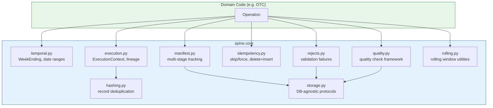
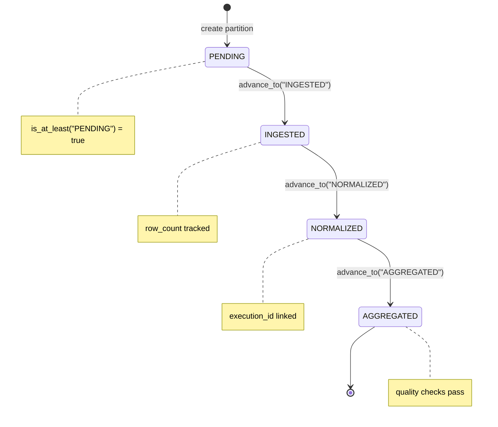
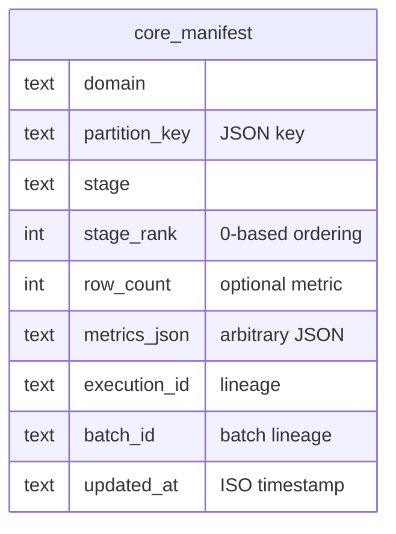
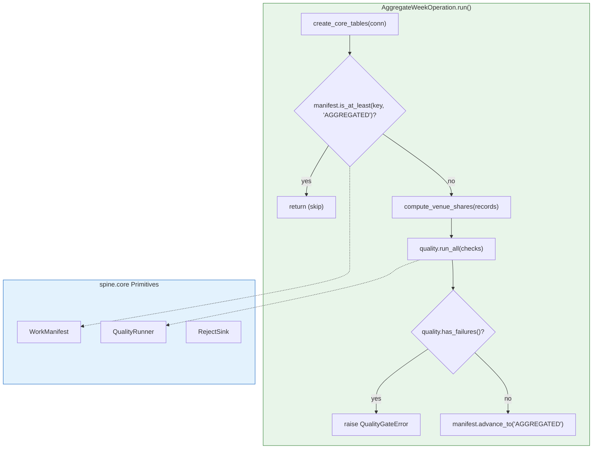
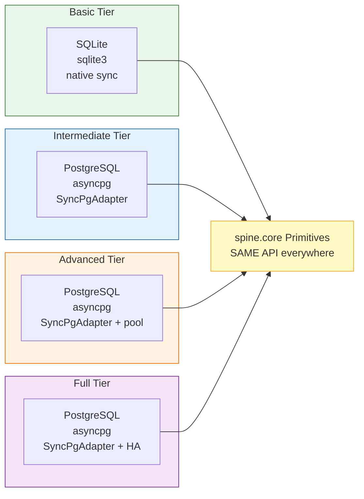

# Core Primitives

> **Location**: `src/spine/core/`  
> **Purpose**: Reusable platform machinery for any domain

---

## Overview

Spine Core provides domain-agnostic primitives that handle common temporal data processing patterns. Domains compose these primitives rather than implementing their own.

### Module Map



```
spine.core
├── temporal.py      # WeekEnding, date ranges
├── execution.py     # ExecutionContext, lineage
├── hashing.py       # Record deduplication
├── manifest.py      # Multi-stage workflow tracking
├── idempotency.py   # Skip/force, delete+insert
├── rejects.py       # Validation failure handling
├── quality.py       # Quality check framework
├── rolling.py       # Rolling window utilities
└── storage.py       # DB-agnostic protocols
```

---

## Primitives

### 1. Temporal (`temporal.py`)

**WeekEnding** - Validated Friday date for weekly workflows.

```python
from spine.core import WeekEnding

# Validation: Must be Friday
week = WeekEnding("2025-12-26")  # OK
week = WeekEnding("2025-12-25")  # Raises ValueError

# From any date
week = WeekEnding.from_any_date(date(2025, 12, 23))  # → 2025-12-26

# Ranges
for w in WeekEnding.range(start, end):
    process(w)

# Last N weeks (oldest first)
weeks = WeekEnding.last_n(6)  # [6 weeks ago, ..., this week]

# Window (for rolling)
window = week.window(6)  # [week-5, week-4, ..., week]
```

---

### 2. Execution Context (`execution.py`)

**ExecutionContext** - Lineage tracking through operation execution.

```python
from spine.core import ExecutionContext, new_context, new_batch_id

# Create root context
ctx = new_context(batch_id=new_batch_id("backfill"))

# Pass to all DB writes
conn.execute("INSERT INTO ... (execution_id, batch_id) VALUES (?, ?)",
             (ctx.execution_id, ctx.batch_id))

# Sub-operation gets child context
child_ctx = ctx.child()
# child_ctx.parent_execution_id == ctx.execution_id
# child_ctx.batch_id == ctx.batch_id (inherited)
```

---

### 3. Core Schema (`schema.py`)

**Core infrastructure tables** - Shared across all domains.

```python
from spine.core import CORE_TABLES, create_core_tables

# Tables available:
# - core_manifest: Workflow stage tracking (UNIQUE per domain/partition/stage)
# - core_rejects: Validation failures
# - core_quality: Quality check results

# Create tables at startup
create_core_tables(conn)

# Domains use these via domain parameter
manifest = WorkManifest(conn, domain="otc", stages=[...])
rejects = RejectSink(conn, domain="otc", execution_id="...")
quality = QualityRunner(conn, domain="otc", execution_id="...")
```

**core_manifest schema (Option A: current-state table)**:

| Column | Type | Description |
|--------|------|-------------|
| domain | TEXT | Domain name (e.g., "otc") |
| partition_key | TEXT | JSON key (e.g., `{"week_ending": "2025-12-26", "tier": "NMS_TIER_1"}`) |
| stage | TEXT | Stage name |
| stage_rank | INTEGER | Stage ordering (0-based) |
| row_count | INTEGER | Optional row count metric |
| metrics_json | TEXT | JSON for arbitrary metrics |
| execution_id | TEXT | Execution lineage |
| batch_id | TEXT | Batch lineage |
| updated_at | TEXT | ISO timestamp |

**Uniqueness**: `UNIQUE(domain, partition_key, stage)` - one row per stage per partition.

**Indexes**: `(domain, partition_key)`, `(domain, stage)`, `(updated_at)`

---

### 4. Work Manifest (`manifest.py`)

**WorkManifest** - Track multi-stage workflow progress (Option A: current-state).

The manifest stores **one row per stage** per partition. `advance_to()` **upserts**:
it creates or updates the row for that specific stage.





```python
from spine.core import WorkManifest, ManifestRow

manifest = WorkManifest(
    conn,
    domain="otc",  # Domain partition in core_manifest
    stages=["PENDING", "INGESTED", "NORMALIZED", "AGGREGATED"]
)

key = {"week_ending": "2025-12-26", "tier": "NMS_TIER_1"}

# Check if at least at a stage (compares stage_rank)
if manifest.is_at_least(key, "INGESTED"):
    print("Already ingested, skipping")

# Advance to a stage (UPSERTS on domain/partition_key/stage)
manifest.advance_to(
    key, 
    "INGESTED", 
    row_count=1000,
    execution_id=ctx.execution_id,
    batch_id=ctx.batch_id
)

# Get all stages for a partition (ordered by stage_rank)
stages: list[ManifestRow] = manifest.get(key)
for stage_row in stages:
    print(f"{stage_row.stage}: {stage_row.row_count} rows at {stage_row.updated_at}")

# Get latest stage reached
latest = manifest.get_latest_stage(key)  # → "INGESTED"

# Check if specific stage has been recorded
if manifest.has_stage(key, "NORMALIZED"):
    print("Normalization complete")

# Get metrics for a specific stage
row = manifest.get_stage_metrics(key, "INGESTED")
if row:
    print(f"Ingested {row.row_count} rows")
```

**Future-proofing for Option B (event sourcing)**:

```python
# Optional hook for event emission (Advanced/Full tiers)
def emit_event(domain, key, stage, rank, metrics):
    # Write to core_manifest_events table
    conn.execute("INSERT INTO core_manifest_events ...")

manifest = WorkManifest(
    conn,
    domain="otc",
    stages=["PENDING", "INGESTED", "NORMALIZED", "AGGREGATED"],
    on_stage_change=emit_event  # Optional hook
)
```

---

### 5. Idempotency (`idempotency.py`)

**IdempotencyHelper** - Patterns for safe re-runs.

```python
from spine.core import IdempotencyHelper, IdempotencyLevel

idem = IdempotencyHelper(conn)

# Level 2: Hash-based dedup
existing = idem.get_existing_hashes("otc_raw", "record_hash")
for record in records:
    if record.hash not in existing:
        insert(record)

# Level 3: Delete + insert
idem.delete_for_key("otc_venue_volume", 
    {"week_ending": "2025-12-26", "tier": "NMS_TIER_1"})
# ... insert fresh data ...
```

---

### 6. Reject Sink (`rejects.py`)

**RejectSink** - Record validation failures to `core_rejects` table.

```python
from spine.core import RejectSink, Reject

# NEW API: Use domain parameter (writes to core_rejects table)
sink = RejectSink(conn, domain="otc", execution_id=ctx.execution_id, batch_id=ctx.batch_id)

# Write single reject
sink.write(Reject(
    stage="NORMALIZE",
    reason_code="INVALID_SYMBOL",
    reason_detail="Symbol 'BAD$YM' contains invalid characters",
    raw_data=record
), partition_key={"week_ending": "2025-12-26", "tier": "NMS_TIER_1"})

# Write batch
sink.write_batch(rejects, partition_key=key)

print(f"Total rejects: {sink.count}")
```

---

### 7. Quality Runner (`quality.py`)

**QualityRunner** - Execute and record quality checks to `core_quality` table.

```python
from spine.core import (
    QualityRunner, QualityCheck, QualityCategory, 
    QualityStatus, QualityResult
)

def check_share_sum(ctx: dict) -> QualityResult:
    total = sum(s.market_share_pct for s in ctx["shares"])
    if 99.9 <= total <= 100.1:
        return QualityResult(QualityStatus.PASS, "Sum OK", total, 100.0)
    return QualityResult(QualityStatus.FAIL, f"Sum {total}", total, 100.0)

# NEW API: Use domain parameter (writes to core_quality table)
runner = QualityRunner(conn, domain="otc", execution_id=ctx.execution_id)
runner.add(QualityCheck("market_share_sum", QualityCategory.BUSINESS_RULE, check_share_sum))

results = runner.run_all({"shares": venue_shares}, partition_key=key)
# results = {"market_share_sum": QualityStatus.PASS}

if runner.has_failures():
    raise QualityGateError(runner.failures())
```

---

### 8. Rolling Window (`rolling.py`)

**RollingWindow** - Compute aggregates over time windows.

```python
from spine.core import RollingWindow, WeekEnding

window = RollingWindow(
    size=6,
    step_back=lambda w: w.previous()
)

def fetch_volume(week: WeekEnding) -> int | None:
    row = conn.execute(
        "SELECT total_volume FROM summary WHERE week = ?",
        (str(week),)
    ).fetchone()
    return row[0] if row else None

def aggregate(data: list[tuple[WeekEnding, int]]) -> dict:
    volumes = [v for _, v in data]
    return {
        "avg_volume": sum(volumes) / len(volumes),
        "max_volume": max(volumes),
    }

result = window.compute(
    as_of=WeekEnding("2025-12-26"),
    fetch_fn=fetch_volume,
    aggregate_fn=aggregate
)

print(result.aggregates["avg_volume"])
print(result.is_complete)  # True if all 6 weeks have data
```

---

## Composition Pattern

Domains use core primitives through composition, not inheritance:



```python
# domains/otc/operations.py

from spine.core import (
    WorkManifest, RejectSink, QualityRunner, 
    WeekEnding, create_core_tables
)
from spine.domains.otc.schema import DOMAIN, STAGES
from spine.domains.otc.calculations import compute_venue_shares

class AggregateWeekOperation(Operation):
    def run(self):
        # Ensure core tables exist
        create_core_tables(conn)
        
        # Setup primitives with domain parameter
        manifest = WorkManifest(conn, domain=DOMAIN, stages=STAGES)
        quality = QualityRunner(conn, domain=DOMAIN, execution_id=ctx.execution_id)
        
        # Skip if already done
        if manifest.is_at_least(key, "AGGREGATED"):
            return
        
        # Domain logic (pure function)
        shares = compute_venue_shares(records)
        
        # Quality checks
        quality.add(QualityCheck(...))
        quality.run_all({"shares": shares}, partition_key=key)
        
        # Update manifest (upserts stage row)
        manifest.advance_to(key, "AGGREGATED", row_count=len(shares))
```

---

## Sync-Only Design

**All `spine.core` primitives are SYNCHRONOUS.** This is a deliberate design choice.

### Why Sync-Only?

1. **Simplicity**: Domain code has no async/await noise
2. **Portability**: Same code runs on all tiers unchanged
3. **Testability**: Easy to test with in-memory SQLite
4. **Pragmatism**: Most operation work is I/O-bound at DB level, not CPU-bound

### How Tiers Handle Async

Higher tiers (Intermediate, Advanced, Full) that use async drivers like `asyncpg`
provide **sync adapters** that wrap their async connections:

```python
# tier_intermediate/adapters.py

import asyncio
import asyncpg

class SyncPgAdapter:
    """Wraps asyncpg connection to provide sync interface."""
    
    def __init__(self, async_conn):
        self._conn = async_conn
        self._loop = asyncio.get_event_loop()
    
    def execute(self, sql: str, params: tuple = ()):
        # Convert ? to $1, $2, ...
        sql = self._convert_placeholders(sql)
        coro = self._conn.fetch(sql, *params)
        return self._loop.run_until_complete(coro)
    
    def commit(self):
        pass  # asyncpg auto-commits per statement
```

### Usage Across Tiers

```python
# Basic tier - native sync
import sqlite3
conn = sqlite3.connect("spine.db")
manifest = WorkManifest(conn, ...)  # Works directly

# Intermediate tier - async wrapped in sync adapter
import asyncpg
async_conn = await asyncpg.connect(...)
conn = SyncPgAdapter(async_conn)
manifest = WorkManifest(conn, ...)  # Same API, same code!

# Advanced tier - same adapter, different orchestration
conn = SyncPgAdapter(get_pool_connection())
manifest = WorkManifest(conn, ...)  # Identical domain code
```

### When Does Async Happen?

Async execution happens at the **tier infrastructure level**, not in domain code:

- **Operation orchestration**: Tier may run multiple operations concurrently
- **HTTP handlers**: Tier's web framework handles async requests
- **Message consumers**: Tier's Celery/event handlers are async

But inside each operation run, the domain code and `spine.core` primitives are sync.

---

## Cross-Tier Usage

Core primitives work unchanged across all tiers:



| Tier | Database | Driver | Adapter | Core Usage |
|------|----------|--------|---------|------------|
| Basic | SQLite | sqlite3 | None (native sync) | Same |
| Intermediate | PostgreSQL | asyncpg | SyncPgAdapter | Same |
| Advanced | PostgreSQL | asyncpg | SyncPgAdapter | Same |
| Full | PostgreSQL | asyncpg | SyncPgAdapter | Same |

The tier provides the connection (possibly wrapped); core primitives use it:

```python
# All tiers - SAME domain code
from spine.core import WorkManifest, create_core_tables
from spine.domains.otc.schema import DOMAIN, STAGES

# conn comes from tier infrastructure (native or wrapped)
create_core_tables(conn)  # Idempotent - safe to call every time

manifest = WorkManifest(conn, domain=DOMAIN, stages=STAGES)
manifest.advance_to(key, "INGESTED", row_count=1000, execution_id=ctx.execution_id)
```

---

## Adding New Primitives

To add a new platform primitive:

1. Create `spine/core/{name}.py`
2. Define the class/function with a clean, minimal API
3. Add to `spine/core/__init__.py` exports
4. Document usage in this file

**Guidelines**:
- Keep primitives domain-agnostic
- Use protocols, not concrete DB imports
- **All methods must be SYNCHRONOUS**
- Prefer composition over inheritance
- Keep APIs small (≤5 public methods)
