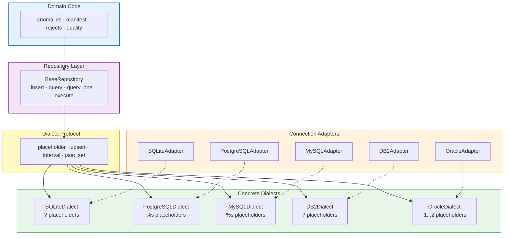
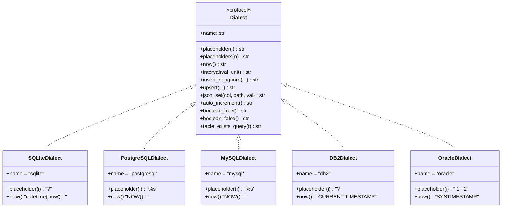
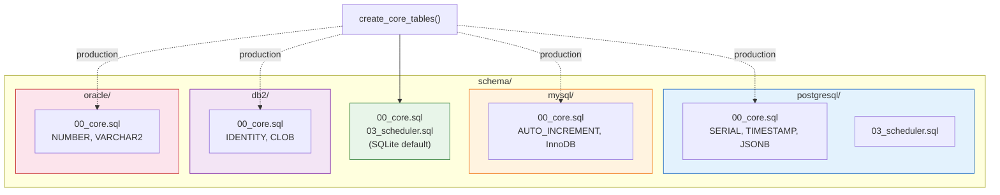
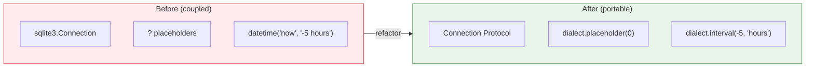

# Database Architecture

> **Location**: `src/spine/core/dialect.py`, `src/spine/core/adapters/`, `src/spine/core/schema/`  
> **Purpose**: Portable, multi-database SQL generation and connection management

---

## Overview

spine-core is **not coupled to any single database**. Every SQL statement generated at
runtime flows through a **Dialect** abstraction that emits vendor-correct SQL for
SQLite, PostgreSQL, MySQL, IBM DB2, and Oracle. Purpose-built adapters manage
connections and pooling for each backend, and per-dialect DDL schema files ensure
table creation works natively on each platform.

### Architecture Overview



```
                      ┌─────────────────────────────────┐
                      │         Your Domain Code        │
                      │   anomalies · manifest · rejects│
                      └───────────────┬─────────────────┘
                                      │  uses
                      ┌───────────────▼─────────────────┐
                      │          Dialect Protocol        │
                      │  placeholder · upsert · interval │
                      └───────────────┬─────────────────┘
                                      │  implements
          ┌──────────┬────────────┬───┴────┬──────────┐
          ▼          ▼            ▼        ▼          ▼
      SQLite    PostgreSQL     MySQL     DB2      Oracle
       (?)        (%s)         (%s)      (?)      (:1,:2)
```

---

## Dialect Protocol

The `Dialect` protocol (defined in `spine.core.dialect`) specifies every
database-specific SQL variation used across the codebase:

### Dialect Class Hierarchy



| Method | Purpose | SQLite | PostgreSQL | MySQL | DB2 | Oracle |
|---|---|---|---|---|---|---|
| `placeholder(i)` | Positional parameter (0-based) | `?` | `%s` | `%s` | `?` | `:1`, `:2` |
| `placeholders(n)` | n comma-separated params | `?,?,?` | `%s,%s,%s` | `%s,%s,%s` | `?,?,?` | `:1,:2,:3` |
| `now()` | Current timestamp expression | `datetime('now')` | `NOW()` | `NOW()` | `CURRENT TIMESTAMP` | `SYSTIMESTAMP` |
| `interval(val, unit)` | Relative timestamp | `datetime('now', '-5 hours')` | `NOW() - INTERVAL '5 hours'` | `NOW() - INTERVAL 5 HOUR` | `CURRENT TIMESTAMP - 5 HOURS` | `SYSTIMESTAMP - INTERVAL '5' HOUR` |
| `insert_or_ignore(...)` | Skip on conflict | `INSERT OR IGNORE` | `ON CONFLICT DO NOTHING` | `INSERT IGNORE` | `MERGE … WHEN NOT MATCHED` | `MERGE … WHEN NOT MATCHED` |
| `upsert(...)` | Insert or update | `INSERT … ON CONFLICT DO UPDATE` | `INSERT … ON CONFLICT DO UPDATE` | `INSERT … ON DUPLICATE KEY UPDATE` | `MERGE` | `MERGE` |
| `json_set(col, path, val)` | JSON field update | `json_set(col, path, val)` | `jsonb_set(col, path, val)` | `JSON_SET(col, path, val)` | `JSON_OBJECT('key': val)` | `JSON_MERGEPATCH` |
| `auto_increment()` | Auto-ID DDL | `AUTOINCREMENT` | `SERIAL` | `AUTO_INCREMENT` | `GENERATED ALWAYS AS IDENTITY` | `GENERATED ALWAYS AS IDENTITY` |
| `boolean_true()` / `boolean_false()` | Boolean literal | `1` / `0` | `TRUE` / `FALSE` | `TRUE` / `FALSE` | `1` / `0` | `1` / `0` |
| `table_exists_query(t)` | Check table exists | `sqlite_master` | `information_schema` | `information_schema` | `SYSCAT.TABLES` | `USER_TABLES` |

### Usage

```python
from spine.core.dialect import Dialect, get_dialect, SQLiteDialect

# Get a dialect by name (singleton)
dialect = get_dialect("postgresql")

# Or import the concrete class directly
dialect = SQLiteDialect()

# Generate portable SQL
ph = dialect.placeholders(3)            # "%s, %s, %s"
cutoff = dialect.interval(-24, "hours") # "NOW() - INTERVAL '24 hours'"
sql = f"DELETE FROM events WHERE ts < {cutoff}"
```

### Registering Custom Dialects

```python
from spine.core.dialect import register_dialect

class CockroachDialect(PostgreSQLDialect):
    """CockroachDB is PostgreSQL-wire-compatible with minor differences."""
    name = "cockroach"

register_dialect("cockroach", CockroachDialect())
```

---

## BaseRepository

`BaseRepository` (in `spine.core.repository`) pairs a `Connection` with a
`Dialect`, providing helper methods that eliminate raw SQL boilerplate:

```python
from spine.core.repository import BaseRepository
from spine.core.dialect import get_dialect

repo = BaseRepository(conn, get_dialect("postgresql"))

# Insert a dict directly
repo.insert("core_anomalies", {
    "domain": "sec",
    "severity": "warning",
    "message": "Missing field",
})

# Parameterized query
rows = repo.query(
    f"SELECT * FROM core_anomalies WHERE domain = {repo.ph(1)}",
    ("sec",),
)
```

Key methods:

| Method | Description |
|---|---|
| `ph(count)` | Shorthand for `self.dialect.placeholders(count)` |
| `execute(sql, params)` | Execute with optional params |
| `query(sql, params)` → `list[dict]` | Fetch rows as dicts |
| `query_one(sql, params)` → `dict \| None` | Fetch single row |
| `insert(table, data)` | INSERT a `dict` |
| `insert_many(table, rows)` | Batch INSERT a list of dicts |
| `commit()` | Commit transaction |

---

## Database Adapters

Each supported backend has a dedicated adapter in `spine.core.adapters` that
handles connection creation, pooling, and lifecycle:

| Adapter | Backend | Driver | Extra |
|---|---|---|---|
| `SQLiteAdapter` | SQLite | `sqlite3` (stdlib) | — |
| `PostgreSQLAdapter` | PostgreSQL | `psycopg2-binary` | `pip install spine-core[postgresql]` |
| `DB2Adapter` | IBM DB2 | `ibm-db` | `pip install spine-core[db2]` |
| `MySQLAdapter` | MySQL / MariaDB | `mysql-connector-python` | `pip install spine-core[mysql]` |
| `OracleAdapter` | Oracle | `oracledb` | `pip install spine-core[oracle]` |

### Adapter Registry

```python
from spine.core.adapters.registry import get_adapter, adapter_registry

# By name
adapter = get_adapter("postgresql", host="localhost", database="spine")

# Or by enum
from spine.core.adapters.types import DatabaseType
adapter = get_adapter(DatabaseType.POSTGRESQL, ...)

# List registered
adapter_registry.list_adapters()
# ['db2', 'mysql', 'oracle', 'postgres', 'postgresql', 'sqlite']
```

Each adapter exposes a `.dialect` property returning the matching `Dialect`
instance, so domain code that receives an adapter can use its dialect directly.

---

## Per-Dialect Schema Files

DDL lives under `src/spine/core/schema/<backend>/`:



```
schema/
├── 00_core.sql            # SQLite (default)
├── 03_scheduler.sql       # SQLite scheduler tables
├── postgresql/
│   ├── 00_core.sql        # SERIAL, TIMESTAMP, JSONB
│   └── 03_scheduler.sql
├── mysql/
│   └── 00_core.sql        # AUTO_INCREMENT, ENGINE=InnoDB, utf8mb4
├── db2/
│   └── 00_core.sql        # GENERATED ALWAYS AS IDENTITY, CLOB
└── oracle/
    └── 00_core.sql        # NUMBER, VARCHAR2, SYSTIMESTAMP
```

The SQLite schemas are the default used by `create_core_tables()` and in tests.
For production deployments on other backends, apply the corresponding DDL from
the backend's directory.

---

## Connection Protocol

Domain code never depends on `sqlite3.Connection`. Instead, a `Connection`
protocol in `spine.core.protocols` defines the duck-typed interface:

```python
from typing import Protocol, runtime_checkable

@runtime_checkable
class Connection(Protocol):
    def execute(self, sql: str, params: tuple = ()) -> Any: ...
    def executemany(self, sql: str, params: list[tuple]) -> Any: ...
    def fetchone(self) -> Any: ...
    def fetchall(self) -> list: ...
    def commit(self) -> None: ...
    def rollback(self) -> None: ...
```

Any object that satisfies this protocol works — real database connections,
mocks, or wrappers around async drivers.

---

## Migration Pattern

When migrating existing code from SQLite-specific SQL:



### Before (coupled to SQLite)

```python
import sqlite3

def count_recent(conn: sqlite3.Connection, domain: str, hours: int) -> int:
    conn.execute(
        "SELECT COUNT(*) FROM anomalies "
        "WHERE domain = ? AND detected_at > datetime('now', ?)",
        (domain, f"-{hours} hours"),
    )
    return conn.fetchone()[0]
```

### After (portable)

```python
from spine.core.protocols import Connection
from spine.core.dialect import Dialect, SQLiteDialect

def count_recent(
    conn: Connection,
    domain: str,
    hours: int,
    dialect: Dialect = SQLiteDialect(),
) -> int:
    cutoff = dialect.interval(-hours, "hours")
    conn.execute(
        f"SELECT COUNT(*) FROM anomalies "
        f"WHERE domain = {dialect.placeholder(0)} AND detected_at > {cutoff}",
        (domain,),
    )
    return conn.fetchone()[0]
```

Key changes:
1. `sqlite3.Connection` → `Connection` protocol
2. `?` → `dialect.placeholder(0)` 
3. `datetime('now', ?)` → `dialect.interval(-hours, "hours")` (value baked into SQL)
4. Default to `SQLiteDialect()` for backward compatibility

---

## Design Principles

1. **No global database assumption** — Every function that touches the database
   accepts a `Dialect` parameter (defaulting to `SQLiteDialect()` for test
   convenience).

2. **Placeholder indexing is 0-based** — `dialect.placeholder(0)` returns `:1`
   on Oracle, `?` on SQLite. Use `placeholder(i)` when building queries
   dynamically; use `placeholders(n)` for INSERT value lists.

3. **Interval values are baked into SQL** — `dialect.interval(-5, "hours")`
   produces a complete SQL expression like `NOW() - INTERVAL '5 hours'`. The
   value is not a bind parameter.

4. **Schema files are authoritative** — The DDL files under `schema/<backend>/`
   are the source of truth for table definitions on each platform. They are not
   auto-generated from SQLite schemas.

5. **SQLite remains the test default** — `create_test_db()` uses SQLite
   in-memory databases. This is intentional; SQLite is always available and
   requires no external dependencies.
