# Job Engine & Container Execution Architecture

> **Location**: `src/spine/execution/engine.py`, `src/spine/execution/runtimes/`  
> **Prompt**: `spine-workspace/prompts/04_project/spine-core/job-engine.prompt.md`  
> **Purpose**: First-class container & compute job execution across any runtime

---

## Overview

The Job Engine extends spine-core's existing execution foundation into a full
container and compute orchestration system. It builds on **existing infrastructure**:

| Component | Location | Role |
|-----------|----------|------|
| `ExecutionLedger` | `execution/ledger.py` | Single source of truth for executions + events |
| `TrackedExecution` | `execution/context.py` | Lifecycle context manager (idempotency, locking, DLQ) |
| `ConcurrencyGuard` | `execution/concurrency.py` | DB-level locking with auto-expiry |
| `CircuitBreaker` | `execution/circuit_breaker.py` | CLOSED/OPEN/HALF_OPEN per runtime |
| `DLQManager` | `execution/dlq.py` | Dead letter queue for exhausted retries |
| `EventBus` | `core/events/` | Pub/sub with memory + Redis backends |
| `WorkSpec` | `execution/spec.py` | Universal work specification |
| `Executor` | `execution/executors/protocol.py` | In-process async protocol |
| `core_executions` | Schema | Execution records with state machine |
| `core_execution_events` | Schema | Append-only event log |

Every compute backend — Docker, Podman, Kubernetes, etc. — is a pluggable
`RuntimeAdapter` behind a single protocol. **No parallel systems are created.**
The Job Engine uses the existing ledger, event bus, and concurrency guard.

### System Architecture

```mermaid
graph TB
    subgraph Consumers["Consumer Layer"]
        CLI["CLI<br/>spine-core job ..."]
        API["REST API<br/>POST /api/v1/jobs"]
        SDK["Python SDK<br/>await engine.submit()"]
        UI["capture-spine UI"]
    end

    subgraph Engine["Job Engine Layer"]
        JE["JobEngine<br/>submit · status · logs · cancel · wait"]
        VAL["Validator<br/>capabilities + constraints"]
        RED["Redactor<br/>spec_json_redacted"]
        REC["Reconciler<br/>desired vs observed"]
    end

    subgraph Router["Routing Layer"]
        RAR["RuntimeAdapterRouter<br/>capability matching · health"]
    end

    subgraph Adapters["Runtime Adapters"]
        DA["DockerAdapter"]
        PA["PodmanAdapter"]
        KA["KubernetesAdapter"]
        EA["ECSAdapter"]
        CRA["CloudRunAdapter"]
        STUB["StubAdapter<br/>(tests)"]
    end

    subgraph Infra["Existing Infrastructure"]
        LED["ExecutionLedger<br/>core_executions + events"]
        EB["EventBus<br/>memory / Redis"]
        CG["ConcurrencyGuard<br/>DB-level locks"]
        CB["CircuitBreaker<br/>per-runtime"]
        DLQ["DLQManager<br/>dead letter queue"]
    end

    CLI & API & SDK & UI --> JE
    JE --> VAL --> RED --> RAR
    JE <--> REC
    RAR --> DA & PA & KA & EA & CRA & STUB
    JE --> LED & EB & CG & CB & DLQ

    style Engine fill:#e1f5fe,stroke:#0288d1
    style Router fill:#f3e5f5,stroke:#7b1fa2
    style Adapters fill:#e8f5e9,stroke:#388e3c
    style Infra fill:#fff3e0,stroke:#f57c00
```

---

## Core Abstractions

### RuntimeAdapter Protocol

Every compute backend implements one protocol with 7 methods:

| Method | Purpose |
|--------|---------|
| `submit(spec)` | Submit container job, return external ref |
| `status(ref)` | Get live job status |
| `cancel(ref)` | Stop a running job |
| `logs(ref, follow)` | Stream or fetch logs |
| `artifacts(ref)` | List output artifacts |
| `cleanup(ref)` | Remove resources (idempotent) |
| `health()` | Check runtime reachability |

### RuntimeCapabilities + RuntimeConstraints

Each adapter declares what it supports (boolean flags) AND its limits (numeric constraints).
The engine validates specs against both **before** submission.

| Capability | Docker | Podman | K8s | ECS | Lambda | ACI | Cloud Run |
|------------|--------|--------|-----|-----|--------|-----|-----------|
| GPU        | ✅     | ✅     | ✅  | ✅  | ❌     | ✅  | ✅        |
| Volumes    | ✅     | ✅     | ✅  | ✅  | ❌     | ✅  | ✅        |
| Sidecars   | ✅*    | ✅*    | ✅  | ✅  | ❌     | ✅  | ✅        |
| Streaming  | ✅     | ✅     | ✅  | ✅  | ❌     | ✅  | ✅        |
| Spot       | ❌     | ❌     | ✅  | ✅  | ❌     | ❌  | ❌        |
| Exec-into  | ✅     | ✅     | ✅  | ✅  | ❌     | ❌  | ❌        |
| Max timeout| ∞      | ∞      | ∞   | ∞   | 15m    | 24h | 60m       |

`RuntimeConstraints` adds: `max_timeout_seconds`, `max_memory_mb`, `max_cpu_cores`,
`max_env_bytes`, `max_artifact_bytes`, `max_concurrent`. Rejection messages are
specific: "Lambda max timeout is 900s but spec requests 3600s".

### RuntimeAdapter Class Hierarchy

### Job Submission Flow

```mermaid
sequenceDiagram
    participant C as Client (CLI/API/SDK)
    participant JE as JobEngine
    participant V as Validator
    participant R as Redactor
    participant RAR as RuntimeAdapterRouter
    participant A as RuntimeAdapter
    participant L as ExecutionLedger
    participant EB as EventBus

    C->>JE: submit(ContainerJobSpec)
    JE->>L: create_execution()
    JE->>V: validate(spec, capabilities, constraints)
    alt validation fails
        V-->>JE: violations[]
        JE->>L: update_status(FAILED)
        JE-->>C: raise JobError(VALIDATION)
    end
    JE->>R: redact_spec(spec)
    R-->>JE: spec_json_redacted + spec_hash
    JE->>L: store redacted spec
    JE->>RAR: route(spec) → adapter
    RAR-->>JE: adapter
    JE->>A: submit(spec)
    A-->>JE: external_ref
    JE->>L: update(external_ref, status=RUNNING)
    JE->>EB: publish(STARTED)
    JE-->>C: execution_id
```

### ContainerJobSpec

Extends `WorkSpec` with container-native fields: image, resources (CPU/memory/GPU),
volumes, sidecars, init containers, environment, secrets references, timeout,
scheduling hints, cost budget, and labels/annotations.

### Job Lifecycle State Machine

```mermaid
stateDiagram-v2
    [*] --> PENDING : submit()
    PENDING --> VALIDATING : validate spec
    VALIDATING --> PULLING : validation passed
    VALIDATING --> FAILED : validation failed
    PULLING --> CREATING : image ready
    PULLING --> FAILED : image pull error
    CREATING --> RUNNING : container started
    CREATING --> FAILED : creation error
    RUNNING --> SUCCEEDED : exit 0
    RUNNING --> FAILED : non-zero exit / OOM / timeout
    RUNNING --> CANCELLED : cancel()
    FAILED --> RETRYING : retries remaining
    RETRYING --> PENDING : retry delay elapsed
    SUCCEEDED --> [*]
    FAILED --> [*] : retries exhausted → DLQ
    CANCELLED --> [*]

    note right of VALIDATING : Checks RuntimeCapabilities\n+ RuntimeConstraints\n+ budget gate
    note right of PULLING : Sub-state in\nmetadata.phase
    note right of RETRYING : Wait retry_delay_seconds\nthen re-submit
```

All transitions are persisted in `core_executions` with events in `core_execution_events`
(via `ExecutionLedger.record_event()`). Sub-states (PULLING, CREATING) are stored in
`metadata.phase`, not as new `ExecutionStatus` values.

---

## Key New Components

### JobReconciler

Background worker that reconciles desired vs observed state. Periodically polls
active jobs and refreshes status from the runtime adapter. Uses `ConcurrencyGuard`
for lease acquisition to prevent double-polling in multi-instance deployments.

### JobError Taxonomy

Structured errors with `category` (auth/quota/oom/timeout/user_code/unknown),
`retryable: bool`, `provider_code`, and `exit_code`. Retry decisions use category,
not string matching.

> Green = retryable by default, Red = not retryable by default

### Spec Redaction

`spec_json_redacted` + `spec_hash` stored instead of raw spec. Sensitive env vars
are masked before persistence. Full spec exists only in memory at submit time.

```mermaid
flowchart LR
    A["ContainerJobSpec<br/>(full spec in memory)"] --> B{"redact_spec()"}
    B --> C["spec_json_redacted<br/>DB_PASSWORD: ***REDACTED***<br/>LOG_LEVEL: debug"]
    B --> D["spec_hash<br/>SHA-256 of canonical JSON"]
    C --> E[("core_executions<br/>spec_json_redacted column")]
    D --> E
    A -.->|"never persisted"| F["🚫 Raw spec"]

    style A fill:#ffebee,stroke:#c62828
    style C fill:#e8f5e9,stroke:#2e7d32
    style D fill:#e8f5e9,stroke:#2e7d32
    style F fill:#ffcdd2,stroke:#b71c1c
```

### Deterministic Naming

External resources get predictable names: `spine-{exec_id[:8]}-{slug(work_name)}`.
Enables reconciler orphan scans across cloud providers.

### Orchestration Bridge

`ContainerRunnable` implements the runnable interface so `WorkflowRunner` can
dispatch operation steps to containers without workflow authors changing anything.

### Executor vs RuntimeAdapter Boundary

| Protocol | Level | Signature | Use Case |
|----------|-------|-----------|----------|
| `Executor` | In-process | `submit(WorkSpec) → str` | Celery, threads |
| `RuntimeAdapter` | Container | `submit(ContainerJobSpec) → str` | Docker, K8s, ECS |

---

## Runtime Adapter Tiers

```mermaid
graph TB
    subgraph T1["Tier 1 — Local Container Runtimes"]
        DA["DockerAdapter<br/>docker-py SDK"]
        PA["PodmanAdapter<br/>podman-py SDK"]
        NA["NerdctlAdapter<br/>containerd CLI"]
    end

    subgraph T2["Tier 2 — Orchestrators"]
        KA["KubernetesAdapter<br/>Job/Pod resources"]
        OSA["OpenShiftAdapter<br/>Routes, SCCs"]
        NOM["NomadAdapter<br/>REST API"]
        SW["DockerSwarmAdapter<br/>services"]
    end

    subgraph T3["Tier 3 — AWS"]
        ECS["ECSAdapter<br/>Fargate/EC2"]
        EKS["EKSAdapter<br/>K8s + STS/IRSA"]
        LAM["LambdaAdapter<br/>container image"]
        BAT["BatchAdapter<br/>managed queues"]
    end

    subgraph T4["Tier 4 — Azure"]
        ACI["ACIAdapter"]
        AKS["AKSAdapter"]
        AFN["AzureFunctionsAdapter"]
        ACA["ContainerAppsAdapter"]
    end

    subgraph T5["Tier 5 — Google Cloud"]
        CRJ["CloudRunJobsAdapter"]
        GKE["GKEAdapter"]
        GCF["CloudFunctionsAdapter"]
    end

    subgraph T6["Tier 6 — Legacy Wrappers"]
        IPA["InProcessAdapter<br/>wraps LocalExecutor"]
        CA["CeleryAdapter<br/>wraps CeleryExecutor"]
    end

    style T1 fill:#e8f5e9,stroke:#2e7d32
    style T2 fill:#e3f2fd,stroke:#1565c0
    style T3 fill:#fff3e0,stroke:#ef6c00
    style T4 fill:#e3f2fd,stroke:#1565c0
    style T5 fill:#fce4ec,stroke:#c62828
    style T6 fill:#f3e5f5,stroke:#7b1fa2
```

### Tier 1 — Local Container Runtimes
- **DockerAdapter** — Docker Engine via `docker` Python SDK or CLI fallback
- **PodmanAdapter** — Podman (rootless/rootful) via `podman-py` or CLI
- **NerdctlAdapter** — containerd + nerdctl CLI

### Tier 2 — Orchestrators
- **KubernetesAdapter** — Any K8s distro (Job/Pod resources)
- **OpenShiftAdapter** — Extends K8s with Routes, SCCs, BuildConfigs
- **NomadAdapter** — HashiCorp Nomad REST API
- **DockerSwarmAdapter** — Swarm services with `restart-condition=none`

### Tier 3 — AWS
- **ECSAdapter** — Fargate or EC2 launch type
- **EKSAdapter** — K8s + STS/IRSA auth
- **LambdaAdapter** — Container image Lambda (15-min max)
- **BatchAdapter** — Managed job queues (HPC, GPU, Spot)

### Tier 4 — Azure
- **ACIAdapter** — Azure Container Instances
- **AKSAdapter** — K8s + AAD/managed identity auth
- **AzureFunctionsAdapter** — Custom container handler
- **ContainerAppsAdapter** — Jobs mode with Dapr/KEDA

### Tier 5 — Google Cloud
- **CloudRunJobsAdapter** — Execute-once container jobs
- **GKEAdapter** — K8s + Workload Identity auth
- **CloudFunctionsAdapter** — Container-based (2nd gen)

### Tier 6 — Legacy (Existing Executors)
- **InProcessAdapter** — Wraps `LocalExecutor`/`AsyncLocalExecutor`
- **CeleryAdapter** — Wraps `CeleryExecutor`

---

## Schema Extensions

```mermaid
erDiagram
    core_executions {
        text id PK
        text operation
        text status
        text runtime "NEW — docker, k8s, ecs..."
        text external_ref "NEW — container ID, pod name, ARN"
        text external_name "NEW — spine-{id}-{slug}"
        text image "NEW — OCI image reference"
        int exit_code "NEW"
        float cost_usd "NEW — phased tracking"
        text budget_tag "NEW — cost attribution"
        text spec_json_redacted "NEW — redacted spec"
        text spec_hash "NEW — SHA-256"
        text phase "NEW — pulling, creating..."
        text last_heartbeat_at "NEW — reconciler"
        text error_category "NEW — auth, oom, timeout..."
        bool error_retryable "NEW"
    }

    core_execution_events {
        text id PK
        text execution_id FK
        text event_type
        text timestamp
        text data
    }

    job_artifacts {
        text id PK
        text execution_id FK
        text name
        text path
        int size_bytes
        text checksum
        text content_type
        text storage_uri
    }

    runtime_configs {
        text id PK
        text runtime_name
        text config_json
        text credentials_ref
        bool enabled
    }

    core_executions ||--o{ core_execution_events : "has events"
    core_executions ||--o{ job_artifacts : "produces"
    runtime_configs ||--o{ core_executions : "runs on"
```

Two new tables + extended columns on `core_executions`:

| Table | Purpose |
|-------|---------|
| `job_artifacts` | Output files with checksum + storage URI |
| `runtime_configs` | Configured runtimes with credentials ref |

**No `job_events` table.** All events go through `core_execution_events` via
`ExecutionLedger.record_event()`. New `EventType` values: IMAGE_PULLING,
CONTAINER_CREATING, ARTIFACT_READY, COST_RECORDED, RECONCILED, ORPHAN_DETECTED.

New columns on `core_executions`: `runtime`, `external_ref`, `external_name`,
`image`, `exit_code`, `cost_usd`, `budget_tag`, `timeout_seconds`, `node`,
`cleanup_at`, `spec_json_redacted`, `spec_hash`, `phase`, `last_heartbeat_at`,
`error_category`, `error_retryable`.

---

## Interface Stack

| Interface | Endpoint / Command | Notes |
|-----------|-------------------|-------|
| **CLI** | `spine-core job submit/status/logs/cancel/list/retry/cleanup` | Also `spine-core runtime list/health/add` |
| **REST API** | `POST /api/v1/jobs`, `GET /api/v1/jobs/{id}/logs?follow=true` (SSE) | Full CRUD + batch + cost |
| **Python SDK** | `JobEngine.from_settings()`, `await engine.submit(spec)` | Async-first |
| **SSE** | `GET /api/v1/jobs/{id}/events` | Real-time status + log stream |

> **Frontend** is capture-spine's domain, not this project.

---

## Cross-Cutting Concerns

### Credential Broker
Never stores cloud credentials in the database. Resolves at submit-time via
chained providers: environment → file (kubeconfig, ~/.aws) → Vault → SSM →
Key Vault → Secret Manager.

### Cost Tracking (Phased)

```mermaid
graph LR
    subgraph V1["v1 — MVP"]
        D1["Docker = $0.00"]
        C1["Cloud = 'unknown'"]
    end

    subgraph V2["v2 — Estimates"]
        E2["vCPU-hours × rate"]
        M2["memory-hours × rate"]
    end

    subgraph V3["v3 — Actual Billing"]
        AWS3["AWS Cost Explorer"]
        AZ3["Azure Cost Mgmt"]
        GCP3["GCP Billing API"]
    end

    V1 -->|"cloud adapters exist"| V2 -->|"billing APIs integrated"| V3

    style V1 fill:#e8f5e9,stroke:#2e7d32
    style V2 fill:#fff9c4,stroke:#f9a825
    style V3 fill:#e3f2fd,stroke:#1565c0
```

- **v1 (MVP)**: Docker = $0.00, cloud = "unknown"
- **v2**: Cloud runtimes get runtime-based estimates (vCPU-hours × rate)
- **v3**: Actual billing via AWS Cost Explorer, Azure Cost Mgmt, GCP Billing

Do not implement v2/v3 until cloud adapters exist.

### Observability
- **Logs**: `LogCollector` streams from adapter, tail stored in DB, bulk to object store
- **Events**: State transitions emit events to `EventBus` (existing, not new)
- **Metrics**: Job count, duration, cost by runtime/lane/tag
- **Artifacts**: Collected from `artifacts_dir`, stored via `ArtifactStore` protocol
- **Budgets**: `max_persisted_log_bytes` + `max_artifact_bytes` per execution

---

## Deploy-Spine Testbed (First Consumer)

The ephemeral container test harness (`deploy-spine`) is the **first consumer** of
the Job Engine. It uses `JobEngine.submit_batch()` with `DockerAdapter`/`PodmanAdapter`
to spin up database containers (PostgreSQL, MySQL, DB2, Oracle, TimescaleDB), run
schema + tests + examples against each, and capture structured results.

See: `spine-workspace/prompts/04_project/spine-core/deploy-spine-testbed.prompt.md`

---

## Implementation Priority (MVP Tiers)

### MVP-1: Core Engine + Docker

| Phase | What | Status |
|-------|------|--------|
| 1 | Types, protocols, `ContainerJobSpec`, `RuntimeConstraints`, `JobError` | **Done** ✅ |
| 2 | Schema (extend `core_executions`, new `EventType` values, `runtime_configs`, `job_artifacts`) | **Done** ✅ |
| 3 | `BaseRuntimeAdapter`, `StubRuntimeAdapter` | **Done** ✅ |
| 4 | `JobEngine`, `RuntimeAdapterRouter`, validator, spec redaction, naming | **Done** ✅ |
| 4.5 | `LocalProcessAdapter` — container-free subprocess runtime | **Done** ✅ |
| 4.6 | `WorkflowPackager` — shiv-style .pyz archive builder | **Done** ✅ |
| 5 | `DockerAdapter` (full lifecycle) | Not started |
| 6 | `JobReconciler` with lease/heartbeat | Not started |
| 7-8 | Log collector (with budgets), artifact store | Not started |
| 9 | Minimal REST API (submit/status/cancel/logs) | Not started |
| 10 | CLI (`spine-core job ...`) | Not started |
| 11 | Orchestration bridge (`ContainerRunnable`) | Not started |

### MVP-2: K8s + Observability

| Phase | What | Status |
|-------|------|--------|
| 12 | `KubernetesAdapter` | Not started |
| 13 | `PodmanAdapter` | Not started |
| 14 | Runtime registry + dynamic discovery | Not started |
| 15 | SSE log streaming | Not started |
| 16 | Python SDK | Not started |

### MVP-3: Cloud + Cost

| Phase | What | Status |
|-------|------|--------|
| 17 | One cloud adapter (ECS, Cloud Run, or ACI) | Not started |
| 18 | Credential broker | Not started |
| 19 | Cost tracker v2 | Not started |
| 20 | Deploy-spine testbed integration | Not started |

### Future

OpenShift, additional cloud adapters (Lambda, Batch, AKS, GKE), Nomad, Swarm,
Celery/in-process adapter wrappers, cost tracker v3, frontend (capture-spine).

---

## Related Documents

- [Database Architecture](DATABASE_ARCHITECTURE.md) — Dialect system for multi-DB support
- [Core Primitives](CORE_PRIMITIVES.md) — Foundational types and protocols
- Full prompt spec: `spine-workspace/prompts/04_project/spine-core/job-engine.prompt.md`
- Testbed prompt: `spine-workspace/prompts/04_project/spine-core/deploy-spine-testbed.prompt.md`
