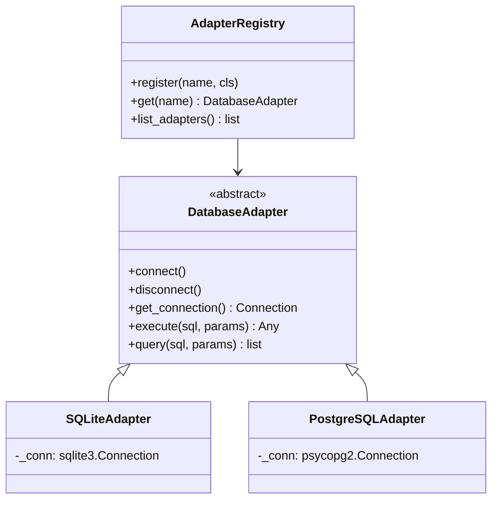

# feat(core/adapters): add database adapter framework

## Migration Guide

No migration needed — this is a new module. If you have custom database
code, consider implementing the `DatabaseAdapter` ABC:

```python
from spine.core.adapters.base import DatabaseAdapter

class MyAdapter(DatabaseAdapter):
    def connect(self) -> None:
        self._conn = my_driver.connect(self._config.url)
    
    def disconnect(self) -> None:
        self._conn.close()
    
    def get_connection(self):
        return self._conn
```

## Architecture Diagram



## Examples

```python
from spine.core.adapters import adapter_registry, get_adapter

# Register and use an adapter
adapter = get_adapter("sqlite", url="spine.db")
adapter.connect()

results = adapter.query("SELECT * FROM runs WHERE status = ?", ("completed",))
adapter.disconnect()
```
